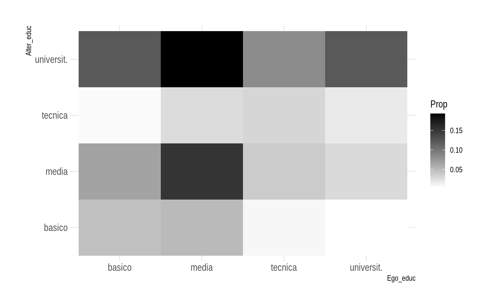



El prsente documento tiene por objetivo realizar la construcción de una bbdd de egos y alteris (anidados) en formato long para anáisis posteriores considerando ELSOC 2017 (w2) y 2019 (w4). Términamos con la construcción de tablas de descriptivos y la construcción de vectores de "distancia sociodemográfica" (mismatch) de parámetros de relevancia evidenciados en el paper de Bargsted et al., (2020) para el caso chileno.

### librerías

``` r
pacman::p_load(ggplot2,ggthemes,tidyverse,sjlabelled,sjPlot,vcd,texreg,ordinal,
               nnet,MASS,mlogit,matrixStats,expss,sjlabelled,sjmisc,tidyverse,
               survey,egor,haven,car,dplyr,stargazer,janitor,gridExtra,ggeffects,
               haven,summarytools,skimr,weights,ggcorrplot,ggridges,panelr,
               GLMMadaptive,survival,R.utils,questionr,car,corrplot,hrbrthemes,
               viridis,extrafont,JWileymisc,xtable)
```

### 2017

### Cargamos data

``` r
load("/home/rober/Documents/ricantillan.rbind.io/dat/ELSOC/ELSOC_W02_v3.00_R.RData")
load("/home/rober/Documents/ricantillan.rbind.io/dat/ELSOC/ELSOC_W04_v2.01_R.RData")
```

### Renombrar ID

``` r
a<-elsoc_2017 %>% rename(.egoID = idencuesta)
b<-elsoc_2019 %>% rename(.egoID = idencuesta)
```

## Crear data frame alteris para 2017=a1

Creamos subset con data de cada uno de los alteris mencionados, manteniendo el ID de cada ego en el cual están anidados. Las columnas de cada uno de los subset deben tener los mismos nombres.

``` r
alter_1<-a %>%
        dplyr::select(.egoID, 
                      alter_sexo=r13_sexo_01, 
                      alter_edad=r13_edad_01, 
                      alter_rel=r13_relacion_01,
                      alter_tiempo=r13_tiempo_01,
                      alter_barrio=r13_barrio_01, 
                      alter_educ=r13_educ_01, 
                      alter_relig=r13_relig_01, 
                      alter_ideol=r13_ideol_01)
#View(alter_1)
alter_2<-a %>%
        dplyr::select(.egoID, 
                      alter_sexo=r13_sexo_02, 
                      alter_edad=r13_edad_02, 
                      alter_rel=r13_relacion_02,
                      alter_tiempo=r13_tiempo_02,
                      alter_barrio=r13_barrio_02, 
                      alter_educ=r13_educ_02, 
                      alter_relig=r13_relig_02, 
                      alter_ideol=r13_ideol_02)

alter_3<-a %>%
        dplyr::select(.egoID, 
                      alter_sexo=r13_sexo_03, 
                      alter_edad=r13_edad_03, 
                      alter_rel=r13_relacion_03,
                      alter_tiempo=r13_tiempo_03,
                      alter_barrio=r13_barrio_03, 
                      alter_educ=r13_educ_03, 
                      alter_relig=r13_relig_03, 
                      alter_ideol=r13_ideol_03)

alter_4<- a %>%
        dplyr::select(.egoID, 
                      alter_sexo=r13_sexo_04, 
                      alter_edad=r13_edad_04, 
                      alter_rel=r13_relacion_04,
                      alter_tiempo=r13_tiempo_04, 
                      alter_barrio=r13_barrio_04, 
                      alter_educ=r13_educ_04, 
                      alter_relig=r13_relig_04, 
                      alter_ideol=r13_ideol_04)

alter_5<-a %>%
        dplyr::select(.egoID, 
                      alter_sexo=r13_sexo_05, 
                      alter_edad=r13_edad_05, 
                      alter_rel=r13_relacion_05,
                      alter_tiempo=r13_tiempo_05, 
                      alter_barrio=r13_barrio_05, 
                      alter_educ=r13_educ_05, 
                      alter_relig=r13_relig_05, 
                      alter_ideol=r13_ideol_05)
```

## setear

Creamos un vector adicional en cada subset de alteris con un número constante que identifica a que alter representa la data.

``` r
alter_1$n<-1
alter_2$n<-2
alter_3$n<-3
alter_4$n<-4
alter_5$n<-5
```

### Crear base en formato *long*

Con la función `rbind` agregamos la data hacia abajo en relación al orden establecido por el los vectores númericos creados anteriormente. Es necesario que todas las columnas (variables) tengan los mismos nombres. Posteriormente con la función `arrange`, ordenamos la data en orden descendente en función del vector identificador de los egos (respondentes).

``` r
alteris<-rbind(alter_1,alter_2,alter_3,alter_4,alter_5)
alteris<-arrange(alteris, .egoID)
```

### Crear vector alter id

En el siguiente chunk creamos un vector identificador para cada uno de los alteris presentes en la data "alteris". Lo identificamos como objeto `tibble` y eliminamos el vector "n".

``` r
alteris   <- rowid_to_column(alteris, var = ".altID")
alteris   <- as_tibble(alteris)
#alteris$n <- NULL
```

### Recod alteris

Recodificamos los valores de los atributos de los alteris.

``` r
alteris$alter_educ <-factor(Recode(alteris$alter_educ ,"1=1;2:3=2;4=3;5=4;-999=NA"))
alteris$alter_relig<-factor(Recode(alteris$alter_relig,"1=1;2=2;3=3;4=4;5=5;-999=NA"))
alteris$alter_ideol<-factor(Recode(alteris$alter_ideol,"1=1;2=2;3=3;4=4;5=5;6=6;-999=NA"))
alteris$alter_edad <-factor(Recode(alteris$alter_edad ,"0:18=1;19:29=2;30:40=3;41:51=4;52:62=5;63:100=6"))
alteris$alter_sexo <-factor(Recode(alteris$alter_sexo ,"1=1;2=2"))
#alteris<-na.omit(alteris)
```

### Data Frame Ego's

Creamos un subset con la data de ego equivalente a la data de los alteris. Las nombramos de la misma manera.

``` r
egos <-a %>%
       dplyr::select(.egoID, 
                     ego_sexo=m0_sexo, 
                     ego_edad=m0_edad, 
                     ego_ideol=c15, 
                     ego_educ=m01, 
                     ego_relig=m38, 
                     ego_ideol=c15)

egos <- as_tibble(egos)
```

### Recod data Ego's

Recodificamos las variables de la data de ego siguiendo el patrón de la data de alteris.

``` r
egos$ego_educ <-factor(Recode(egos$ego_educ,"1:3=1;4:5=2;6:7=3;8:10=4;-999:-888=NA"))
egos$ego_relig<-factor(Recode(egos$ego_relig,"1=1;2=2;9=3;7:8=4;3:6=5;-999:-888=NA"))
egos$ego_ideol<-factor(Recode(egos$ego_ideol,"9:10=1;6:8=2;5=3;2:4=4;0:1=5;11:12=6;-999:-888=NA"))
egos$ego_edad <-factor(Recode(egos$ego_edad,"18=1;19:29=2;30:40=3;41:51=4;52:62=5;63:100=6"))
egos$ego_sexo <-factor(Recode(egos$ego_sexo,"1=1;2=2"))
```

### join

Con la función `left_join` agregamos la data de alteris y egos hacia el lado, en función del id de ego.

``` r
obs<-left_join(alteris,egos, by=".egoID")
obs$case<-1

obs[obs=="-999"] <- NA
obs[obs=="-888"] <- NA
```

### Descriptivos (alter)

Observamos la frecuencia de las categorias de los atributos de alteris.

``` r
xtable(freq(obs$alter_educ))
```

    % latex table generated in R 4.1.2 by xtable 1.8-4 package
    % Wed Aug  9 19:04:30 2023
    \begin{table}[ht]
    \centering
    \begin{tabular}{rrrr}
      \hline
     & n & \% & val\% \\ 
      \hline
    1 & 1362.00 & 11.00 & 17.80 \\ 
      2 & 3543.00 & 28.70 & 46.20 \\ 
      3 & 1042.00 & 8.40 & 13.60 \\ 
      4 & 1719.00 & 13.90 & 22.40 \\ 
      NA & 4699.00 & 38.00 &  \\ 
       \hline
    \end{tabular}
    \end{table}

``` r
xtable(freq(obs$alter_relig))
```

    % latex table generated in R 4.1.2 by xtable 1.8-4 package
    % Wed Aug  9 19:04:30 2023
    \begin{table}[ht]
    \centering
    \begin{tabular}{rrrr}
      \hline
     & n & \% & val\% \\ 
      \hline
    1 & 4907.00 & 39.70 & 60.80 \\ 
      2 & 1407.00 & 11.40 & 17.40 \\ 
      3 & 1128.00 & 9.10 & 14.00 \\ 
      4 & 251.00 & 2.00 & 3.10 \\ 
      5 & 373.00 & 3.00 & 4.60 \\ 
      NA & 4299.00 & 34.80 &  \\ 
       \hline
    \end{tabular}
    \end{table}

``` r
xtable(freq(obs$alter_ideol))
```

    % latex table generated in R 4.1.2 by xtable 1.8-4 package
    % Wed Aug  9 19:04:30 2023
    \begin{table}[ht]
    \centering
    \begin{tabular}{rrrr}
      \hline
     & n & \% & val\% \\ 
      \hline
    1 & 786.00 & 6.40 & 11.10 \\ 
      2 & 191.00 & 1.50 & 2.70 \\ 
      3 & 382.00 & 3.10 & 5.40 \\ 
      4 & 303.00 & 2.50 & 4.30 \\ 
      5 & 759.00 & 6.10 & 10.70 \\ 
      6 & 4644.00 & 37.60 & 65.70 \\ 
      NA & 5300.00 & 42.90 &  \\ 
       \hline
    \end{tabular}
    \end{table}

``` r
xtable(freq(obs$alter_edad))
```

    % latex table generated in R 4.1.2 by xtable 1.8-4 package
    % Wed Aug  9 19:04:30 2023
    \begin{table}[ht]
    \centering
    \begin{tabular}{rrrr}
      \hline
     & n & \% & val\% \\ 
      \hline
    1 & 349.00 & 2.80 & 4.30 \\ 
      2 & 1477.00 & 11.90 & 18.30 \\ 
      3 & 1875.00 & 15.20 & 23.20 \\ 
      4 & 1713.00 & 13.90 & 21.20 \\ 
      5 & 1466.00 & 11.90 & 18.20 \\ 
      6 & 1186.00 & 9.60 & 14.70 \\ 
      NA & 4299.00 & 34.80 &  \\ 
       \hline
    \end{tabular}
    \end{table}

``` r
xtable(freq(obs$alter_sexo))
```

    % latex table generated in R 4.1.2 by xtable 1.8-4 package
    % Wed Aug  9 19:04:30 2023
    \begin{table}[ht]
    \centering
    \begin{tabular}{rrrr}
      \hline
     & n & \% & val\% \\ 
      \hline
    1 & 3388.00 & 27.40 & 42.00 \\ 
      2 & 4678.00 & 37.80 & 58.00 \\ 
      NA & 4299.00 & 34.80 &  \\ 
       \hline
    \end{tabular}
    \end{table}

### Descriptivos (ego)

Observamos la frecuencia de las categorias de los atributos sociodemográficos de ego.

``` r
xtable(freq(obs$ego_educ))
```

    % latex table generated in R 4.1.2 by xtable 1.8-4 package
    % Wed Aug  9 19:04:30 2023
    \begin{table}[ht]
    \centering
    \begin{tabular}{rrrr}
      \hline
     & n & \% & val\% \\ 
      \hline
    1 & 2985.00 & 24.10 & 24.10 \\ 
      2 & 5225.00 & 42.30 & 42.30 \\ 
      3 & 2010.00 & 16.30 & 16.30 \\ 
      4 & 2145.00 & 17.30 & 17.30 \\ 
       \hline
    \end{tabular}
    \end{table}

``` r
xtable(freq(obs$ego_relig))
```

    % latex table generated in R 4.1.2 by xtable 1.8-4 package
    % Wed Aug  9 19:04:30 2023
    \begin{table}[ht]
    \centering
    \begin{tabular}{rrrr}
      \hline
     & n & \% & val\% \\ 
      \hline
    1 & 6915.00 & 55.90 & 56.10 \\ 
      2 & 2495.00 & 20.20 & 20.20 \\ 
      3 & 1055.00 & 8.50 & 8.60 \\ 
      4 & 485.00 & 3.90 & 3.90 \\ 
      5 & 1380.00 & 11.20 & 11.20 \\ 
      NA & 35.00 & 0.30 &  \\ 
       \hline
    \end{tabular}
    \end{table}

``` r
xtable(freq(obs$ego_ideol))
```

    % latex table generated in R 4.1.2 by xtable 1.8-4 package
    % Wed Aug  9 19:04:30 2023
    \begin{table}[ht]
    \centering
    \begin{tabular}{rrrr}
      \hline
     & n & \% & val\% \\ 
      \hline
    1 & 915.00 & 7.40 & 7.50 \\ 
      2 & 1090.00 & 8.80 & 8.90 \\ 
      3 & 2350.00 & 19.00 & 19.20 \\ 
      4 & 1380.00 & 11.20 & 11.30 \\ 
      5 & 1075.00 & 8.70 & 8.80 \\ 
      6 & 5400.00 & 43.70 & 44.20 \\ 
      NA & 155.00 & 1.30 &  \\ 
       \hline
    \end{tabular}
    \end{table}

``` r
xtable(freq(obs$ego_edad))
```

    % latex table generated in R 4.1.2 by xtable 1.8-4 package
    % Wed Aug  9 19:04:30 2023
    \begin{table}[ht]
    \centering
    \begin{tabular}{rrrr}
      \hline
     & n & \% & val\% \\ 
      \hline
    1 & 10.00 & 0.10 & 0.10 \\ 
      2 & 1865.00 & 15.10 & 15.10 \\ 
      3 & 2530.00 & 20.50 & 20.50 \\ 
      4 & 2720.00 & 22.00 & 22.00 \\ 
      5 & 2870.00 & 23.20 & 23.20 \\ 
      6 & 2370.00 & 19.20 & 19.20 \\ 
       \hline
    \end{tabular}
    \end{table}

``` r
xtable(freq(obs$ego_sexo))
```

    % latex table generated in R 4.1.2 by xtable 1.8-4 package
    % Wed Aug  9 19:04:30 2023
    \begin{table}[ht]
    \centering
    \begin{tabular}{rrrr}
      \hline
     & n & \% & val\% \\ 
      \hline
    1 & 4755.00 & 38.50 & 38.50 \\ 
      2 & 7610.00 & 61.50 & 61.50 \\ 
       \hline
    \end{tabular}
    \end{table}

### Croos tab educ

Creamos una tabla cruzada de las categorías educativas de Ego y alteris para observar su distribución.

``` r
# recod labels. 
obs<-obs%>%
  dplyr::mutate(ego_educ=case_when(ego_educ==1~"basico",
                                   ego_educ==2~"media",
                                   ego_educ==3~"tecnica",
                                   TRUE~"universit."))%>%
  dplyr::mutate(alter_educ=case_when(alter_educ==1~"basico",
                                     alter_educ==2~"media",
                                     alter_educ==3~"tecnica",
                                     TRUE~"universit."))
  
table_cont<-sjPlot::tab_xtab(var.row = obs$ego_educ, 
                             var.col = obs$alter_educ, 
                             title = "Social mix by educational level ELSOC 2017", 
                             show.row.prc = TRUE,
                             show.summary = TRUE,
                             show.col.prc = TRUE,
                             use.viewer = FALSE)
table_cont
```

<table style="border-collapse:collapse; border:none;">
<caption style="font-weight: bold; text-align:left;">Social mix by educational level ELSOC 2017</caption>
 <tr>
 <th style="border-top:double; text-align:center; font-style:italic; font-weight:normal; border-bottom:1px solid;" rowspan="2">ego_educ</th>
 <th style="border-top:double; text-align:center; font-style:italic; font-weight:normal;" colspan="4">alter_educ</th>
 <th style="border-top:double; text-align:center; font-style:italic; font-weight:normal; font-weight:bolder; font-style:italic; border-bottom:1px solid; " rowspan="2">Total</th>
 </tr>
 
<tr>
 <td style="border-bottom:1px solid; text-align:center; padding:0.2cm;">basico</td>
 <td style="border-bottom:1px solid; text-align:center; padding:0.2cm;">media</td>
 <td style="border-bottom:1px solid; text-align:center; padding:0.2cm;">tecnica</td>
 <td style="border-bottom:1px solid; text-align:center; padding:0.2cm;">universit.</td>
 </tr>
 
<tr> 
<td style="padding:0.2cm;  text-align:left; vertical-align:middle;">basico</td>
<td style="padding:0.2cm; text-align:center; "><span style="color:black;">570</span><br><span style="color:#333399;">19.1&nbsp;&#37;</span><br><span style="color:#339933;">41.9&nbsp;&#37;</span></td>
<td style="padding:0.2cm; text-align:center; "><span style="color:black;">825</span><br><span style="color:#333399;">27.6&nbsp;&#37;</span><br><span style="color:#339933;">23.3&nbsp;&#37;</span></td>
<td style="padding:0.2cm; text-align:center; "><span style="color:black;">89</span><br><span style="color:#333399;">3&nbsp;&#37;</span><br><span style="color:#339933;">8.5&nbsp;&#37;</span></td>
<td style="padding:0.2cm; text-align:center; "><span style="color:black;">1501</span><br><span style="color:#333399;">50.3&nbsp;&#37;</span><br><span style="color:#339933;">23.4&nbsp;&#37;</span></td>
<td style="padding:0.2cm; text-align:center;  "><span style="color:black;">2985</span><br><span style="color:#333399;">100&nbsp;&#37;</span><br><span style="color:#339933;">24.1&nbsp;&#37;</span></td> 
</tr>
 
<tr> 
<td style="padding:0.2cm;  text-align:left; vertical-align:middle;">media</td>
<td style="padding:0.2cm; text-align:center; "><span style="color:black;">622</span><br><span style="color:#333399;">11.9&nbsp;&#37;</span><br><span style="color:#339933;">45.7&nbsp;&#37;</span></td>
<td style="padding:0.2cm; text-align:center; "><span style="color:black;">1881</span><br><span style="color:#333399;">36&nbsp;&#37;</span><br><span style="color:#339933;">53.1&nbsp;&#37;</span></td>
<td style="padding:0.2cm; text-align:center; "><span style="color:black;">336</span><br><span style="color:#333399;">6.4&nbsp;&#37;</span><br><span style="color:#339933;">32.2&nbsp;&#37;</span></td>
<td style="padding:0.2cm; text-align:center; "><span style="color:black;">2386</span><br><span style="color:#333399;">45.7&nbsp;&#37;</span><br><span style="color:#339933;">37.2&nbsp;&#37;</span></td>
<td style="padding:0.2cm; text-align:center;  "><span style="color:black;">5225</span><br><span style="color:#333399;">100&nbsp;&#37;</span><br><span style="color:#339933;">42.3&nbsp;&#37;</span></td> 
</tr>
 
<tr> 
<td style="padding:0.2cm;  text-align:left; vertical-align:middle;">tecnica</td>
<td style="padding:0.2cm; text-align:center; "><span style="color:black;">116</span><br><span style="color:#333399;">5.8&nbsp;&#37;</span><br><span style="color:#339933;">8.5&nbsp;&#37;</span></td>
<td style="padding:0.2cm; text-align:center; "><span style="color:black;">481</span><br><span style="color:#333399;">23.9&nbsp;&#37;</span><br><span style="color:#339933;">13.6&nbsp;&#37;</span></td>
<td style="padding:0.2cm; text-align:center; "><span style="color:black;">389</span><br><span style="color:#333399;">19.4&nbsp;&#37;</span><br><span style="color:#339933;">37.3&nbsp;&#37;</span></td>
<td style="padding:0.2cm; text-align:center; "><span style="color:black;">1024</span><br><span style="color:#333399;">50.9&nbsp;&#37;</span><br><span style="color:#339933;">16&nbsp;&#37;</span></td>
<td style="padding:0.2cm; text-align:center;  "><span style="color:black;">2010</span><br><span style="color:#333399;">100&nbsp;&#37;</span><br><span style="color:#339933;">16.3&nbsp;&#37;</span></td> 
</tr>
 
<tr> 
<td style="padding:0.2cm;  text-align:left; vertical-align:middle;">universit.</td>
<td style="padding:0.2cm; text-align:center; "><span style="color:black;">54</span><br><span style="color:#333399;">2.5&nbsp;&#37;</span><br><span style="color:#339933;">4&nbsp;&#37;</span></td>
<td style="padding:0.2cm; text-align:center; "><span style="color:black;">356</span><br><span style="color:#333399;">16.6&nbsp;&#37;</span><br><span style="color:#339933;">10&nbsp;&#37;</span></td>
<td style="padding:0.2cm; text-align:center; "><span style="color:black;">228</span><br><span style="color:#333399;">10.6&nbsp;&#37;</span><br><span style="color:#339933;">21.9&nbsp;&#37;</span></td>
<td style="padding:0.2cm; text-align:center; "><span style="color:black;">1507</span><br><span style="color:#333399;">70.3&nbsp;&#37;</span><br><span style="color:#339933;">23.5&nbsp;&#37;</span></td>
<td style="padding:0.2cm; text-align:center;  "><span style="color:black;">2145</span><br><span style="color:#333399;">100&nbsp;&#37;</span><br><span style="color:#339933;">17.3&nbsp;&#37;</span></td> 
</tr>
 
<tr> 
<td style="padding:0.2cm;  border-bottom:double; font-weight:bolder; font-style:italic; text-align:left; vertical-align:middle;">Total</td>
<td style="padding:0.2cm; text-align:center;   border-bottom:double;"><span style="color:black;">1362</span><br><span style="color:#333399;">11&nbsp;&#37;</span><br><span style="color:#339933;">100&nbsp;&#37;</span></td>
<td style="padding:0.2cm; text-align:center;   border-bottom:double;"><span style="color:black;">3543</span><br><span style="color:#333399;">28.7&nbsp;&#37;</span><br><span style="color:#339933;">100&nbsp;&#37;</span></td>
<td style="padding:0.2cm; text-align:center;   border-bottom:double;"><span style="color:black;">1042</span><br><span style="color:#333399;">8.4&nbsp;&#37;</span><br><span style="color:#339933;">100&nbsp;&#37;</span></td>
<td style="padding:0.2cm; text-align:center;   border-bottom:double;"><span style="color:black;">6418</span><br><span style="color:#333399;">51.9&nbsp;&#37;</span><br><span style="color:#339933;">100&nbsp;&#37;</span></td>
<td style="padding:0.2cm; text-align:center;   border-bottom:double;"><span style="color:black;">12365</span><br><span style="color:#333399;">100&nbsp;&#37;</span><br><span style="color:#339933;">100&nbsp;&#37;</span></td> 
</tr>
<td style="text-align:right; font-size:0.9em; font-style:italic; padding:0.2cm;" colspan="6">&chi;<sup>2</sup>=1202.528 &middot; df=9 &middot; Cramer's V=0.180 &middot; p=0.000</td> 
</tr>
 
</table>

### Tabla para plot (con ggplot en formato long)

El siguiente código crea una tabla long para ser ploteada como un heatmap en ggplot

``` r
table<-as.data.frame(prop.table(table(obs$ego_educ,obs$alter_educ)))
colnames(table)<-c("Ego_educ", "Alter_educ", "Prop")
#print(addmargins(table*100,1),3)
#table
```

### Heatmap

``` r
ggplot(table,aes(Ego_educ, Alter_educ))+
  geom_tile(aes(fill=Prop))+
  scale_fill_gradient(low="white", high="black") +
  theme_ipsum()
```



### Mean en tiempo \* tipos de relación

``` r
obs %>%
  summarise(
    mean.clo.esp   = mean(alter_tiempo[alter_rel=="1"], na.rm=T),
    mean.clo.hijo  = mean(alter_tiempo[alter_rel=="2"], na.rm=T),
    mean.clo.pari  = mean(alter_tiempo[alter_rel=="3"], na.rm=T),
    mean.clo.amig  = mean(alter_tiempo[alter_rel=="4"], na.rm=T),
    mean.clo.otro  = mean(alter_tiempo[alter_rel=="5"], na.rm=T),
    count.par.barr = sum((alter_rel=="3" & alter_barrio=="1"), na.rm=T))
```

    # A tibble: 1 × 6
      mean.clo.esp mean.clo.hijo mean.clo.pari mean.clo.amig mean.clo.otro
             <dbl>         <dbl>         <dbl>         <dbl>         <dbl>
    1         4.50          4.92          4.88          4.08          3.68
    # ℹ 1 more variable: count.par.barr <int>

### Crear vectores de distancia sociodemográfica

### Crear un vector que sea TRUE siempre que alter tenga distinto sexo que ego

``` r
obs$sexo_dist<-obs$alter_sexo != obs$ego_sexo
```

### otra alternativa para crear vector de distancia o "mismatch"

``` r
obs$sexo_dist <-ifelse(obs$alter_sexo ==obs$ego_sexo,  0, 1) # mismatch
obs$edad_dist <-ifelse(obs$alter_edad ==obs$ego_edad,  0, 1) 
obs$educ_dist <-ifelse(obs$alter_educ ==obs$ego_educ,  0, 1) 
obs$ideol_dist<-ifelse(obs$alter_ideol==obs$ego_ideol, 0, 1) 
obs$relig_dist<-ifelse(obs$alter_relig==obs$ego_relig, 0, 1) 
```

### Descriptivos

``` r
xtable(egltable(c("sexo_dist", "edad_dist", "educ_dist", "ideol_dist", "relig_dist"),
         data = obs, strict=T))
```

    % latex table generated in R 4.1.2 by xtable 1.8-4 package
    % Wed Aug  9 19:04:30 2023
    \begin{table}[ht]
    \centering
    \begin{tabular}{rll}
      \hline
     &  & M (SD) \\ 
      \hline
    1 & sexo\_dist & 0.36 (0.48) \\ 
      2 & edad\_dist & 0.65 (0.48) \\ 
      3 & educ\_dist & 0.65 (0.48) \\ 
      4 & ideol\_dist & 0.55 (0.50) \\ 
      5 & relig\_dist & 0.38 (0.49) \\ 
       \hline
    \end{tabular}
    \end{table}

Esta tabla es la misma de Smith et al. (2014). Describe la media de la distancia sociodemogrpafica por parámetro. Como alternativa, el valor TRUE del argumento `strict` de la función `egltable`, muestra los porcentajes por categoría de la variable dummy.
