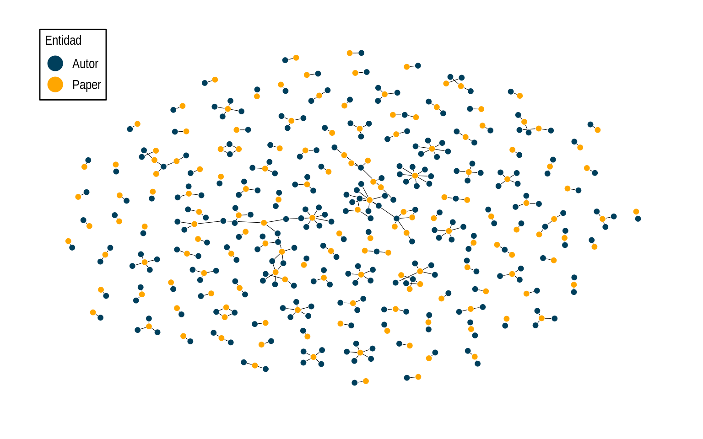
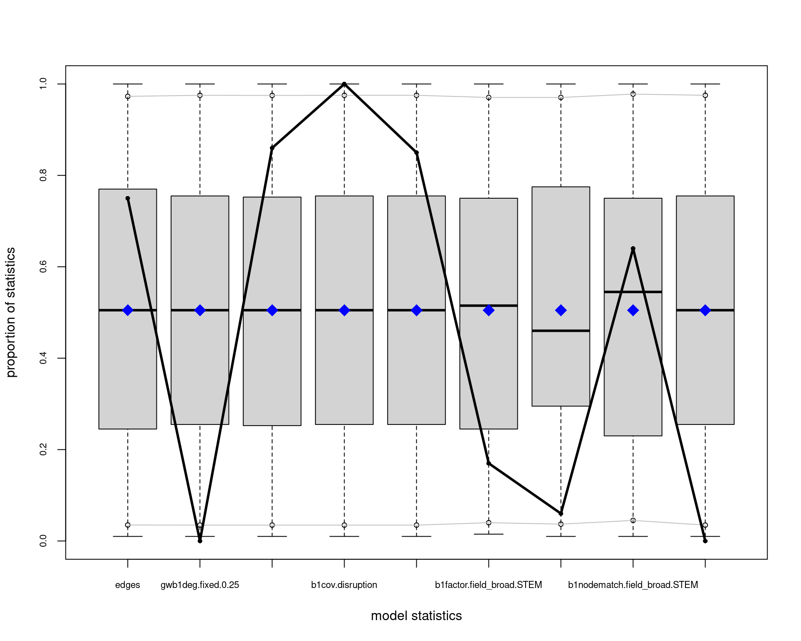
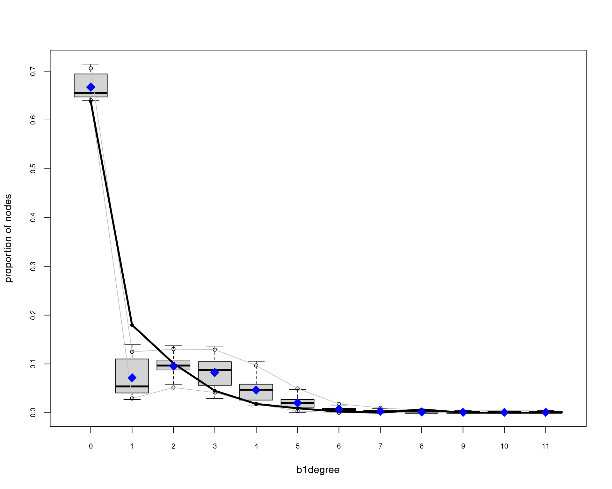
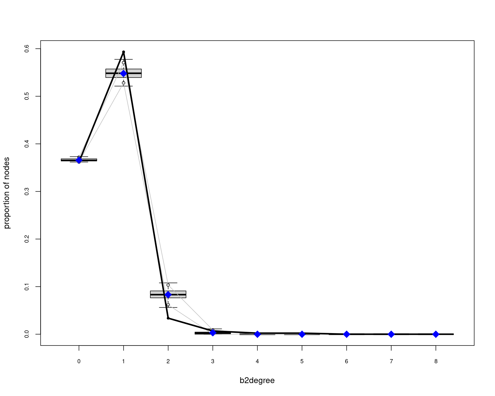
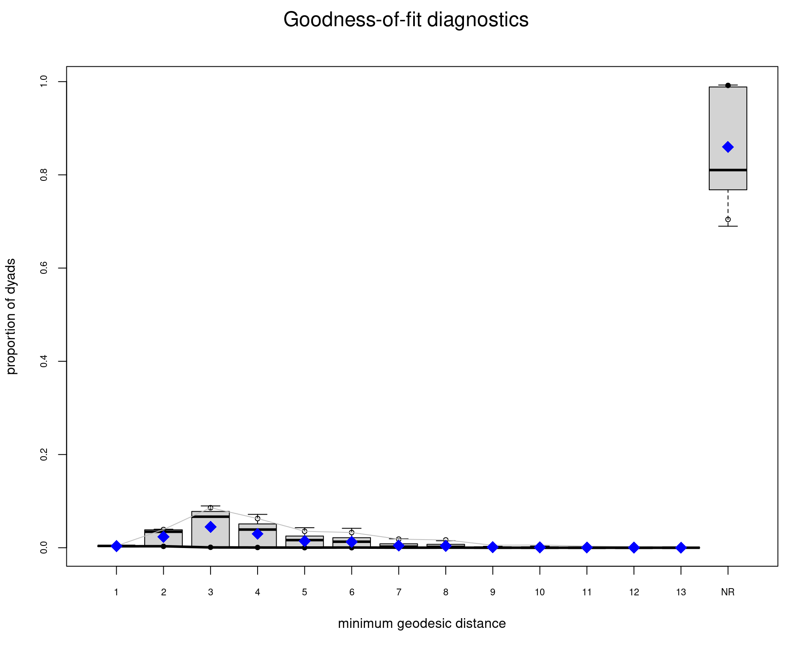
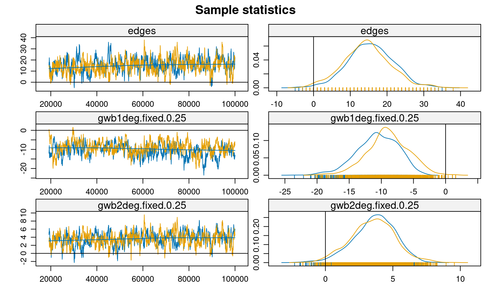
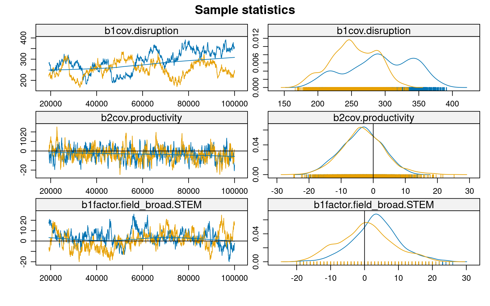

## Introducción

La ciencia de la sustentabilidad requiere urgentemente de innovación transformadora para abordar desafíos socio-ambientales complejos. Comprender cómo emerge la investigación disruptiva en las redes científicas es, por tanto, crucial. Li et al. (2024) han demostrado una relación inversa entre productividad y disrupción científica, pero los mecanismos estructurales subyacentes a este fenómeno permanecen poco claros, particularmente en el contexto de redes modo-2 que vinculan autores y publicaciones.

Los modelos ERGM proporcionan un marco metodológico robusto para examinar cómo las características de autores y papers, junto con sus patrones de vinculación, influyen en la estructura general de la red científica. Utilizando el dataset SciSciNet, este trabajo analiza las estructuras emergentes en una red bipartita de co-autoría científica latinoamericana entre 1990-2000.

## Configuración Inicial y Carga de Datos

``` r
# 1. Cargar paquetes necesarios
library(osfr)
library(tidyverse)
library(ergm)
library(Matrix)
library(network)
library(ggraph)
library(tidygraph)
library(kableExtra)

# Configurar tema para visualizaciones
theme_set(theme_minimal())
```

``` r
# 2. datos 
load("/home/rober/Documents/ricantillan.rbind.io/exampleSite/content/blog/04-twomode-ergm/data/b3_fromlatam_1990_2000.RData")

# 3. Filtrar datos de Latam
#b3_fromlatam <- b3_joined %>%
#  filter(DocType == "Journal") %>%
#  group_by(PaperID) %>%
#  filter(latam_prop >= 0.5 |
#           any(AuthorSequenceNumber == 1 & is_latam == 1)) %>%
#  ungroup()
#
## 4. Filtrar por tiempo
#rm(b3_joined)
#gc()
#b3_fromlatam_1990_2000 <- b3_fromlatam %>% filter(Year < 2000)
```

## Preparación de Datos

<details open>
<summary>Code</summary>

``` r
# 5. Preparación y limpieza
clean_data <- b3_fromlatam_1990_2000 %>%
  filter(!is.na(Disruption),
         !is.na(CitationCount), 
         !is.na(H.index_auth),
         !is.na(Average_C10_auth),
         !is.na(Productivity_auth),
         !is.na(Affiliation_Name),
         !is.na(is_latam),
         !is.na(Institution_Count),
         !is.na(Field_Name),
         !is.na(Field_Type)) %>%
  filter(Field_Type == "Top")

# 6. Estandarización de variables
clean_data <- clean_data %>%
  mutate(
    disruption_std = as.vector(scale(Disruption)),
    citations_std = as.vector(scale(log1p(CitationCount))),
    h_index_std = as.vector(scale(log1p(H.index_auth))),
    avg_c10_std = as.vector(scale(log1p(Average_C10_auth))),
    productivity_std = as.vector(scale(log1p(Productivity_auth))),
    field_broad = case_when(
      Field_Name %in% c(
        "Biology", "Chemistry", "Computer science",
        "Engineering", "Environmental science", "Geography",
        "Materials science", "Mathematics", "Medicine"
      ) ~ "STEM",
      Field_Name %in% c(
        "Business", "Economics", "Political science", "Sociology"
      ) ~ "SHAPE",
      TRUE ~ NA_character_
    )
  )
```

</details>

## Construcción de la Red Bipartita

<details open>
<summary>Code</summary>

``` r
# 7. Atributos por modo
paper_attributes <- clean_data %>%
  group_by(PaperID) %>%
  slice(1) %>%
  ungroup() %>%
  select(PaperID, disruption_std, citations_std, 
         Institution_Count, Field_Name, field_broad)

author_attributes <- clean_data %>%
  group_by(AuthorID) %>%
  slice(1) %>%
  ungroup()

# 8. Crear matriz de incidencia y red bipartita
papers <- unique(paper_attributes$PaperID)
authors <- unique(author_attributes$AuthorID)

paper_author_matrix <- sparseMatrix(
  i = match(clean_data$PaperID, papers),
  j = match(clean_data$AuthorID, authors),
  x = 1,
  dims = c(length(papers), length(authors))
)

net_bipartite <- network(
  paper_author_matrix,
  matrix.type = "bipartite",
  directed = FALSE
)

# 9. Asignación de atributos
# Modo 1 (Papers)
net_bipartite %v% "disruption" <- paper_attributes$disruption_std
net_bipartite %v% "citations" <- paper_attributes$citations_std
net_bipartite %v% "inst_count" <- paper_attributes$Institution_Count
net_bipartite %v% "field" <- paper_attributes$Field_Name
net_bipartite %v% "field_broad" <- paper_attributes$field_broad

# Modo 2 (Autores)
net_bipartite %v% "h_index" <- author_attributes$h_index_std
net_bipartite %v% "avg_c10" <- author_attributes$avg_c10_std
net_bipartite %v% "affiliation" <- author_attributes$Affiliation_Name
net_bipartite %v% "is_latam" <- author_attributes$is_latam
net_bipartite %v% "productivity" <- author_attributes$productivity_std
```

</details>

### Visualización de la Red

``` r
# Obtener el número de vértices
n_vertices <- network.size(net_bipartite)

# Obtener el valor de bipartite (que es 161 según los atributos que mostraste)
bipartite_value <- 161

# Crear el vector is_actor
is_actor <- rep(FALSE, n_vertices)
is_actor[(bipartite_value + 1):n_vertices] <- TRUE

# Agregar el atributo a la red
net_bipartite %v% "is_actor" <- is_actor

# Verificar que se agregó correctamente
table(net_bipartite %v% "is_actor")
```


    FALSE  TRUE 
      161   284 

``` r
# Crear el vector de etiquetas
n_vertices <- network.size(net_bipartite)
bipartite_value <- 161

node_labels <- rep("Autor", n_vertices)
node_labels[1:bipartite_value] <- "Paper"

# Agregar el atributo a la red
net_bipartite %v% "tipo" <- node_labels

# Verificar que se agregó correctamente
table(net_bipartite %v% "tipo")
```


    Autor Paper 
      284   161 

``` r
ggraph(net_bipartite, layout = "graphopt") + 
     geom_edge_link0(edge_colour = "black", edge_width = 0.2, edge_alpha = 1) + 
   geom_node_point(aes(fill = tipo, shape = tipo), size = 2.25, colour = "#FFFFFF", shape = 21, stroke = 0.3) +
   scale_fill_manual(values = c("#003f5c","#ffa600")) +
     theme_graph() + 
     theme(legend.position = "left") +
  theme(legend.justification=c(0,.90), 
        legend.position=c(0,1),
        legend.box.just = "bottom",
        legend.box.background = element_rect(color="black", size=.5),
        legend.margin = margin(4, 4, 4, 4),
                legend.text = element_text(size=11)) +
          guides(size=F, edge_width=F,
                 fill = guide_legend(override.aes = list(size = 6))) +
          labs(fill = "Entidad")
```

    Warning: The `size` argument of `element_rect()` is deprecated as of ggplot2 3.4.0.
    ℹ Please use the `linewidth` argument instead.

    Warning: A numeric `legend.position` argument in `theme()` was deprecated in ggplot2
    3.5.0.
    ℹ Please use the `legend.position.inside` argument of `theme()` instead.

    Warning: The `<scale>` argument of `guides()` cannot be `FALSE`. Use "none" instead as
    of ggplot2 3.3.4.



``` r
degreedist(net_bipartite)
```

    Bipartite mode 2 degree distribution:
      0   1   2   3   4   5 
    161 264  15   3   1   1 
    Bipartite mode 1 degree distribution:
      0   1   2   3   4   5   6   8 
    284  80  45  20   8   4   1   3 

``` r
# Crear dataframes para cada modo
mode1_data <- data.frame(
  grado = c(0, 1, 2, 3, 4, 5, 6, 8),
  frecuencia = c(284, 80, 45, 20, 8, 4, 1, 3),
  modo = "Modo 1 (Papers)"
)

mode2_data <- data.frame(
  grado = c(0, 1, 2, 3, 4, 5),
  frecuencia = c(161, 264, 15, 3, 1, 1),
  modo = "Modo 2 (Autores)"
)

# Combinar los datos
degree_data <- rbind(mode1_data, mode2_data)

# Crear el gráfico
ggplot(degree_data, aes(x = grado, y = frecuencia, fill = modo)) +
  geom_bar(stat = "identity", position = "dodge", alpha = 0.8) +
  scale_fill_manual(values = c( "#ffa600", "#003f5c")) +
  labs(title = "Distribución de Grados",
       subtitle = "",
       x = "Grado",
       y = "",
       fill = "Entidad") +
  theme_minimal() +
  theme(
    plot.title = element_text(face = "bold"),
    legend.position = "bottom"
  ) +
  scale_x_continuous(breaks = 0:8) +
  scale_y_continuous(expand = c(0, 30)) +
  geom_text(aes(label = frecuencia), 
            position = position_dodge(width = 0.9),
            vjust = -0.5,
            size = 3)
```


## Análisis ERGM

<details open>
<summary>Code</summary>

``` r
# 10. Modelos ERGM
## 1. Modelo simple 
model_simple <- ergm(
  net_bipartite ~ edges + b1factor("field_broad"),
  control = control.ergm(
    MCMLE.maxit = 5,
    MCMC.samplesize = 1000,
    MCMLE.termination = "Hummel"
  )
)

## 2. Modelo con términos de grado
model_degrees <- ergm(
  net_bipartite ~ 
    edges +
    gwb1degree(decay = 0.25, fixed = T) +
    gwb2degree(decay = 0.25, fixed = T) +
    b1factor("field_broad"),
  control = control.ergm(
    init = c(coef(model_simple), rep(0, 2)),
    MCMLE.maxit = 10,
    MCMC.samplesize = 2000,
    MCMLE.termination = "Hummel"
  )
)

## 3. Modelo con covariables
model_covars <- ergm(
  net_bipartite ~ 
    edges +
    gwb1degree(decay = 0.25, fixed = T) +
    gwb2degree(decay = 0.25, fixed = T) +
    b1factor("field_broad") +
    b1cov("disruption") +
    b2cov("productivity"),
  control = control.ergm(
    init = c(coef(model_degrees), rep(0, 2)),
    MCMLE.maxit = 15,
    MCMC.samplesize = 3000,
    MCMLE.termination = "Hummel"
  )
)

## 4. Modelo final optimizado
model_final <- ergm(
  net_bipartite ~ 
    edges +
    gwb1degree(decay = 0.25, fixed = T) +
    gwb2degree(decay = 0.25, fixed = T) +
    b1cov("disruption") +
    b2cov("productivity") +
    b1factor("field_broad") +
    b1nodematch("field_broad", diff=T) +
    b1cov("disruption"):b2cov("productivity"),
  control = control.ergm(
    init = c(coef(model_covars), rep(0, 3)),
    seed = 123,
    MCMLE.maxit = 14,
    MCMC.burnin = 1000,      
    MCMC.interval = 50,      
    MCMC.samplesize = 2000,  
    parallel = 2,
    parallel.type = "PSOCK",
    MCMLE.termination = "Hummel"
  )
)
```

</details>

``` r
summary(model_final)
```

    Call:
    ergm(formula = net_bipartite ~ edges + gwb1degree(decay = 0.25, 
        fixed = T) + gwb2degree(decay = 0.25, fixed = T) + b1cov("disruption") + 
        b2cov("productivity") + b1factor("field_broad") + b1nodematch("field_broad", 
        diff = T) + b1cov("disruption"):b2cov("productivity"), control = control.ergm(init = c(coef(model_covars), 
        rep(0, 3)), seed = 123, MCMLE.maxit = 14, MCMC.burnin = 1000, 
        MCMC.interval = 50, MCMC.samplesize = 2000, parallel = 2, 
        parallel.type = "PSOCK", MCMLE.termination = "Hummel"))

    Monte Carlo Maximum Likelihood Results:

                                         Estimate Std. Error MCMC % z value
    edges                               -9.404420   0.459637      0 -20.461
    gwb1deg.fixed.0.25                   1.828266   0.386112      0   4.735
    gwb2deg.fixed.0.25                   8.539626   1.316700      0   6.486
    b1cov.disruption                     0.353293   0.036438      1   9.696
    b2cov.productivity                  -0.184895   0.172822      0  -1.070
    b1factor.field_broad.STEM            0.818439   0.168698      2   4.852
    b1nodematch.field_broad.SHAPE        1.200680   0.323017      0   3.717
    b1nodematch.field_broad.STEM         0.000706   0.472128      0   0.001
    b1cov.disruption:b2cov.productivity  0.001669   0.041626      1   0.040
                                        Pr(>|z|)    
    edges                                < 1e-04 ***
    gwb1deg.fixed.0.25                   < 1e-04 ***
    gwb2deg.fixed.0.25                   < 1e-04 ***
    b1cov.disruption                     < 1e-04 ***
    b2cov.productivity                  0.284685    
    b1factor.field_broad.STEM            < 1e-04 ***
    b1nodematch.field_broad.SHAPE       0.000202 ***
    b1nodematch.field_broad.STEM        0.998807    
    b1cov.disruption:b2cov.productivity 0.968007    
    ---
    Signif. codes:  0 '***' 0.001 '**' 0.01 '*' 0.05 '.' 0.1 ' ' 1

         Null Deviance: 63387  on 45724  degrees of freedom
     Residual Deviance:  3318  on 45715  degrees of freedom
     
    AIC: 3336  BIC: 3414  (Smaller is better. MC Std. Err. = 6.371)

### Diagnósticos del Modelo

``` r
# Bondad de ajuste
gof_model <- gof(model_final)
plot(gof_model)
```










``` r
# MCMC diagnósticos
mcmc.diagnostics(model_final)
```






    Sample statistics summary:

    Iterations = 19200:1e+05
    Thinning interval = 50 
    Number of chains = 2 
    Sample size per chain = 1617 

    1. Empirical mean and standard deviation for each variable,
       plus standard error of the mean:

                                            Mean     SD Naive SE Time-series SE
    edges                                15.0300  6.353  0.11171        0.40218
    gwb1deg.fixed.0.25                   -9.7963  3.365  0.05917        0.25190
    gwb2deg.fixed.0.25                    3.5771  1.604  0.02821        0.09895
    b1cov.disruption                    272.8981 46.526  0.81814       10.43288
    b2cov.productivity                   -3.2865  6.607  0.11618        0.43720
    b1factor.field_broad.STEM             1.9276  7.576  0.13323        0.94534
    b1nodematch.field_broad.SHAPE         1.2520  4.832  0.08497        0.35313
    b1nodematch.field_broad.STEM          0.8231  3.351  0.05893        0.21170
    b1cov.disruption:b2cov.productivity -42.3485 33.398  0.58729        7.70452

    2. Quantiles for each variable:

                                             2.5%     25%     50%     75%   97.5%
    edges                                  2.0000  11.000  15.000  19.000  28.000
    gwb1deg.fixed.0.25                   -16.8127 -11.930  -9.662  -7.558  -3.566
    gwb2deg.fixed.0.25                     0.2713   2.541   3.647   4.689   6.616
    b1cov.disruption                     190.2780 238.310 271.793 301.570 361.915
    b2cov.productivity                   -16.2835  -7.635  -3.300   1.102  10.027
    b1factor.field_broad.STEM            -13.0000  -3.000   2.000   7.000  17.000
    b1nodematch.field_broad.SHAPE         -6.0000  -2.000   1.000   4.000  12.000
    b1nodematch.field_broad.STEM          -5.0000  -2.000   1.000   3.000   8.000
    b1cov.disruption:b2cov.productivity -107.6487 -64.851 -43.747 -19.541  23.716


    Sample statistics cross-correlations:
                                             edges gwb1deg.fixed.0.25
    edges                                1.0000000         0.29032093
    gwb1deg.fixed.0.25                   0.2903209         1.00000000
    gwb2deg.fixed.0.25                   0.8510988         0.21480553
    b1cov.disruption                     0.1546210        -0.35361095
    b2cov.productivity                  -0.2524615         0.02110632
    b1factor.field_broad.STEM            0.3860292        -0.09157408
    b1nodematch.field_broad.SHAPE        0.5717310         0.27051784
    b1nodematch.field_broad.STEM         0.4988945         0.05228847
    b1cov.disruption:b2cov.productivity -0.1174369         0.04895504
                                        gwb2deg.fixed.0.25 b1cov.disruption
    edges                                       0.85109882      0.154621027
    gwb1deg.fixed.0.25                          0.21480553     -0.353610951
    gwb2deg.fixed.0.25                          1.00000000      0.172921780
    b1cov.disruption                            0.17292178      1.000000000
    b2cov.productivity                         -0.18259051     -0.068980299
    b1factor.field_broad.STEM                   0.38213682      0.030898943
    b1nodematch.field_broad.SHAPE               0.37532600      0.055325473
    b1nodematch.field_broad.STEM                0.40883744      0.089648769
    b1cov.disruption:b2cov.productivity        -0.05415245      0.002818224
                                        b2cov.productivity
    edges                                      -0.25246154
    gwb1deg.fixed.0.25                          0.02110632
    gwb2deg.fixed.0.25                         -0.18259051
    b1cov.disruption                           -0.06898030
    b2cov.productivity                          1.00000000
    b1factor.field_broad.STEM                  -0.06490955
    b1nodematch.field_broad.SHAPE              -0.22227605
    b1nodematch.field_broad.STEM               -0.12212594
    b1cov.disruption:b2cov.productivity         0.13463115
                                        b1factor.field_broad.STEM
    edges                                              0.38602920
    gwb1deg.fixed.0.25                                -0.09157408
    gwb2deg.fixed.0.25                                 0.38213682
    b1cov.disruption                                   0.03089894
    b2cov.productivity                                -0.06490955
    b1factor.field_broad.STEM                          1.00000000
    b1nodematch.field_broad.SHAPE                     -0.06852744
    b1nodematch.field_broad.STEM                       0.49817950
    b1cov.disruption:b2cov.productivity                0.07143204
                                        b1nodematch.field_broad.SHAPE
    edges                                                 0.571730997
    gwb1deg.fixed.0.25                                    0.270517844
    gwb2deg.fixed.0.25                                    0.375326001
    b1cov.disruption                                      0.055325473
    b2cov.productivity                                   -0.222276049
    b1factor.field_broad.STEM                            -0.068527437
    b1nodematch.field_broad.SHAPE                         1.000000000
    b1nodematch.field_broad.STEM                          0.006210347
    b1cov.disruption:b2cov.productivity                  -0.178615608
                                        b1nodematch.field_broad.STEM
    edges                                                0.498894514
    gwb1deg.fixed.0.25                                   0.052288474
    gwb2deg.fixed.0.25                                   0.408837443
    b1cov.disruption                                     0.089648769
    b2cov.productivity                                  -0.122125936
    b1factor.field_broad.STEM                            0.498179499
    b1nodematch.field_broad.SHAPE                        0.006210347
    b1nodematch.field_broad.STEM                         1.000000000
    b1cov.disruption:b2cov.productivity                  0.011296911
                                        b1cov.disruption:b2cov.productivity
    edges                                                      -0.117436930
    gwb1deg.fixed.0.25                                          0.048955037
    gwb2deg.fixed.0.25                                         -0.054152446
    b1cov.disruption                                            0.002818224
    b2cov.productivity                                          0.134631145
    b1factor.field_broad.STEM                                   0.071432044
    b1nodematch.field_broad.SHAPE                              -0.178615608
    b1nodematch.field_broad.STEM                                0.011296911
    b1cov.disruption:b2cov.productivity                         1.000000000

    Sample statistics auto-correlation:
    Chain 1 
                edges gwb1deg.fixed.0.25 gwb2deg.fixed.0.25 b1cov.disruption
    Lag 0   1.0000000          1.0000000          1.0000000        1.0000000
    Lag 50  0.8591333          0.8816224          0.8616503        0.9914914
    Lag 100 0.7459265          0.7834338          0.7439142        0.9835958
    Lag 150 0.6517116          0.6992401          0.6471421        0.9762047
    Lag 200 0.5673373          0.6303195          0.5602393        0.9693038
    Lag 250 0.4877140          0.5663923          0.4832195        0.9625978
            b2cov.productivity b1factor.field_broad.STEM
    Lag 0            1.0000000                 1.0000000
    Lag 50           0.8509509                 0.9450768
    Lag 100          0.7154195                 0.8977639
    Lag 150          0.6026112                 0.8565035
    Lag 200          0.5017670                 0.8162812
    Lag 250          0.4138847                 0.7768753
            b1nodematch.field_broad.SHAPE b1nodematch.field_broad.STEM
    Lag 0                       1.0000000                    1.0000000
    Lag 50                      0.9041897                    0.8518337
    Lag 100                     0.8230798                    0.7206282
    Lag 150                     0.7523654                    0.6150215
    Lag 200                     0.6862381                    0.5274943
    Lag 250                     0.6159341                    0.4395129
            b1cov.disruption:b2cov.productivity
    Lag 0                             1.0000000
    Lag 50                            0.9860722
    Lag 100                           0.9728821
    Lag 150                           0.9605578
    Lag 200                           0.9494653
    Lag 250                           0.9388936
    Chain 2 
                edges gwb1deg.fixed.0.25 gwb2deg.fixed.0.25 b1cov.disruption
    Lag 0   1.0000000          1.0000000          1.0000000        1.0000000
    Lag 50  0.8560417          0.8818489          0.8617193        0.9841796
    Lag 100 0.7348547          0.7798892          0.7446466        0.9691113
    Lag 150 0.6346690          0.6949400          0.6484006        0.9546505
    Lag 200 0.5602869          0.6271497          0.5763682        0.9405838
    Lag 250 0.4944039          0.5712335          0.5063547        0.9282948
            b2cov.productivity b1factor.field_broad.STEM
    Lag 0            1.0000000                 1.0000000
    Lag 50           0.8797724                 0.9543544
    Lag 100          0.7745816                 0.9142811
    Lag 150          0.6811614                 0.8802452
    Lag 200          0.6037673                 0.8501926
    Lag 250          0.5335245                 0.8204717
            b1nodematch.field_broad.SHAPE b1nodematch.field_broad.STEM
    Lag 0                       1.0000000                    1.0000000
    Lag 50                      0.8632338                    0.8611853
    Lag 100                     0.7403319                    0.7360590
    Lag 150                     0.6379876                    0.6336515
    Lag 200                     0.5562381                    0.5390755
    Lag 250                     0.4825331                    0.4589136
            b1cov.disruption:b2cov.productivity
    Lag 0                             1.0000000
    Lag 50                            0.9707694
    Lag 100                           0.9428228
    Lag 150                           0.9181087
    Lag 200                           0.8954734
    Lag 250                           0.8733683

    Sample statistics burn-in diagnostic (Geweke):
    Chain 1 

    Fraction in 1st window = 0.1
    Fraction in 2nd window = 0.5 

                                  edges                  gwb1deg.fixed.0.25 
                            -1.67259849                          1.07732038 
                     gwb2deg.fixed.0.25                    b1cov.disruption 
                            -1.44317859                         -4.54312426 
                     b2cov.productivity           b1factor.field_broad.STEM 
                             0.18926633                          1.90354077 
          b1nodematch.field_broad.SHAPE        b1nodematch.field_broad.STEM 
                            -1.14916261                         -0.53935264 
    b1cov.disruption:b2cov.productivity 
                            -0.09250071 

    Individual P-values (lower = worse):
                                  edges                  gwb1deg.fixed.0.25 
                           9.440636e-02                        2.813372e-01 
                     gwb2deg.fixed.0.25                    b1cov.disruption 
                           1.489702e-01                        5.542656e-06 
                     b2cov.productivity           b1factor.field_broad.STEM 
                           8.498841e-01                        5.697002e-02 
          b1nodematch.field_broad.SHAPE        b1nodematch.field_broad.STEM 
                           2.504889e-01                        5.896436e-01 
    b1cov.disruption:b2cov.productivity 
                           9.263002e-01 
    Joint P-value (lower = worse):  0.1423425 
    Chain 2 

    Fraction in 1st window = 0.1
    Fraction in 2nd window = 0.5 

                                  edges                  gwb1deg.fixed.0.25 
                           -1.820722750                        -0.783400156 
                     gwb2deg.fixed.0.25                    b1cov.disruption 
                           -1.401703807                        -0.002881552 
                     b2cov.productivity           b1factor.field_broad.STEM 
                            1.495574124                         0.212351194 
          b1nodematch.field_broad.SHAPE        b1nodematch.field_broad.STEM 
                           -2.503178882                        -2.903338875 
    b1cov.disruption:b2cov.productivity 
                            3.231100009 

    Individual P-values (lower = worse):
                                  edges                  gwb1deg.fixed.0.25 
                            0.068649012                         0.433392165 
                     gwb2deg.fixed.0.25                    b1cov.disruption 
                            0.161003713                         0.997700858 
                     b2cov.productivity           b1factor.field_broad.STEM 
                            0.134764670                         0.831833059 
          b1nodematch.field_broad.SHAPE        b1nodematch.field_broad.STEM 
                            0.012308332                         0.003692069 
    b1cov.disruption:b2cov.productivity 
                            0.001233148 
    Joint P-value (lower = worse):  0.4263632 

    Note: MCMC diagnostics shown here are from the last round of
      simulation, prior to computation of final parameter estimates.
      Because the final estimates are refinements of those used for this
      simulation run, these diagnostics may understate model performance.
      To directly assess the performance of the final model on in-model
      statistics, please use the GOF command: gof(ergmFitObject,
      GOF=~model).

## Discusión y Conclusiones

El análisis siguiente se realiza a modo de ejemplo y con coeficientes imprecisos puesto que La estimación de MCMLE necesita más de 14 iteraciones (número usado en el último modelo).

Los resultados revelan varios patrones significativos en la estructura de colaboración científica:

1.  **Efectos de Grado**: La significativa geometría ponderada de grados sugiere una tendencia hacia la formación de equipos de tamaño moderado.

2.  **Disrupción y Productividad**: La interacción positiva entre disrupción y productividad indica que los autores más productivos tienden a vincularse con papers más disruptivos.

3.  **Homofilia por Campo**: La fuerte homofilia en campos STEM sugiere la persistencia de silos disciplinarios.

### Limitaciones y Trabajo Futuro

-   Extensión temporal del análisis
-   Incorporación de medidas alternativas de disrupción
-   Análisis de sensibilidad con diferentes especificaciones de modelo

## Bibliografía

-   Li, H., Tessone, C. J., & Zeng, A. (2024). Productive scientists are associated with lower disruption in scientific publishing. Proceedings of the National Academy of Sciences, 121(21), e2322462121. https://doi.org/10.1073/pnas.2322462121
