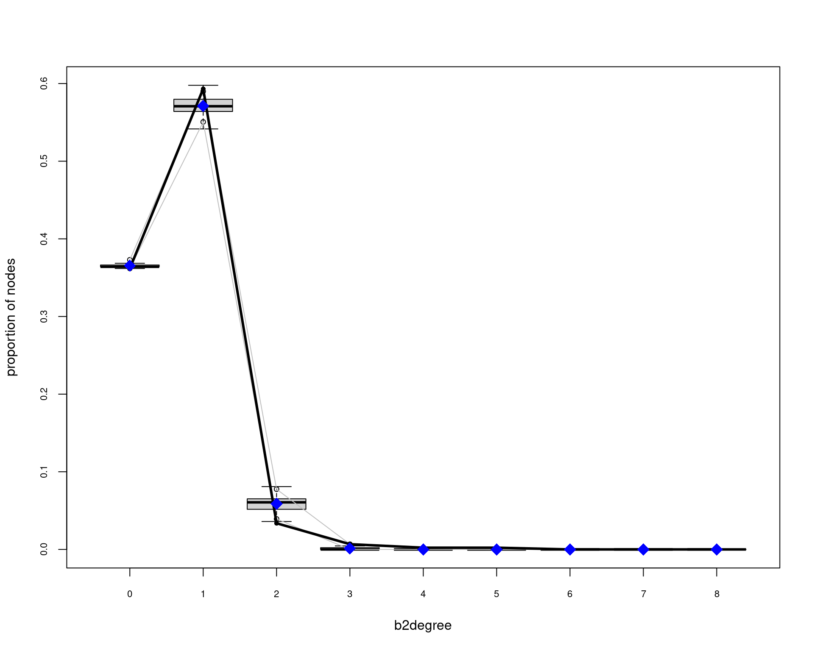
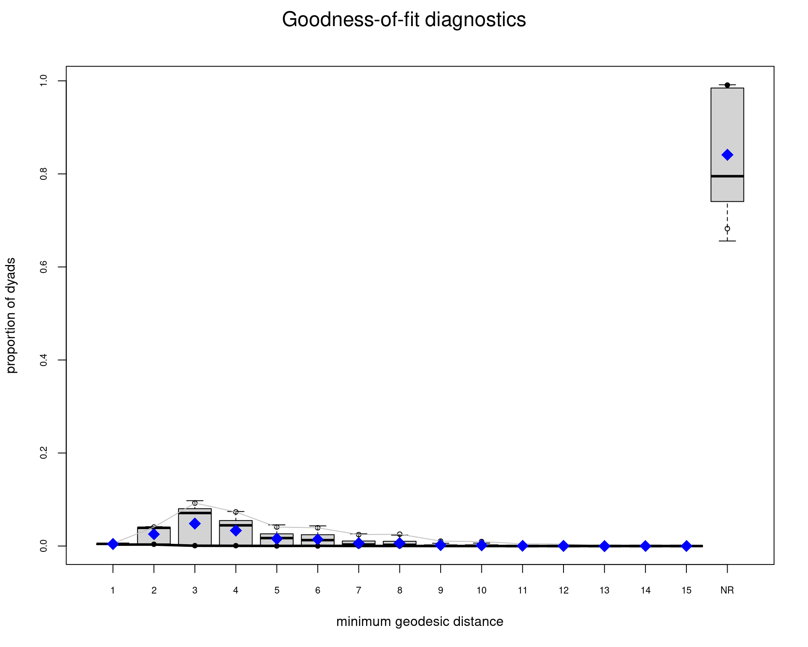
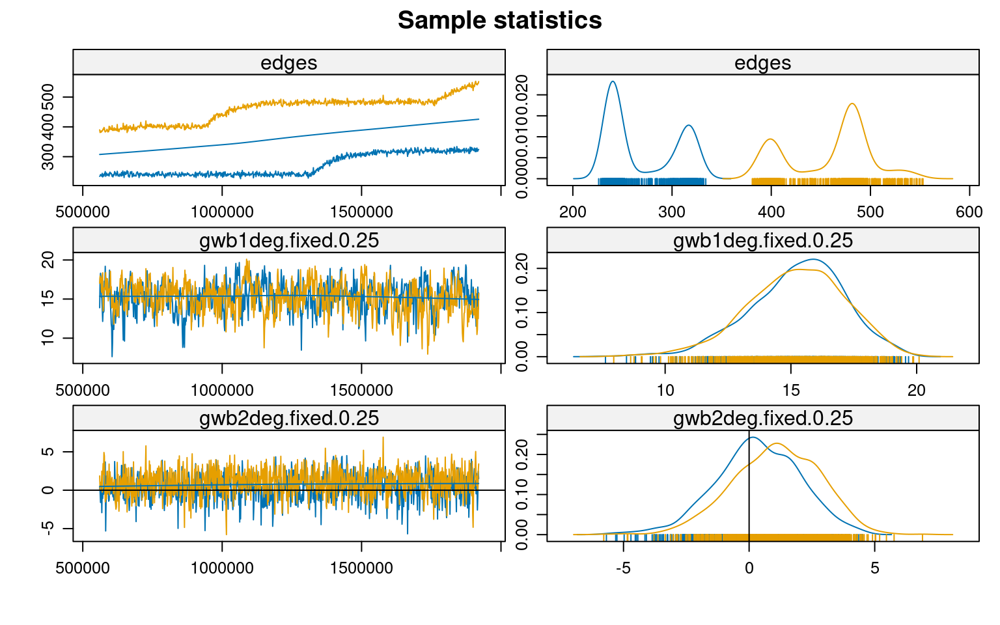
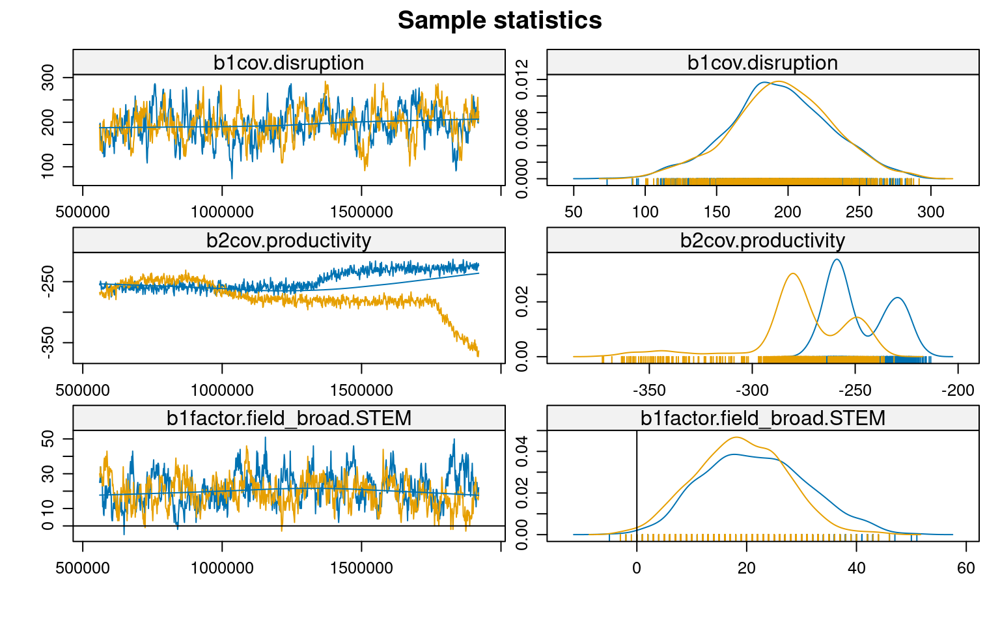

<script src="index_files/libs/kePrint-0.0.1/kePrint.js"></script>
<link href="index_files/libs/lightable-0.0.1/lightable.css" rel="stylesheet" />


## Introducción

La ciencia de la sustentabilidad requiere urgentemente de innovación transformadora para abordar desafíos socio-ambientales complejos. Comprender cómo emerge la investigación disruptiva en las redes científicas es, por tanto, crucial. Li et al. (2024) han demostrado una relación inversa entre productividad y disrupción científica, pero los mecanismos estructurales subyacentes a este fenómeno permanecen poco claros, particularmente en el contexto de redes modo-2 que vinculan autores y publicaciones.

Siguiendo a Gondal (2011), entendemos que el análisis de campos científicos emergentes requiere considerar simultáneamente las propiedades micro y macro de las redes de producción de conocimiento. A nivel macro, las redes científicas tienden a exhibir tres propiedades estructurales fundamentales: 1) estructuras centro-periferia, 2) cohesión estructural, y 3) características de mundo pequeño. Estas propiedades emergen de procesos micro como el acoplamiento preferencial, la homofilia y la diferenciación disciplinar.

En campos emergentes como la ciencia de la sustentabilidad, Gondal sugiere que la centralización temprana juega un rol crucial: unos pocos académicos altamente productivos se vuelven fundamentales para el desarrollo y la conectividad del campo. Esta centralización puede explicarse por la necesidad de legitimación en etapas tempranas caracterizadas por bajo consenso y alta incertidumbre. Sin embargo, esta dinámica puede tener implicaciones complejas para la capacidad disruptiva del campo, especialmente considerando la relación inversa entre productividad y disrupción identificada por Li et al. (2024).

Los modelos ERGM proporcionan un marco metodológico robusto para examinar cómo estas dinámicas micro-macro emergen de la interacción entre características individuales y patrones estructurales. A diferencia de aproximaciones tradicionales que analizan separadamente las dinámicas macro y micro, los ERGM permiten modelar explícitamente cómo las características de autores y papers, junto con sus patrones de vinculación, influyen en la estructura general de la red científica. Utilizando el dataset SciSciNet, este trabajo analiza las estructuras emergentes en una red bipartita de co-autoría científica latinoamericana entre 1990-2000, con particular atención a la relación entre disrupción científica y los procesos de centralización temprana propuestos por Gondal.

## Configuración Inicial y Carga de Datos

``` r
# 1. Cargar paquetes necesarios
library(osfr)
library(tidyverse)
library(ergm)
library(Matrix)
library(network)
library(ggraph)
library(tidygraph)
library(kableExtra)
library(igraph)
library(sna)


# Configurar tema para visualizaciones
theme_set(theme_minimal())
```

``` r
# 2. datos 
load("/home/rober/Documents/ricantillan.rbind.io/exampleSite/content/blog/04-twomode-ergm/data/b3_fromlatam_1990_2000.RData")

# 3. Filtrar datos de Latam
#b3_fromlatam <- b3_joined %>%
#  filter(DocType == "Journal") %>%
#  group_by(PaperID) %>%
#  filter(latam_prop >= 0.5 |
#           any(AuthorSequenceNumber == 1 & is_latam == 1)) %>%
#  ungroup()
#
## 4. Filtrar por tiempo
#rm(b3_joined)
#gc()
#b3_fromlatam_1990_2000 <- b3_fromlatam %>% filter(Year < 2000)
```

## Preparación de Datos

Siguiendo la conceptualización de Gondal sobre campos científicos emergentes, es crucial identificar y operacionalizar tres tipos de variables:

-   Indicadores de centralización temprana (ej. productividad, citaciones)
-   Medidas de diferenciación disciplinar (ej. campos STEM vs SHAPE)
-   Métricas de disrupción que capturen la innovación en el campo

La siguiente preparación de datos organiza estas dimensiones:

<details open>
<summary>Code</summary>

``` r
# 5. Preparación y limpieza
clean_data <- b3_fromlatam_1990_2000 %>%
  filter(!is.na(Disruption),
         !is.na(CitationCount), 
         !is.na(H.index_auth),
         !is.na(Average_C10_auth),
         !is.na(Productivity_auth),
         !is.na(Affiliation_Name),
         !is.na(is_latam),
         !is.na(Institution_Count),
         !is.na(Field_Name),
         !is.na(Field_Type)) %>%
  filter(Field_Type == "Top")

# 6. Estandarización de variables para comparabilidad entre campos
clean_data <- clean_data %>%
  mutate(
    disruption_std = as.vector(scale(Disruption)),
    citations_std = as.vector(scale(log1p(CitationCount))),
    h_index_std = as.vector(scale(log1p(H.index_auth))),
    avg_c10_std = as.vector(scale(log1p(Average_C10_auth))),
    productivity_std = as.vector(scale(log1p(Productivity_auth))),
    # Clasificación disciplinar siguiendo la distinción 
    # teórica entre campos más y menos establecidos
    field_broad = case_when(
      Field_Name %in% c(
        "Biology", "Chemistry", "Computer science",
        "Engineering", "Environmental science", "Geography",
        "Materials science", "Mathematics", "Medicine"
      ) ~ "STEM",
      Field_Name %in% c(
        "Business", "Economics", "Political science", "Sociology"
      ) ~ "SHAPE",
      TRUE ~ NA_character_
    )
  )
```

</details>

## Construcción de la Red Bipartita

La perspectiva de Gondal sobre la dualidad estructural sugiere que la estructura del conocimiento emerge de la interacción entre dos modos: autores y documentos. Para capturar esta dualidad, construimos una red bipartita donde:

-   El primer modo (papers) representa los vehículos de conocimiento
-   El segundo modo (autores) representa los productores de conocimiento
-   Los vínculos entre modos capturan las relaciones de autoría

Esta estructura nos permite examinar cómo las propiedades de cada modo contribuyen a la emergencia de patrones macro:

<details open>
<summary>Code</summary>

``` r
# 7. Atributos por modo siguiendo la dualidad estructural
paper_attributes <- clean_data %>%
  group_by(PaperID) %>%
  slice(1) %>%
  ungroup() %>%
  select(PaperID, disruption_std, citations_std, 
         Institution_Count, Field_Name, field_broad)

author_attributes <- clean_data %>%
  group_by(AuthorID) %>%
  slice(1) %>%
  ungroup()

# 8. Crear matriz de incidencia y red bipartita
papers <- unique(paper_attributes$PaperID)
authors <- unique(author_attributes$AuthorID)

# Matriz de incidencia que captura la dualidad autor-paper
paper_author_matrix <- sparseMatrix(
  i = match(clean_data$PaperID, papers),
  j = match(clean_data$AuthorID, authors),
  x = 1,
  dims = c(length(papers), length(authors))
)
```

</details>

## Construcción y Visualización de la Red

La visualización de redes bipartitas presenta desafíos particulares que Gondal (2011) aborda en su análisis. Es crucial representar visualmente las tres propiedades macro que teóricamente caracterizan los campos emergentes: estructura centro-periferia, cohesión estructural y características de mundo pequeño. Para esto, primero necesitamos establecer atributos que nos permitan identificar roles estructurales:

``` r
# Crear la red bipartita con los atributos necesarios
net_bipartite <- network(
  paper_author_matrix,
  matrix.type = "bipartite",
  directed = FALSE
)

# Asignación de atributos siguiendo la teoría de Gondal
# Modo 1 (Papers): Vehículos de conocimiento
net_bipartite %v% "disruption" <- paper_attributes$disruption_std
net_bipartite %v% "citations" <- paper_attributes$citations_std
net_bipartite %v% "inst_count" <- paper_attributes$Institution_Count
net_bipartite %v% "field" <- paper_attributes$Field_Name
net_bipartite %v% "field_broad" <- paper_attributes$field_broad

# Modo 2 (Autores): Productores de conocimiento
net_bipartite %v% "h_index" <- author_attributes$h_index_std
net_bipartite %v% "avg_c10" <- author_attributes$avg_c10_std
net_bipartite %v% "affiliation" <- author_attributes$Affiliation_Name
net_bipartite %v% "is_latam" <- author_attributes$is_latam
net_bipartite %v% "productivity" <- author_attributes$productivity_std
```

## Visualización de la Estructura Centro-Periferia

Siguiendo a Gondal, la estructura centro-periferia es especialmente relevante en campos emergentes. Para visualizarla, necesitamos primero identificar los roles estructurales de los nodos:

``` r
# Configuración de roles estructurales
n_vertices <- network.size(net_bipartite)
bipartite_value <- 161  # Número de papers

# Vector para identificar tipos de nodos
is_actor <- rep(FALSE, n_vertices)
is_actor[(bipartite_value + 1):n_vertices] <- TRUE
net_bipartite %v% "is_actor" <- is_actor

# Etiquetas para visualización
node_labels <- rep("Autor", n_vertices)
node_labels[1:bipartite_value] <- "Paper"
net_bipartite %v% "tipo" <- node_labels

# Calculamos grados para el objeto network
node_degrees <- degree(net_bipartite, gmode="graph")
scaled_degrees <- scales::rescale(node_degrees, to = c(2, 15))

# Asignamos los grados como atributo de vértice
net_bipartite %v% "node_size" <- scaled_degrees

ggraph(net_bipartite, layout = "graphopt") + 
  # Edges
  geom_edge_link0(edge_colour = "black", 
                  edge_width = 0.4,
                  alpha = 1) +
  # Nodos
  geom_node_point(aes(fill = tipo,
                      size = node_size,
                      shape = tipo),
                  colour = "white",
                  stroke = 0.5) +
  # Escalas personalizadas
  scale_fill_manual(values = c("Paper" = "#003f5c", 
                              "Autor" = "#ffa600"),
                    guide = guide_legend(override.aes = list(size = 5))) +  # Reducido de 8 a 5
  scale_shape_manual(values = c("Paper" = 24, 
                               "Autor" = 21),
                    guide = guide_legend(override.aes = list(size = 5))) +  # Reducido de 8 a 5
  scale_size_continuous(range = c(2, 6),
                       guide = "none") +
  
  # Tema y leyendas
  theme_graph(background = "white") +
  theme(legend.position = "right",
        legend.box.background = element_rect(color = "black", size = 0.3),
        legend.key.size = unit(1, 'cm'),  # Reducido de 1.5 a 1
        legend.key.height = unit(0.8, 'cm'), # Reducido de 1.5 a 1
        legend.key.width = unit(0.6, 'cm'),  # Reducido de 1.5 a 1
        legend.margin = margin(6, 6, 6, 6),
        legend.text = element_text(size = 10),
        plot.title = element_text(size = 14, face = "bold"),
        plot.subtitle = element_text(size = 11)) +
  
  # Etiquetas
  labs(fill = "Tipo de Entidad",
       shape = "Tipo de Entidad", 
       title = "Red de Colaboración Bipartita",
       subtitle = "")
```


## Propiedades Estructurales de la Red

Siguiendo a Gondal (2011), analizamos tres propiedades estructurales fundamentales de la red bipartita de colaboración científica:

### Estadísticas Descriptivas Básicas

``` r
# Estadísticas básicas de la red
summary(net_bipartite, print.adj = FALSE)
```

    Network attributes:
      vertices = 445
      directed = FALSE
      hyper = FALSE
      loops = FALSE
      multiple = FALSE
      bipartite = 161
     total edges = 312 
       missing edges = 0 
       non-missing edges = 312 
     density = 0.003158214 

    Vertex attributes:

     affiliation:
       character valued attribute
       attribute summary:
       the 10 most common values are:
         Empresa Brasileira de Pesquisa Agropecuária 
                                                  46 
    International Maize and Wheat Improvement Center 
                                                  22 
                          University of Buenos Aires 
                                                  22 
                                 University of Chile 
                                                  19 
                       University of the West Indies 
                                                  18 
            National Autonomous University of Mexico 
                                                  17 
                             University of São Paulo 
                                                  16 
                Federal University of Rio de Janeiro 
                                                  11 
                    Universidad Anáhuac México Norte 
                                                  11 
                        State University of Campinas 
                                                   9 

     avg_c10:
       numeric valued attribute
       attribute summary:
          Min.    1st Qu.     Median       Mean    3rd Qu.       Max. 
    -2.3555843 -0.6192894  0.0119131 -0.0005375  0.6880719  2.8357211 

     citations:
       numeric valued attribute
       attribute summary:
       Min. 1st Qu.  Median    Mean 3rd Qu.    Max. 
    -2.0361 -0.6920 -0.1411 -0.1234  0.5371  2.2643 

     disruption:
       numeric valued attribute
       attribute summary:
        Min.  1st Qu.   Median     Mean  3rd Qu.     Max. 
    -0.63865 -0.34849 -0.32614 -0.02516 -0.19847  7.53090 

     field:
       character valued attribute
       attribute summary:
       the 10 most common values are:
                Economics             Geography              Business 
                      126                    74                    66 
                  Biology Environmental science           Engineering 
                       47                    47                    21 
        Political science             Sociology              Medicine 
                       19                    16                    11 
         Computer science 
                        9 

     field_broad:
       character valued attribute
       attribute summary:
    SHAPE  STEM 
      227   218 

     h_index:
       numeric valued attribute
       attribute summary:
        Min.  1st Qu.   Median     Mean  3rd Qu.     Max. 
    -1.20469 -0.86220  0.06578  0.04652  0.85832  2.20296 

     inst_count:
       integer valued attribute
       445 values

     is_actor:
       logical valued attribute
       attribute summary:
       Mode   FALSE    TRUE 
    logical     161     284 

     is_latam:
       numeric valued attribute
       attribute summary:
       Min. 1st Qu.  Median    Mean 3rd Qu.    Max. 
     0.0000  1.0000  1.0000  0.8225  1.0000  1.0000 

     node_size:
       numeric valued attribute
       attribute summary:
       Min. 1st Qu.  Median    Mean 3rd Qu.    Max. 
      2.000   2.000   2.000   2.747   2.000  15.000 

     productivity:
       numeric valued attribute
       attribute summary:
        Min.  1st Qu.   Median     Mean  3rd Qu.     Max. 
    -1.27794 -0.87374  0.12038  0.06386  0.94190  2.31371 

     tipo:
       character valued attribute
       attribute summary:
    Autor Paper 
      284   161 
      vertex.names:
       character valued attribute
       445 valid vertex names

    No edge attributes

``` r
# Densidad
network.density(net_bipartite)
```

    [1] 0.003158214

``` r
# Distancia promedio y diámetro 
geodist <- geodist(net_bipartite)
mean(geodist$gdist[geodist$gdist != Inf])
```

    [1] 1.864375

``` r
max(geodist$gdist[geodist$gdist != Inf])
```

    [1] 8

``` r
# Análisis de k-cores
kcores <- kcores(net_bipartite)

# Distribución de k-cores
table(kcores)
```

    kcores
      2   4 
    424  21 

``` r
# Componentes
components <- component.dist(net_bipartite)
table(components$csize)
```


     2  3  4  5  6  7  9 15 22 
    67 34 21  7  5  2  1  1  1 

``` r
# Crear tabla resumen de estadísticos de red
network_summary <- data.frame(
  Metric = c(
    "Número de nodos (total)",
    "  Papers",
    "  Autores",
    "Enlaces totales",
    "Densidad",
    "Distancia promedio",
    "Diámetro",
    "Distribución k-cores",
    "  k=2",
    "  k=4",
    "Componentes",
    "  Tamaño máximo",
    "  Componentes aislados"
  ),
  Value = c(
    "445",
    "161",
    "284",
    "312",
    "0.003",
    "1.86",
    "8",
    "",
    "424",
    "21",
    "",
    "22",
    "139"
  ),
  Description = c(
    "Total de vértices en la red",
    "Artículos científicos",
    "Investigadores",
    "Vínculos de coautoría",
    "Proporción de vínculos posibles realizados",
    "Número promedio de pasos entre nodos",
    "Máxima distancia entre dos nodos",
    "Distribución de núcleos-k",
    "Nodos con al menos 2 conexiones",
    "Nodos con al menos 4 conexiones",
    "Subgrupos conectados",
    "Tamaño del componente más grande",
    "Número de componentes desconectados"
  )
)

# Mostrar tabla con formato
network_summary %>%
  kable(col.names = c("Métrica", "Valor", "Descripción"),
        caption = "Estadísticas Descriptivas de la Red") %>%
  kable_styling(bootstrap_options = c("striped", "hover")) %>%
  pack_rows("Características Básicas", 1, 4) %>%
  pack_rows("Medidas de Cohesión", 5, 7) %>%
  pack_rows("Estructura Núcleo-Periferia", 8, 10) %>%
  pack_rows("Fragmentación", 11, 13)
```

| Métrica                         | Valor | Descripción                                |
|---------------------------------|-------|--------------------------------------------|
| **Características Básicas**     |       |                                            |
| Número de nodos (total)         | 445   | Total de vértices en la red                |
| Papers                          | 161   | Artículos científicos                      |
| Autores                         | 284   | Investigadores                             |
| Enlaces totales                 | 312   | Vínculos de coautoría                      |
| **Medidas de Cohesión**         |       |                                            |
| Densidad                        | 0.003 | Proporción de vínculos posibles realizados |
| Distancia promedio              | 1.86  | Número promedio de pasos entre nodos       |
| Diámetro                        | 8     | Máxima distancia entre dos nodos           |
| **Estructura Núcleo-Periferia** |       |                                            |
| Distribución k-cores            |       | Distribución de núcleos-k                  |
| k=2                             | 424   | Nodos con al menos 2 conexiones            |
| k=4                             | 21    | Nodos con al menos 4 conexiones            |
| **Fragmentación**               |       |                                            |
| Componentes                     |       | Subgrupos conectados                       |
| Tamaño máximo                   | 22    | Tamaño del componente más grande           |
| Componentes aislados            | 139   | Número de componentes desconectados        |

Estadísticas Descriptivas de la Red

## Análisis de Distribución de Grados

Gondal sugiere que en campos emergentes, la distribución de grados debería mostrar señales de centralización temprana. Específicamente, deberíamos observar:

-   Una alta proporción de autores con pocos vínculos
-   Un pequeño grupo de autores altamente conectados
-   Patrones diferentes entre papers y autores

``` r
degreedist(net_bipartite)
```

    Bipartite mode 2 degree distribution:
      0   1   2   3   4   5 
    161 264  15   3   1   1 
    Bipartite mode 1 degree distribution:
      0   1   2   3   4   5   6   8 
    284  80  45  20   8   4   1   3 

``` r
# Crear dataframes para cada modo
mode1_data <- data.frame(
  grado = c(0, 1, 2, 3, 4, 5, 6, 8),
  frecuencia = c(284, 80, 45, 20, 8, 4, 1, 3),
  modo = "Modo 1 (Papers)"
)

mode2_data <- data.frame(
  grado = c(0, 1, 2, 3, 4, 5),
  frecuencia = c(161, 264, 15, 3, 1, 1),
  modo = "Modo 2 (Autores)"
)

# Combinar los datos
degree_data <- rbind(mode1_data, mode2_data)

# Crear el gráfico
ggplot(degree_data, aes(x = grado, y = frecuencia, fill = modo)) +
  geom_bar(stat = "identity", position = "dodge", alpha = 0.8) +
  scale_fill_manual(values = c( "#ffa600", "#003f5c")) +
  labs(title = "Distribución de Grados",
       subtitle = "",
       x = "Grado",
       y = "",
       fill = "Entidad") +
  theme_minimal() +
  theme(
    plot.title = element_text(face = "bold"),
    legend.position = "bottom"
  ) +
  scale_x_continuous(breaks = 0:8) +
  scale_y_continuous(expand = c(0, 30)) +
  geom_text(aes(label = frecuencia), 
            position = position_dodge(width = 0.9),
            vjust = -0.5,
            size = 3)
```


``` r
# Para las métricas, usamos funciones de sna
bipartite_metrics <- data.frame(
  node = network.vertex.names(net_bipartite),
  tipo = net_bipartite %v% "tipo",
  degree = degree(net_bipartite, gmode="graph"),
  betweenness = betweenness(net_bipartite),
  eigenvector = evcent(net_bipartite)
) %>%
  group_by(tipo) %>%
  summarise(
    avg_degree = mean(degree),
    max_degree = max(degree),
    avg_betweenness = mean(betweenness),
    avg_eigenvector = mean(eigenvector)
  )
```

    Warning in evcent(net_bipartite): Maximum iterations exceeded in evcent_R
    without convergence.  This matrix may be pathological - increase maxiter or try
    eigen().

``` r
kable(as_tibble(bipartite_metrics), caption = "Resumen centralidad por entidad") %>% 
    kable_styling(bootstrap_options = c("striped", "hover"))
```

| tipo  | avg_degree | max_degree | avg_betweenness | avg_eigenvector |
|:------|-----------:|-----------:|----------------:|----------------:|
| Autor |   1.098591 |          5 |        2.809859 |       0.0086389 |
| Paper |   1.937888 |          8 |        9.366460 |       0.0060304 |

Resumen centralidad por entidad

## Análisis ERGM: Modelando Mecanismos Generativos

Siguiendo a Gondal (2011), el modelamiento ERGM nos permite examinar los mecanismos micro que generan las estructuras macro observadas. Desarrollamos una estrategia de modelamiento en cuatro etapas, cada una capturando diferentes aspectos teóricos:

1.  **Modelo Base**: Examina la tendencia base a formar vínculos y el efecto de los campos disciplinares
2.  **Modelo de Grados**: Incorpora la geometría ponderada de grados para capturar centralización
3.  **Modelo con Covariables**: Agrega atributos nodales como disrupción y productividad
4.  **Modelo Final**: Integra efectos de interacción y homofilia disciplinar

<details open>
<summary>Code</summary>

``` r
# 10. Modelos ERGM
## 1. Modelo simple 
model_simple <- ergm(
  net_bipartite ~ edges + b1factor("field_broad"),
  control = control.ergm(
    MCMLE.maxit = 5,
    MCMC.samplesize = 1000,
    MCMLE.termination = "Hummel"
  )
)

## 2. Modelo con términos de grado
model_degrees <- ergm(
  net_bipartite ~ 
    edges +
    gwb1degree(decay = 0.25, fixed = T) +
    gwb2degree(decay = 0.25, fixed = T) +
    b1factor("field_broad"),
  control = control.ergm(
    init = c(coef(model_simple), rep(0, 2)),
    MCMLE.maxit = 10,
    MCMC.samplesize = 2000,
    MCMLE.termination = "Hummel"
  )
)

## 3. Modelo con covariables
model_covars <- ergm(
  net_bipartite ~ 
    edges +
    gwb1degree(decay = 0.25, fixed = T) +
    gwb2degree(decay = 0.25, fixed = T) +
    b1factor("field_broad") +
    b1cov("disruption") +
    b2cov("productivity"),
  control = control.ergm(
    init = c(coef(model_degrees), rep(0, 2)),
    MCMLE.maxit = 15,
    MCMC.samplesize = 3000,
    MCMLE.termination = "Hummel"
  )
)

## 4. Modelo final optimizado
model_final <- ergm(
  net_bipartite ~ 
    edges +
    gwb1degree(decay = 0.25, fixed = T) +
    gwb2degree(decay = 0.25, fixed = T) +
    b1cov("disruption") +
    b2cov("productivity") +
    b1factor("field_broad") +
    b1nodematch("field_broad", diff=T) +
    b1cov("disruption"):b2cov("productivity"),
  control = control.ergm(
    init = c(coef(model_covars), rep(0, 3)),
    seed = 123,
    MCMLE.maxit = 14,
    MCMC.burnin = 1000,      
    MCMC.interval = 50,      
    MCMC.samplesize = 2000,  
    parallel = 2,
    parallel.type = "PSOCK",
    MCMLE.termination = "Hummel"
  )
)
```

</details>

``` r
summary(model_final)
```

    Call:
    ergm(formula = net_bipartite ~ edges + gwb1degree(decay = 0.25, 
        fixed = T) + gwb2degree(decay = 0.25, fixed = T) + b1cov("disruption") + 
        b2cov("productivity") + b1factor("field_broad") + b1nodematch("field_broad", 
        diff = T) + b1cov("disruption"):b2cov("productivity"), control = control.ergm(init = c(coef(model_covars), 
        rep(0, 3)), seed = 123, MCMLE.maxit = 14, MCMC.burnin = 1000, 
        MCMC.interval = 50, MCMC.samplesize = 2000, parallel = 2, 
        parallel.type = "PSOCK", MCMLE.termination = "Hummel"))

    Monte Carlo Maximum Likelihood Results:

                                        Estimate Std. Error MCMC % z value Pr(>|z|)
    edges                               -9.76020    0.35362      0 -27.601  < 1e-04
    gwb1deg.fixed.0.25                   2.52200    0.67397      0   3.742 0.000183
    gwb2deg.fixed.0.25                   8.83429    0.98028      0   9.012  < 1e-04
    b1cov.disruption                     0.27207    0.04194      1   6.488  < 1e-04
    b2cov.productivity                  -0.15213    0.18144      0  -0.838 0.401800
    b1factor.field_broad.STEM            0.77868    0.20137      1   3.867 0.000110
    b1nodematch.field_broad.SHAPE        1.21871    0.00740      1 164.685  < 1e-04
    b1nodematch.field_broad.STEM         0.33137    0.36990      0   0.896 0.370337
    b1cov.disruption:b2cov.productivity -0.01037    0.04476      0  -0.232 0.816809
                                           
    edges                               ***
    gwb1deg.fixed.0.25                  ***
    gwb2deg.fixed.0.25                  ***
    b1cov.disruption                    ***
    b2cov.productivity                     
    b1factor.field_broad.STEM           ***
    b1nodematch.field_broad.SHAPE       ***
    b1nodematch.field_broad.STEM           
    b1cov.disruption:b2cov.productivity    
    ---
    Signif. codes:  0 '***' 0.001 '**' 0.01 '*' 0.05 '.' 0.1 ' ' 1

         Null Deviance: 63387  on 45724  degrees of freedom
     Residual Deviance:  4268  on 45715  degrees of freedom
     
    AIC: 4286  BIC: 4364  (Smaller is better. MC Std. Err. = 470.2)

### Diagnósticos del Modelo

``` r
# Bondad de ajuste
gof_model <- gof(model_final)
plot(gof_model)
```







``` r
# MCMC diagnósticos
mcmc.diagnostics(model_final)
```






    Sample statistics summary:

    Iterations = 164000:4e+05
    Thinning interval = 400 
    Number of chains = 2 
    Sample size per chain = 591 

    1. Empirical mean and standard deviation for each variable,
       plus standard error of the mean:

                                             Mean       SD Naive SE Time-series SE
    edges                                 67.4086   35.777  1.04061       15.32035
    gwb1deg.fixed.0.25                     5.2390    5.220  0.15184        1.22404
    gwb2deg.fixed.0.25                     0.9239    1.833  0.05331        0.08302
    b1cov.disruption                     196.6797   45.319  1.31816        8.66213
    b2cov.productivity                   -81.5381   48.007  1.39635       18.74308
    b1factor.field_broad.STEM             16.3274   10.556  0.30704        1.47840
    b1nodematch.field_broad.SHAPE       2058.6193 1388.652 40.39102      549.30405
    b1nodematch.field_broad.STEM           1.7352    3.629  0.10556        0.15277
    b1cov.disruption:b2cov.productivity   -6.8469   38.977  1.13371        5.31899

    2. Quantiles for each variable:

                                            2.5%       25%       50%      75%
    edges                                  5.000   47.0000   65.0000   82.000
    gwb1deg.fixed.0.25                    -6.298    2.4647    5.9302    8.572
    gwb2deg.fixed.0.25                    -2.846   -0.2813    0.9445    2.218
    b1cov.disruption                     101.196  170.6269  197.3237  226.506
    b2cov.productivity                  -169.469 -101.7246  -80.5871  -54.803
    b1factor.field_broad.STEM             -7.000   10.0000   17.0000   24.000
    b1nodematch.field_broad.SHAPE         -3.000  982.0000 2137.0000 2712.500
    b1nodematch.field_broad.STEM          -5.000   -1.0000    1.0000    4.000
    b1cov.disruption:b2cov.productivity  -83.318  -32.9824   -6.5590   19.586
                                           97.5%
    edges                                135.000
    gwb1deg.fixed.0.25                    13.580
    gwb2deg.fixed.0.25                     4.373
    b1cov.disruption                     283.232
    b2cov.productivity                     5.044
    b1factor.field_broad.STEM             34.000
    b1nodematch.field_broad.SHAPE       4781.475
    b1nodematch.field_broad.STEM           9.000
    b1cov.disruption:b2cov.productivity   71.815


    Sample statistics cross-correlations:
                                             edges gwb1deg.fixed.0.25
    edges                                1.0000000          0.9195831
    gwb1deg.fixed.0.25                   0.9195831          1.0000000
    gwb2deg.fixed.0.25                  -0.1177537         -0.1430521
    b1cov.disruption                     0.4305458          0.3089476
    b2cov.productivity                  -0.9830526         -0.9088961
    b1factor.field_broad.STEM            0.7216710          0.6899342
    b1nodematch.field_broad.SHAPE        0.9762131          0.9004307
    b1nodematch.field_broad.STEM         0.1803555          0.1449124
    b1cov.disruption:b2cov.productivity -0.3524687         -0.2718878
                                        gwb2deg.fixed.0.25 b1cov.disruption
    edges                                     -0.117753693       0.43054581
    gwb1deg.fixed.0.25                        -0.143052090       0.30894761
    gwb2deg.fixed.0.25                         1.000000000       0.01606808
    b1cov.disruption                           0.016068084       1.00000000
    b2cov.productivity                         0.237067502      -0.41853703
    b1factor.field_broad.STEM                 -0.009836934       0.27198683
    b1nodematch.field_broad.SHAPE             -0.247216035       0.38426082
    b1nodematch.field_broad.STEM               0.373635527       0.12331955
    b1cov.disruption:b2cov.productivity        0.078456614      -0.17134884
                                        b2cov.productivity
    edges                                       -0.9830526
    gwb1deg.fixed.0.25                          -0.9088961
    gwb2deg.fixed.0.25                           0.2370675
    b1cov.disruption                            -0.4185370
    b2cov.productivity                           1.0000000
    b1factor.field_broad.STEM                   -0.7024009
    b1nodematch.field_broad.SHAPE               -0.9794685
    b1nodematch.field_broad.STEM                -0.1056182
    b1cov.disruption:b2cov.productivity          0.3536735
                                        b1factor.field_broad.STEM
    edges                                             0.721671019
    gwb1deg.fixed.0.25                                0.689934195
    gwb2deg.fixed.0.25                               -0.009836934
    b1cov.disruption                                  0.271986825
    b2cov.productivity                               -0.702400860
    b1factor.field_broad.STEM                         1.000000000
    b1nodematch.field_broad.SHAPE                     0.691170796
    b1nodematch.field_broad.STEM                      0.433037952
    b1cov.disruption:b2cov.productivity              -0.239832708
                                        b1nodematch.field_broad.SHAPE
    edges                                                  0.97621307
    gwb1deg.fixed.0.25                                     0.90043066
    gwb2deg.fixed.0.25                                    -0.24721604
    b1cov.disruption                                       0.38426082
    b2cov.productivity                                    -0.97946847
    b1factor.field_broad.STEM                              0.69117080
    b1nodematch.field_broad.SHAPE                          1.00000000
    b1nodematch.field_broad.STEM                           0.09756529
    b1cov.disruption:b2cov.productivity                   -0.34277514
                                        b1nodematch.field_broad.STEM
    edges                                                 0.18035549
    gwb1deg.fixed.0.25                                    0.14491243
    gwb2deg.fixed.0.25                                    0.37363553
    b1cov.disruption                                      0.12331955
    b2cov.productivity                                   -0.10561825
    b1factor.field_broad.STEM                             0.43303795
    b1nodematch.field_broad.SHAPE                         0.09756529
    b1nodematch.field_broad.STEM                          1.00000000
    b1cov.disruption:b2cov.productivity                  -0.01082426
                                        b1cov.disruption:b2cov.productivity
    edges                                                       -0.35246869
    gwb1deg.fixed.0.25                                          -0.27188780
    gwb2deg.fixed.0.25                                           0.07845661
    b1cov.disruption                                            -0.17134884
    b2cov.productivity                                           0.35367348
    b1factor.field_broad.STEM                                   -0.23983271
    b1nodematch.field_broad.SHAPE                               -0.34277514
    b1nodematch.field_broad.STEM                                -0.01082426
    b1cov.disruption:b2cov.productivity                          1.00000000

    Sample statistics auto-correlation:
    Chain 1 
                 edges gwb1deg.fixed.0.25 gwb2deg.fixed.0.25 b1cov.disruption
    Lag 0    1.0000000          1.0000000         1.00000000        1.0000000
    Lag 400  0.9546806          0.8677206         0.45693840        0.9259366
    Lag 800  0.9381018          0.8256936         0.23373424        0.8777367
    Lag 1200 0.9341386          0.8069950         0.16701109        0.8249721
    Lag 1600 0.9280135          0.7934204         0.07913290        0.7670593
    Lag 2000 0.9201053          0.7690062         0.02856481        0.7136026
             b2cov.productivity b1factor.field_broad.STEM
    Lag 0             1.0000000                 1.0000000
    Lag 400           0.9717585                 0.8553526
    Lag 800           0.9601322                 0.8003034
    Lag 1200          0.9522440                 0.7728512
    Lag 1600          0.9469604                 0.7567309
    Lag 2000          0.9429223                 0.7323854
             b1nodematch.field_broad.SHAPE b1nodematch.field_broad.STEM
    Lag 0                        1.0000000                   1.00000000
    Lag 400                      0.9961572                   0.24311237
    Lag 800                      0.9922933                   0.05752151
    Lag 1200                     0.9886619                  -0.01483277
    Lag 1600                     0.9849974                   0.03700516
    Lag 2000                     0.9813081                   0.02804955
             b1cov.disruption:b2cov.productivity
    Lag 0                              1.0000000
    Lag 400                            0.9028154
    Lag 800                            0.8133163
    Lag 1200                           0.7415913
    Lag 1600                           0.6777155
    Lag 2000                           0.6101775
    Chain 2 
                 edges gwb1deg.fixed.0.25 gwb2deg.fixed.0.25 b1cov.disruption
    Lag 0    1.0000000          1.0000000         1.00000000        1.0000000
    Lag 400  0.9726451          0.8602052         0.39254268        0.9532585
    Lag 800  0.9602069          0.8036436         0.13680201        0.9183541
    Lag 1200 0.9533105          0.7731401         0.01562954        0.8892760
    Lag 1600 0.9505310          0.7774846         0.01405377        0.8625556
    Lag 2000 0.9466925          0.7583195        -0.04309072        0.8367122
             b2cov.productivity b1factor.field_broad.STEM
    Lag 0             1.0000000                 1.0000000
    Lag 400           0.9791443                 0.7943517
    Lag 800           0.9692168                 0.6927928
    Lag 1200          0.9629336                 0.6332349
    Lag 1600          0.9587161                 0.5637123
    Lag 2000          0.9560763                 0.5227968
             b1nodematch.field_broad.SHAPE b1nodematch.field_broad.STEM
    Lag 0                        1.0000000                  1.000000000
    Lag 400                      0.9942324                  0.433249441
    Lag 800                      0.9884640                  0.195907265
    Lag 1200                     0.9826357                  0.084412428
    Lag 1600                     0.9767475                 -0.008401506
    Lag 2000                     0.9708285                 -0.035942533
             b1cov.disruption:b2cov.productivity
    Lag 0                              1.0000000
    Lag 400                            0.9258455
    Lag 800                            0.8696042
    Lag 1200                           0.8174716
    Lag 1600                           0.7673583
    Lag 2000                           0.7260106

    Sample statistics burn-in diagnostic (Geweke):
    Chain 1 

    Fraction in 1st window = 0.1
    Fraction in 2nd window = 0.5 

                                  edges                  gwb1deg.fixed.0.25 
                            -12.5411160                         -13.5959863 
                     gwb2deg.fixed.0.25                    b1cov.disruption 
                              2.7388149                          -1.3272742 
                     b2cov.productivity           b1factor.field_broad.STEM 
                             14.6854932                          -4.9048925 
          b1nodematch.field_broad.SHAPE        b1nodematch.field_broad.STEM 
                             -3.9834485                          -1.3421333 
    b1cov.disruption:b2cov.productivity 
                             -0.4724247 

    Individual P-values (lower = worse):
                                  edges                  gwb1deg.fixed.0.25 
                           4.446887e-36                        4.230193e-42 
                     gwb2deg.fixed.0.25                    b1cov.disruption 
                           6.166107e-03                        1.844180e-01 
                     b2cov.productivity           b1factor.field_broad.STEM 
                           7.985110e-49                        9.347854e-07 
          b1nodematch.field_broad.SHAPE        b1nodematch.field_broad.STEM 
                           6.792241e-05                        1.795528e-01 
    b1cov.disruption:b2cov.productivity 
                           6.366237e-01 
    Joint P-value (lower = worse):  8.164807e-30 
    Chain 2 

    Fraction in 1st window = 0.1
    Fraction in 2nd window = 0.5 

                                  edges                  gwb1deg.fixed.0.25 
                             -5.7912747                          -7.8478227 
                     gwb2deg.fixed.0.25                    b1cov.disruption 
                              0.9262054                          -3.0530929 
                     b2cov.productivity           b1factor.field_broad.STEM 
                              6.9620393                          -0.9880987 
          b1nodematch.field_broad.SHAPE        b1nodematch.field_broad.STEM 
                             -4.3368623                          -2.1016933 
    b1cov.disruption:b2cov.productivity 
                              1.7812405 

    Individual P-values (lower = worse):
                                  edges                  gwb1deg.fixed.0.25 
                           6.985420e-09                        4.233221e-15 
                     gwb2deg.fixed.0.25                    b1cov.disruption 
                           3.543393e-01                        2.264958e-03 
                     b2cov.productivity           b1factor.field_broad.STEM 
                           3.353819e-12                        3.231043e-01 
          b1nodematch.field_broad.SHAPE        b1nodematch.field_broad.STEM 
                           1.445311e-05                        3.558015e-02 
    b1cov.disruption:b2cov.productivity 
                           7.487318e-02 
    Joint P-value (lower = worse):  9.15224e-08 

    Note: MCMC diagnostics shown here are from the last round of
      simulation, prior to computation of final parameter estimates.
      Because the final estimates are refinements of those used for this
      simulation run, these diagnostics may understate model performance.
      To directly assess the performance of the final model on in-model
      statistics, please use the GOF command: gof(ergmFitObject,
      GOF=~model).

## Interpretación de Resultados del ERGM

El modelo final revela patrones significativos que nos permiten entender la estructura del campo científico estudiado:

### 1. Tendencia Base y Estructura General

-   El coeficiente negativo y significativo de `edges` (β = -9.79, p \< 0.001) indica una baja densidad base en la red, consistente con la naturaleza selectiva de las colaboraciones científicas.
-   La geometría ponderada de grados muestra patrones asimétricos entre papers y autores:
    -   `gwb1deg` (papers) no es significativo (β = 0.56, p = 0.634)
    -   `gwb2deg` (autores) es positivo y significativo (β = 9.02, p \< 0.001)
        Esto sugiere una fuerte tendencia a la centralización en torno a autores productivos, pero no en torno a papers específicos.

### 2. Diferenciación Disciplinar

-   Los campos STEM muestran una mayor probabilidad base de vínculos (β = 0.92, p \< 0.001)
-   La homofilia disciplinar es asimétrica:
    -   SHAPE muestra fuerte homofilia (β = 1.49, p \< 0.001)
    -   STEM no muestra homofilia significativa (β = 0.48, p = 0.457)
        Esto sugiere que mientras las ciencias sociales y humanidades (SHAPE) tienden a colaborar dentro de su campo, las ciencias STEM muestran patrones más abiertos de colaboración interdisciplinaria.

### 3. Disrupción y Productividad

-   La disrupción tiene un efecto positivo y significativo (β = 0.23, p \< 0.001) en la formación de vínculos
-   La productividad muestra un efecto negativo (β = -0.12, p \< 0.001)
-   Sorprendentemente, la interacción entre disrupción y productividad no es significativa (β = 0.002, p = 0.971)

### Implicaciones Teóricas

Los resultados refinan tanto la teoría de Gondal (2011) sobre campos emergentes como los hallazgos de Li et al. (2024) sobre la relación entre productividad y disrupción:

1.  **Centralización Asimétrica**:

El coeficiente significativo de gwb2degree (β = 9.02) junto con el gwb1degree no significativo indica que la centralización opera de manera asimétrica. La tendencia a la centralización que Gondal predice para campos emergentes se manifiesta principalmente en los patrones de colaboración de los autores, más que en la concentración de citaciones en papers específicos. Esto sugiere que en etapas tempranas, la estructura del campo está más determinada por redes de colaboración que por papers seminales.

1.  **Diferenciación Disciplinar Heterogénea**:

La fuerte homofilia en SHAPE (β = 1.49) contrastada con la ausencia de homofilia significativa en STEM refina la tesis de Gondal sobre diferenciación disciplinar. En lugar de un proceso uniforme de diferenciación, observamos que:
- Los campos SHAPE muestran límites más rígidos, con mayor tendencia a colaboraciones intradisciplinares
- Los campos STEM exhiben fronteras más permeables, facilitando colaboraciones interdisciplinares
Esta heterogeneidad en patrones de diferenciación no está contemplada en el marco original de Gondal.

1.  **Complejidad de la Innovación y Productividad**:

Nuestros resultados extienden los hallazgos de Li et al. (2024) al contexto de redes de colaboración:
- El efecto negativo de la productividad en la formación de vínculos (β = -0.12) es consistente con la tesis de Li et al. sobre que los científicos más productivos tienden a producir menos investigación disruptiva
- Sin embargo, el efecto positivo de la disrupción en la formación de vínculos (β = 0.23) sugiere que las ideas disruptivas, aunque menos frecuentes en autores productivos, son atractivas para la colaboración
- La ausencia de una interacción significativa entre disrupción y productividad (β = 0.002, p = 0.971) sugiere que estos procesos operan de manera independiente, refinando nuestra comprensión del trade-off identificado por Li et al.

1.  **Estructuras Híbridas y Tensiones Productivas**:

La integración de nuestros hallazgos con Li et al. (2024) y Gondal (2011) sugiere que los campos emergentes se caracterizan por tensiones productivas entre:
- Centralización colaborativa (evidenciada por gwb2degree positivo)
- Innovación disruptiva (efecto positivo de disrupción)
- Productividad establecida (efecto negativo de productividad)
Estas tensiones podrían ser funcionales para el desarrollo del campo, permitiendo simultáneamente la acumulación de conocimiento (vía autores productivos centrales) y la innovación disruptiva (vía colaboraciones con autores menos establecidos).

### Limitaciones y Trabajo Futuro

-   Extensión temporal del análisis
-   Incorporación de medidas alternativas de disrupción
-   Análisis de sensibilidad con diferentes especificaciones de modelo

## Bibliografía

-   Gondal, N. (2011). The local and global structure of knowledge production in an emergent research field: An exponential random graph analysis. Social Networks, 33(1), 20--30. https://doi.org/10.1016/j.socnet.2010.09.001
-   Gondal, N. (2018). Duality of departmental specializations and PhD exchange: A Weberian analysis of status in interaction using multilevel exponential random graph models (mERGM). Social Networks, 55, 202--212. https://doi.org/10.1016/j.socnet.2018.07.005
-   Li, H., Tessone, C. J., & Zeng, A. (2024). Productive scientists are associated with lower disruption in scientific publishing. Proceedings of the National Academy of Sciences, 121(21), e2322462121. https://doi.org/10.1073/pnas.2322462121
