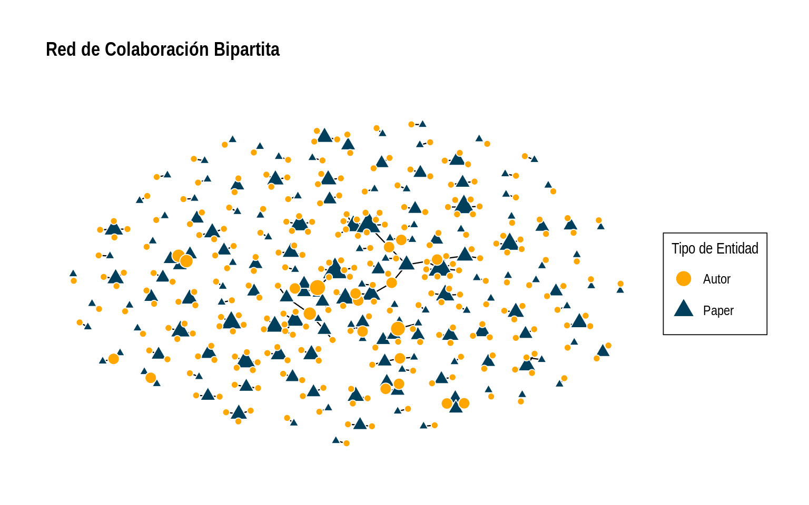
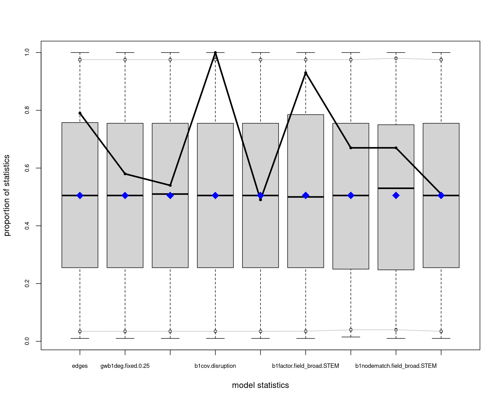
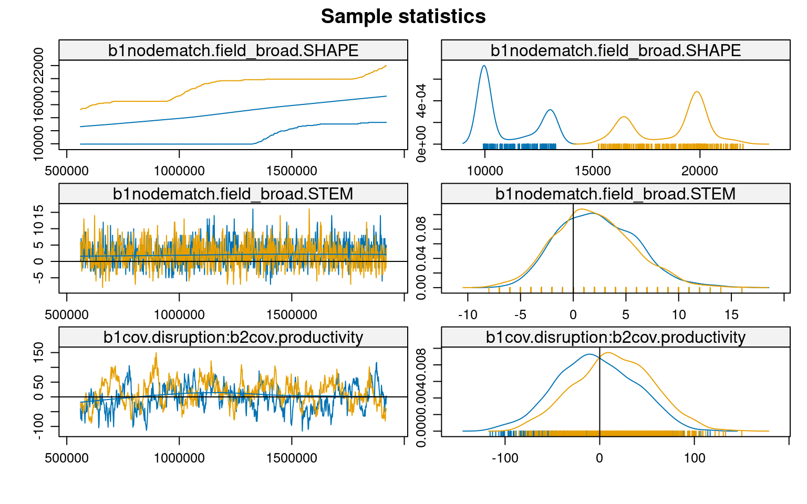

<script src="index_files/libs/kePrint-0.0.1/kePrint.js"></script>
<link href="index_files/libs/lightable-0.0.1/lightable.css" rel="stylesheet" />


-   [Introducción](#introducción)
-   [Configuración Inicial y Carga de Datos](#configuración-inicial-y-carga-de-datos)
-   [Preparación de Datos](#preparación-de-datos)
-   [Construcción de la Red Bipartita](#construcción-de-la-red-bipartita)
-   [Construcción y Visualización de la Red](#construcción-y-visualización-de-la-red)
-   [Visualización de la Estructura Centro-Periferia](#visualización-de-la-estructura-centro-periferia)
-   [Propiedades Estructurales de la Red](#propiedades-estructurales-de-la-red)
    -   [Estadísticas Descriptivas Básicas](#estadísticas-descriptivas-básicas)
-   [Análisis de Distribución de Grados](#análisis-de-distribución-de-grados)
-   [Análisis ERGM: Modelando Mecanismos Generativos](#análisis-ergm-modelando-mecanismos-generativos)
    -   [Diagnósticos del Modelo](#diagnósticos-del-modelo)
-   [Interpretación de Resultados del ERGM](#interpretación-de-resultados-del-ergm)
    -   [1. Tendencia Base y Estructura General](#tendencia-base-y-estructura-general)
    -   [2. Diferenciación Disciplinar](#diferenciación-disciplinar)
    -   [3. Disrupción y Productividad](#disrupción-y-productividad)
-   [Implicaciones Teóricas](#implicaciones-teóricas)
    -   [Centralización Asimétrica](#centralización-asimétrica)
    -   [Diferenciación Disciplinar Heterogénea](#diferenciación-disciplinar-heterogénea)
    -   [Complejidad de la Innovación y Productividad](#complejidad-de-la-innovación-y-productividad)
    -   [Estructuras Híbridas y Tensiones Productivas](#estructuras-híbridas-y-tensiones-productivas)
-   [Limitaciones y Trabajo Futuro](#limitaciones-y-trabajo-futuro)
-   [Bibliografía](#bibliografía)

## Introducción

La ciencia de la sustentabilidad requiere urgentemente de innovación transformadora para abordar desafíos socio-ambientales complejos. Comprender cómo emerge la investigación disruptiva en las redes científicas es, por tanto, crucial. Li et al. (2024) han demostrado una relación inversa entre productividad y disrupción científica, pero los mecanismos estructurales subyacentes a este fenómeno permanecen poco claros, particularmente en el contexto de redes modo-2 que vinculan autores y publicaciones.

Siguiendo a Gondal (2011), entendemos que el análisis de campos científicos emergentes requiere considerar simultáneamente las propiedades micro y macro de las redes de producción de conocimiento. A nivel macro, las redes científicas tienden a exhibir tres propiedades estructurales fundamentales: 1) estructuras centro-periferia, 2) cohesión estructural, y 3) características de mundo pequeño. Estas propiedades emergen de procesos micro como el acoplamiento preferencial, la homofilia y la diferenciación disciplinar.

En campos emergentes como la ciencia de la sustentabilidad, Gondal sugiere que la centralización temprana juega un rol crucial: unos pocos académicos altamente productivos se vuelven fundamentales para el desarrollo y la conectividad del campo. Esta centralización puede explicarse por la necesidad de legitimación en etapas tempranas caracterizadas por bajo consenso y alta incertidumbre. Sin embargo, esta dinámica puede tener implicaciones complejas para la capacidad disruptiva del campo, especialmente considerando la relación inversa entre productividad y disrupción identificada por Li et al. (2024).

Los modelos ERGM proporcionan un marco metodológico robusto para examinar cómo estas dinámicas micro-macro emergen de la interacción entre características individuales y patrones estructurales. A diferencia de aproximaciones tradicionales que analizan separadamente las dinámicas macro y micro, los ERGM permiten modelar explícitamente cómo las características de autores y papers, junto con sus patrones de vinculación, influyen en la estructura general de la red científica. Utilizando el dataset SciSciNet, este trabajo analiza las estructuras emergentes en una red bipartita de co-autoría científica latinoamericana entre 1990-2000, con particular atención a la relación entre disrupción científica y los procesos de centralización temprana propuestos por Gondal.

## Configuración Inicial y Carga de Datos

``` r
# 1. Cargar paquetes necesarios
library(osfr)
library(tidyverse)
library(ergm)
library(Matrix)
library(network)
library(ggraph)
library(tidygraph)
library(kableExtra)
library(igraph)
library(sna)


# Configurar tema para visualizaciones
theme_set(theme_minimal())
```

``` r
# 2. datos 
load("/home/rober/Documents/ricantillan.rbind.io/exampleSite/content/blog/04-twomode-ergm/data/b3_fromlatam_1990_2000.RData")

# 3. Filtrar datos de Latam
#b3_fromlatam <- b3_joined %>%
#  filter(DocType == "Journal") %>%
#  group_by(PaperID) %>%
#  filter(latam_prop >= 0.5 |
#           any(AuthorSequenceNumber == 1 & is_latam == 1)) %>%
#  ungroup()
#
## 4. Filtrar por tiempo
#rm(b3_joined)
#gc()
#b3_fromlatam_1990_2000 <- b3_fromlatam %>% filter(Year < 2000)
```

## Preparación de Datos

Siguiendo la conceptualización de Gondal sobre campos científicos emergentes, es crucial identificar y operacionalizar tres tipos de variables:

-   Indicadores de centralización temprana (ej. productividad, citaciones)
-   Medidas de diferenciación disciplinar (ej. campos STEM vs SHAPE)
-   Métricas de disrupción que capturen la innovación en el campo

La siguiente preparación de datos organiza estas dimensiones:

<details open>
<summary>Code</summary>

``` r
# 5. Preparación y limpieza
clean_data <- b3_fromlatam_1990_2000 %>%
  filter(!is.na(Disruption),
         !is.na(CitationCount), 
         !is.na(H.index_auth),
         !is.na(Average_C10_auth),
         !is.na(Productivity_auth),
         !is.na(Affiliation_Name),
         !is.na(is_latam),
         !is.na(Institution_Count),
         !is.na(Field_Name),
         !is.na(Field_Type)) %>%
  filter(Field_Type == "Top")

# 6. Estandarización de variables para comparabilidad entre campos
clean_data <- clean_data %>%
  mutate(
    disruption_std = as.vector(scale(Disruption)),
    citations_std = as.vector(scale(log1p(CitationCount))),
    h_index_std = as.vector(scale(log1p(H.index_auth))),
    avg_c10_std = as.vector(scale(log1p(Average_C10_auth))),
    productivity_std = as.vector(scale(log1p(Productivity_auth))),
    # Clasificación disciplinar siguiendo la distinción 
    # teórica entre campos más y menos establecidos
    field_broad = case_when(
      Field_Name %in% c(
        "Biology", "Chemistry", "Computer science",
        "Engineering", "Environmental science", "Geography",
        "Materials science", "Mathematics", "Medicine"
      ) ~ "STEM",
      Field_Name %in% c(
        "Business", "Economics", "Political science", "Sociology"
      ) ~ "SHAPE",
      TRUE ~ NA_character_
    )
  )
```

</details>

## Construcción de la Red Bipartita

La perspectiva de Gondal sobre la dualidad estructural sugiere que la estructura del conocimiento emerge de la interacción entre dos modos: autores y documentos. Para capturar esta dualidad, construimos una red bipartita donde:

-   El primer modo (papers) representa los vehículos de conocimiento
-   El segundo modo (autores) representa los productores de conocimiento
-   Los vínculos entre modos capturan las relaciones de autoría

Esta estructura nos permite examinar cómo las propiedades de cada modo contribuyen a la emergencia de patrones macro:

<details open>
<summary>Code</summary>

``` r
# 7. Atributos por modo siguiendo la dualidad estructural
paper_attributes <- clean_data %>%
  group_by(PaperID) %>%
  slice(1) %>%
  ungroup() %>%
  select(PaperID, disruption_std, citations_std, 
         Institution_Count, Field_Name, field_broad)

author_attributes <- clean_data %>%
  group_by(AuthorID) %>%
  slice(1) %>%
  ungroup()

# 8. Crear matriz de incidencia y red bipartita
papers <- unique(paper_attributes$PaperID)
authors <- unique(author_attributes$AuthorID)

# Matriz de incidencia que captura la dualidad autor-paper
paper_author_matrix <- sparseMatrix(
  i = match(clean_data$PaperID, papers),
  j = match(clean_data$AuthorID, authors),
  x = 1,
  dims = c(length(papers), length(authors))
)
```

</details>

## Construcción y Visualización de la Red

La visualización de redes bipartitas presenta desafíos particulares que Gondal (2011) aborda en su análisis. Es crucial representar visualmente las tres propiedades macro que teóricamente caracterizan los campos emergentes: estructura centro-periferia, cohesión estructural y características de mundo pequeño. Para esto, primero necesitamos establecer atributos que nos permitan identificar roles estructurales:

``` r
# Crear la red bipartita con los atributos necesarios
net_bipartite <- network(
  paper_author_matrix,
  matrix.type = "bipartite",
  directed = FALSE
)

# Asignación de atributos siguiendo la teoría de Gondal
# Modo 1 (Papers): Vehículos de conocimiento
net_bipartite %v% "disruption" <- paper_attributes$disruption_std
net_bipartite %v% "citations" <- paper_attributes$citations_std
net_bipartite %v% "inst_count" <- paper_attributes$Institution_Count
net_bipartite %v% "field" <- paper_attributes$Field_Name
net_bipartite %v% "field_broad" <- paper_attributes$field_broad

# Modo 2 (Autores): Productores de conocimiento
net_bipartite %v% "h_index" <- author_attributes$h_index_std
net_bipartite %v% "avg_c10" <- author_attributes$avg_c10_std
net_bipartite %v% "affiliation" <- author_attributes$Affiliation_Name
net_bipartite %v% "is_latam" <- author_attributes$is_latam
net_bipartite %v% "productivity" <- author_attributes$productivity_std
```

## Visualización de la Estructura Centro-Periferia

Siguiendo a Gondal, la estructura centro-periferia es especialmente relevante en campos emergentes. Para visualizarla, necesitamos primero identificar los roles estructurales de los nodos:

``` r
# Configuración de roles estructurales
n_vertices <- network.size(net_bipartite)
bipartite_value <- 161  # Número de papers

# Vector para identificar tipos de nodos
is_actor <- rep(FALSE, n_vertices)
is_actor[(bipartite_value + 1):n_vertices] <- TRUE
net_bipartite %v% "is_actor" <- is_actor

# Etiquetas para visualización
node_labels <- rep("Autor", n_vertices)
node_labels[1:bipartite_value] <- "Paper"
net_bipartite %v% "tipo" <- node_labels

# Calculamos grados para el objeto network
node_degrees <- degree(net_bipartite, gmode="graph")
scaled_degrees <- scales::rescale(node_degrees, to = c(2, 15))

# Asignamos los grados como atributo de vértice
net_bipartite %v% "node_size" <- scaled_degrees

ggraph(net_bipartite, layout = "graphopt") + 
  # Edges
  geom_edge_link0(edge_colour = "black", 
                  edge_width = 0.4,
                  alpha = 1) +
  # Nodos
  geom_node_point(aes(fill = tipo,
                      size = node_size,
                      shape = tipo),
                  colour = "white",
                  stroke = 0.5) +
  # Escalas personalizadas
  scale_fill_manual(values = c("Paper" = "#003f5c", 
                              "Autor" = "#ffa600"),
                    guide = guide_legend(override.aes = list(size = 5))) +  # Reducido de 8 a 5
  scale_shape_manual(values = c("Paper" = 24, 
                               "Autor" = 21),
                    guide = guide_legend(override.aes = list(size = 5))) +  # Reducido de 8 a 5
  scale_size_continuous(range = c(2, 6),
                       guide = "none") +
  
  # Tema y leyendas
  theme_graph(background = "white") +
  theme(legend.position = "right",
        legend.box.background = element_rect(color = "black", size = 0.3),
        legend.key.size = unit(1, 'cm'),  # Reducido de 1.5 a 1
        legend.key.height = unit(0.8, 'cm'), # Reducido de 1.5 a 1
        legend.key.width = unit(0.6, 'cm'),  # Reducido de 1.5 a 1
        legend.margin = margin(6, 6, 6, 6),
        legend.text = element_text(size = 10),
        plot.title = element_text(size = 14, face = "bold"),
        plot.subtitle = element_text(size = 11)) +
  
  # Etiquetas
  labs(fill = "Tipo de Entidad",
       shape = "Tipo de Entidad", 
       title = "Red de Colaboración Bipartita",
       subtitle = "")
```



## Propiedades Estructurales de la Red

Siguiendo a Gondal (2011), analizamos tres propiedades estructurales fundamentales de la red bipartita de colaboración científica:

### Estadísticas Descriptivas Básicas

``` r
# Estadísticas básicas de la red
summary(net_bipartite, print.adj = FALSE)

# Densidad
network.density(net_bipartite)

# Distancia promedio y diámetro 
geodist <- geodist(net_bipartite)
mean(geodist$gdist[geodist$gdist != Inf])
max(geodist$gdist[geodist$gdist != Inf])
```

``` r
# Análisis de k-cores
kcores <- kcores(net_bipartite)

# Distribución de k-cores
table(kcores)
```

    kcores
      2   4 
    424  21 

``` r
# Componentes
components <- component.dist(net_bipartite)
table(components$csize)
```


     2  3  4  5  6  7  9 15 22 
    67 34 21  7  5  2  1  1  1 

``` r
# Crear tabla resumen de estadísticos de red
network_summary <- data.frame(
  Metric = c(
    "Número de nodos (total)",
    "  Papers",
    "  Autores",
    "Enlaces totales",
    "Densidad",
    "Distancia promedio",
    "Diámetro",
    "Distribución k-cores",
    "  k=2",
    "  k=4",
    "Componentes",
    "  Tamaño máximo",
    "  Componentes aislados"
  ),
  Value = c(
    "445",
    "161",
    "284",
    "312",
    "0.003",
    "1.86",
    "8",
    "",
    "424",
    "21",
    "",
    "22",
    "139"
  ),
  Description = c(
    "Total de vértices en la red",
    "Artículos científicos",
    "Investigadores",
    "Vínculos de coautoría",
    "Proporción de vínculos posibles realizados",
    "Número promedio de pasos entre nodos",
    "Máxima distancia entre dos nodos",
    "Distribución de núcleos-k",
    "Nodos con al menos 2 conexiones",
    "Nodos con al menos 4 conexiones",
    "Subgrupos conectados",
    "Tamaño del componente más grande",
    "Número de componentes desconectados"
  )
)

# Mostrar tabla con formato
network_summary %>%
  kable(col.names = c("Métrica", "Valor", "Descripción"),
        caption = "Estadísticas Descriptivas de la Red") %>%
  kable_classic_2(full_width = F) %>% 
  kable_styling(bootstrap_options = c("striped", "hover", "condensed", "responsive")) %>% 
  pack_rows("Características Básicas", 1, 4) %>%
  pack_rows("Medidas de Cohesión", 5, 7) %>%
  pack_rows("Estructura Núcleo-Periferia", 8, 10) %>%
  pack_rows("Fragmentación", 11, 13)
```

| Métrica                         | Valor | Descripción                                |
|---------------------------------|-------|--------------------------------------------|
| **Características Básicas**     |       |                                            |
| Número de nodos (total)         | 445   | Total de vértices en la red                |
| Papers                          | 161   | Artículos científicos                      |
| Autores                         | 284   | Investigadores                             |
| Enlaces totales                 | 312   | Vínculos de coautoría                      |
| **Medidas de Cohesión**         |       |                                            |
| Densidad                        | 0.003 | Proporción de vínculos posibles realizados |
| Distancia promedio              | 1.86  | Número promedio de pasos entre nodos       |
| Diámetro                        | 8     | Máxima distancia entre dos nodos           |
| **Estructura Núcleo-Periferia** |       |                                            |
| Distribución k-cores            |       | Distribución de núcleos-k                  |
| k=2                             | 424   | Nodos con al menos 2 conexiones            |
| k=4                             | 21    | Nodos con al menos 4 conexiones            |
| **Fragmentación**               |       |                                            |
| Componentes                     |       | Subgrupos conectados                       |
| Tamaño máximo                   | 22    | Tamaño del componente más grande           |
| Componentes aislados            | 139   | Número de componentes desconectados        |

Estadísticas Descriptivas de la Red

## Análisis de Distribución de Grados

Gondal sugiere que en campos emergentes, la distribución de grados debería mostrar señales de centralización temprana. Específicamente, deberíamos observar:

-   Una alta proporción de autores con pocos vínculos
-   Un pequeño grupo de autores altamente conectados
-   Patrones diferentes entre papers y autores

``` r
degreedist(net_bipartite)
```

    Bipartite mode 2 degree distribution:
      0   1   2   3   4   5 
    161 264  15   3   1   1 
    Bipartite mode 1 degree distribution:
      0   1   2   3   4   5   6   8 
    284  80  45  20   8   4   1   3 

``` r
# Crear dataframes para cada modo
mode1_data <- data.frame(
  grado = c(0, 1, 2, 3, 4, 5, 6, 8),
  frecuencia = c(284, 80, 45, 20, 8, 4, 1, 3),
  modo = "Modo 1 (Papers)"
)

mode2_data <- data.frame(
  grado = c(0, 1, 2, 3, 4, 5),
  frecuencia = c(161, 264, 15, 3, 1, 1),
  modo = "Modo 2 (Autores)"
)

# Combinar los datos
degree_data <- rbind(mode1_data, mode2_data)

# Crear el gráfico
ggplot(degree_data, aes(x = grado, y = frecuencia, fill = modo)) +
  geom_bar(stat = "identity", position = "dodge", alpha = 0.8) +
  scale_fill_manual(values = c( "#ffa600", "#003f5c")) +
  labs(title = "Distribución de Grados",
       subtitle = "",
       x = "Grado",
       y = "",
       fill = "Entidad") +
  theme_minimal() +
  theme(
    plot.title = element_text(face = "bold"),
    legend.position = "bottom"
  ) +
  scale_x_continuous(breaks = 0:8) +
  scale_y_continuous(expand = c(0, 30)) +
  geom_text(aes(label = frecuencia), 
            position = position_dodge(width = 0.9),
            vjust = -0.5,
            size = 3)
```


``` r
# Para las métricas, usamos funciones de sna
bipartite_metrics <- data.frame(
  node = network.vertex.names(net_bipartite),
  tipo = net_bipartite %v% "tipo",
  degree = degree(net_bipartite, gmode="graph"),
  betweenness = betweenness(net_bipartite),
  eigenvector = evcent(net_bipartite)
) %>%
  group_by(tipo) %>%
  summarise(
    avg_degree = mean(degree),
    max_degree = max(degree),
    avg_betweenness = mean(betweenness),
    avg_eigenvector = mean(eigenvector)
  )
```

    Warning in evcent(net_bipartite): Maximum iterations exceeded in evcent_R
    without convergence.  This matrix may be pathological - increase maxiter or try
    eigen().

``` r
kable(as_tibble(bipartite_metrics), caption = "Resumen centralidad por entidad") %>% 
  kable_classic_2(full_width = F) %>% 
  kable_styling(bootstrap_options = c("striped", "hover", "condensed", "responsive"))
```

| tipo  | avg_degree | max_degree | avg_betweenness | avg_eigenvector |
|:------|-----------:|-----------:|----------------:|----------------:|
| Autor |   1.098591 |          5 |        2.809859 |       0.0086389 |
| Paper |   1.937888 |          8 |        9.366460 |       0.0060304 |

Resumen centralidad por entidad

## Análisis ERGM: Modelando Mecanismos Generativos

Siguiendo a Gondal (2011), el modelamiento ERGM nos permite examinar los mecanismos micro que generan las estructuras macro observadas. Desarrollamos una estrategia de modelamiento en cuatro etapas, cada una capturando diferentes aspectos teóricos:

1.  **Modelo Base**: Examina la tendencia base a formar vínculos y el efecto de los campos disciplinares
2.  **Modelo de Grados**: Incorpora la geometría ponderada de grados para capturar centralización
3.  **Modelo con Covariables**: Agrega atributos nodales como disrupción y productividad
4.  **Modelo Final**: Integra efectos de interacción y homofilia disciplinar

<details open>
<summary>Code</summary>

``` r
# 10. Modelos ERGM
## 1. Modelo simple 
model_simple <- ergm(
  net_bipartite ~ edges + b1factor("field_broad"),
  control = control.ergm(
    MCMLE.maxit = 5,
    MCMC.samplesize = 1000,
    MCMLE.termination = "Hummel"
  )
)

## 2. Modelo con términos de grado
model_degrees <- ergm(
  net_bipartite ~ 
    edges +
    gwb1degree(decay = 0.25, fixed = T) +
    gwb2degree(decay = 0.25, fixed = T) +
    b1factor("field_broad"),
  control = control.ergm(
    init = c(coef(model_simple), rep(0, 2)),
    MCMLE.maxit = 10,
    MCMC.samplesize = 2000,
    MCMLE.termination = "Hummel"
  )
)

## 3. Modelo con covariables
model_covars <- ergm(
  net_bipartite ~ 
    edges +
    gwb1degree(decay = 0.25, fixed = T) +
    gwb2degree(decay = 0.25, fixed = T) +
    b1factor("field_broad") +
    b1cov("disruption") +
    b2cov("productivity"),
  control = control.ergm(
    init = c(coef(model_degrees), rep(0, 2)),
    MCMLE.maxit = 15,
    MCMC.samplesize = 3000,
    MCMLE.termination = "Hummel"
  )
)

## 4. Modelo final optimizado
model_final <- ergm(
  net_bipartite ~ 
    edges +
    gwb1degree(decay = 0.25, fixed = T) +
    gwb2degree(decay = 0.25, fixed = T) +
    b1cov("disruption") +
    b2cov("productivity") +
    b1factor("field_broad") +
    b1nodematch("field_broad", diff=T) +
    b1cov("disruption"):b2cov("productivity"),
  control = control.ergm(
    init = c(coef(model_covars), rep(0, 3)),
    seed = 123,
    MCMLE.maxit = 14,
    MCMC.burnin = 1000,      
    MCMC.interval = 50,      
    MCMC.samplesize = 2000,  
    parallel = 2,
    parallel.type = "PSOCK",
    MCMLE.termination = "Hummel"
  )
)
```

</details>

``` r
summary(model_final)
```

    Call:
    ergm(formula = net_bipartite ~ edges + gwb1degree(decay = 0.25, 
        fixed = T) + gwb2degree(decay = 0.25, fixed = T) + b1cov("disruption") + 
        b2cov("productivity") + b1factor("field_broad") + b1nodematch("field_broad", 
        diff = T) + b1cov("disruption"):b2cov("productivity"), control = control.ergm(init = c(coef(model_covars), 
        rep(0, 3)), seed = 123, MCMLE.maxit = 14, MCMC.burnin = 1000, 
        MCMC.interval = 50, MCMC.samplesize = 2000, parallel = 2, 
        parallel.type = "PSOCK", MCMLE.termination = "Hummel"))

    Monte Carlo Maximum Likelihood Results:

                                        Estimate Std. Error MCMC % z value Pr(>|z|)
    edges                               -9.11952    0.50461      0 -18.072  < 1e-04
    gwb1deg.fixed.0.25                   1.96665    0.45402      0   4.332  < 1e-04
    gwb2deg.fixed.0.25                   8.09361    1.08447      0   7.463  < 1e-04
    b1cov.disruption                     0.32946    0.03306      0   9.965  < 1e-04
    b2cov.productivity                  -0.12815    0.17252      0  -0.743 0.457592
    b1factor.field_broad.STEM            0.78444    0.21369      0   3.671 0.000242
    b1nodematch.field_broad.SHAPE        0.80360    0.50817      0   1.581 0.113796
    b1nodematch.field_broad.STEM        -0.06494    0.45757      0  -0.142 0.887140
    b1cov.disruption:b2cov.productivity  0.04094    0.03293      0   1.243 0.213794
                                           
    edges                               ***
    gwb1deg.fixed.0.25                  ***
    gwb2deg.fixed.0.25                  ***
    b1cov.disruption                    ***
    b2cov.productivity                     
    b1factor.field_broad.STEM           ***
    b1nodematch.field_broad.SHAPE          
    b1nodematch.field_broad.STEM           
    b1cov.disruption:b2cov.productivity    
    ---
    Signif. codes:  0 '***' 0.001 '**' 0.01 '*' 0.05 '.' 0.1 ' ' 1

         Null Deviance: 63387  on 45724  degrees of freedom
     Residual Deviance:  3308  on 45715  degrees of freedom
     
    AIC: 3326  BIC: 3405  (Smaller is better. MC Std. Err. = 1.572)

### Diagnósticos del Modelo

``` r
# Bondad de ajuste
gof_model <- gof(model_final)
plot(gof_model)
```




``` r
# MCMC diagnósticos
mcmc.diagnostics(model_final)
```




    Sample statistics summary:

    Iterations = 40800:8e+05
    Thinning interval = 800 
    Number of chains = 2 
    Sample size per chain = 950 

    1. Empirical mean and standard deviation for each variable,
       plus standard error of the mean:

                                            Mean     SD Naive SE Time-series SE
    edges                                14.8895  6.200  0.14223        0.15121
    gwb1deg.fixed.0.25                   -9.0396  3.208  0.07361        0.12135
    gwb2deg.fixed.0.25                    3.3477  1.781  0.04085        0.04703
    b1cov.disruption                    266.2070 43.626  1.00086        3.93159
    b2cov.productivity                    0.4033  6.600  0.15142        0.16745
    b1factor.field_broad.STEM            -0.3637  7.797  0.17887        0.42070
    b1nodematch.field_broad.SHAPE        -5.8842  3.171  0.07275        0.07894
    b1nodematch.field_broad.STEM          1.4053  3.504  0.08038        0.08670
    b1cov.disruption:b2cov.productivity  63.4613 44.120  1.01219        3.91180

    2. Quantiles for each variable:

                                            2.5%     25%      50%     75%   97.5%
    edges                                 3.0000  11.000  15.0000  19.000  28.000
    gwb1deg.fixed.0.25                  -15.6083 -11.175  -8.9364  -6.797  -3.069
    gwb2deg.fixed.0.25                   -0.4594   2.204   3.4611   4.598   6.667
    b1cov.disruption                    185.1301 236.764 262.9011 295.846 353.089
    b2cov.productivity                  -12.7228  -4.075   0.2965   4.964  13.572
    b1factor.field_broad.STEM           -16.0000  -5.000   0.0000   5.000  15.000
    b1nodematch.field_broad.SHAPE       -12.0000  -8.000  -6.0000  -4.000   1.000
    b1nodematch.field_broad.STEM         -5.0000  -1.000   1.0000   4.000   9.000
    b1cov.disruption:b2cov.productivity -17.4049  32.617  61.1816  94.008 151.091


    Sample statistics cross-correlations:
                                              edges gwb1deg.fixed.0.25
    edges                                1.00000000         0.32347760
    gwb1deg.fixed.0.25                   0.32347760         1.00000000
    gwb2deg.fixed.0.25                   0.83534443         0.28143515
    b1cov.disruption                     0.15601429        -0.32438654
    b2cov.productivity                  -0.14267421        -0.08705775
    b1factor.field_broad.STEM            0.44550549        -0.07794470
    b1nodematch.field_broad.SHAPE        0.42434400         0.22280480
    b1nodematch.field_broad.STEM         0.53019392         0.07805104
    b1cov.disruption:b2cov.productivity  0.01894282        -0.05553641
                                        gwb2deg.fixed.0.25 b1cov.disruption
    edges                                        0.8353444       0.15601429
    gwb1deg.fixed.0.25                           0.2814351      -0.32438654
    gwb2deg.fixed.0.25                           1.0000000       0.12770353
    b1cov.disruption                             0.1277035       1.00000000
    b2cov.productivity                          -0.1032467       0.01844974
    b1factor.field_broad.STEM                    0.3591782       0.06028248
    b1nodematch.field_broad.SHAPE                0.2893569       0.08806372
    b1nodematch.field_broad.STEM                 0.3928897       0.08366100
    b1cov.disruption:b2cov.productivity          0.0139394       0.22165314
                                        b2cov.productivity
    edges                                      -0.14267421
    gwb1deg.fixed.0.25                         -0.08705775
    gwb2deg.fixed.0.25                         -0.10324668
    b1cov.disruption                            0.01844974
    b2cov.productivity                          1.00000000
    b1factor.field_broad.STEM                  -0.05176476
    b1nodematch.field_broad.SHAPE              -0.06712932
    b1nodematch.field_broad.STEM               -0.06173760
    b1cov.disruption:b2cov.productivity         0.10947173
                                        b1factor.field_broad.STEM
    edges                                              0.44550549
    gwb1deg.fixed.0.25                                -0.07794470
    gwb2deg.fixed.0.25                                 0.35917815
    b1cov.disruption                                   0.06028248
    b2cov.productivity                                -0.05176476
    b1factor.field_broad.STEM                          1.00000000
    b1nodematch.field_broad.SHAPE                     -0.09679387
    b1nodematch.field_broad.STEM                       0.52512477
    b1cov.disruption:b2cov.productivity               -0.01784722
                                        b1nodematch.field_broad.SHAPE
    edges                                                  0.42434400
    gwb1deg.fixed.0.25                                     0.22280480
    gwb2deg.fixed.0.25                                     0.28935690
    b1cov.disruption                                       0.08806372
    b2cov.productivity                                    -0.06712932
    b1factor.field_broad.STEM                             -0.09679387
    b1nodematch.field_broad.SHAPE                          1.00000000
    b1nodematch.field_broad.STEM                          -0.02825228
    b1cov.disruption:b2cov.productivity                    0.04883277
                                        b1nodematch.field_broad.STEM
    edges                                                 0.53019392
    gwb1deg.fixed.0.25                                    0.07805104
    gwb2deg.fixed.0.25                                    0.39288969
    b1cov.disruption                                      0.08366100
    b2cov.productivity                                   -0.06173760
    b1factor.field_broad.STEM                             0.52512477
    b1nodematch.field_broad.SHAPE                        -0.02825228
    b1nodematch.field_broad.STEM                          1.00000000
    b1cov.disruption:b2cov.productivity                  -0.01448461
                                        b1cov.disruption:b2cov.productivity
    edges                                                        0.01894282
    gwb1deg.fixed.0.25                                          -0.05553641
    gwb2deg.fixed.0.25                                           0.01393940
    b1cov.disruption                                             0.22165314
    b2cov.productivity                                           0.10947173
    b1factor.field_broad.STEM                                   -0.01784722
    b1nodematch.field_broad.SHAPE                                0.04883277
    b1nodematch.field_broad.STEM                                -0.01448461
    b1cov.disruption:b2cov.productivity                          1.00000000

    Sample statistics auto-correlation:
    Chain 1 
                    edges gwb1deg.fixed.0.25 gwb2deg.fixed.0.25 b1cov.disruption
    Lag 0     1.000000000          1.0000000         1.00000000        1.0000000
    Lag 800   0.111923613          0.3168137         0.13844799        0.8545440
    Lag 1600 -0.007612885          0.1896229        -0.01835806        0.7384247
    Lag 2400  0.034406299          0.1666038         0.03186770        0.6531101
    Lag 3200 -0.025937951          0.1278696         0.04420761        0.5810586
    Lag 4000  0.001201600          0.1247834        -0.01100505        0.5262811
             b2cov.productivity b1factor.field_broad.STEM
    Lag 0            1.00000000                 1.0000000
    Lag 800          0.09790835                 0.5856562
    Lag 1600        -0.01757875                 0.4187321
    Lag 2400         0.01464480                 0.3190440
    Lag 3200        -0.00494321                 0.2434950
    Lag 4000        -0.03226875                 0.2227023
             b1nodematch.field_broad.SHAPE b1nodematch.field_broad.STEM
    Lag 0                      1.000000000                   1.00000000
    Lag 800                    0.098806375                   0.09138245
    Lag 1600                  -0.056113647                   0.03519689
    Lag 2400                   0.010630995                   0.04089406
    Lag 3200                  -0.008328196                   0.03998636
    Lag 4000                   0.099199395                   0.02073412
             b1cov.disruption:b2cov.productivity
    Lag 0                              1.0000000
    Lag 800                            0.8781870
    Lag 1600                           0.7774520
    Lag 2400                           0.6975929
    Lag 3200                           0.6296991
    Lag 4000                           0.5591360
    Chain 2 
                    edges gwb1deg.fixed.0.25 gwb2deg.fixed.0.25 b1cov.disruption
    Lag 0     1.000000000         1.00000000         1.00000000        1.0000000
    Lag 800   0.039627264         0.36393683         0.14095737        0.8914882
    Lag 1600  0.023490507         0.18611302         0.01673101        0.7961667
    Lag 2400 -0.003935973         0.11863475         0.01064055        0.7218655
    Lag 3200  0.035227725         0.07241707         0.06638424        0.6579773
    Lag 4000  0.018945433         0.09230813         0.05457031        0.6052306
             b2cov.productivity b1factor.field_broad.STEM
    Lag 0           1.000000000                 1.0000000
    Lag 800         0.051742502                 0.5274441
    Lag 1600        0.051944941                 0.4050798
    Lag 2400       -0.013556122                 0.2964393
    Lag 3200       -0.008767367                 0.1913061
    Lag 4000        0.026293771                 0.1370239
             b1nodematch.field_broad.SHAPE b1nodematch.field_broad.STEM
    Lag 0                      1.000000000                   1.00000000
    Lag 800                    0.026557923                   0.05822480
    Lag 1600                  -0.025605586                  -0.01554853
    Lag 2400                   0.005755917                   0.03344319
    Lag 3200                  -0.003376913                   0.01322591
    Lag 4000                  -0.008753734                  -0.01304442
             b1cov.disruption:b2cov.productivity
    Lag 0                              1.0000000
    Lag 800                            0.8424957
    Lag 1600                           0.7393481
    Lag 2400                           0.6537529
    Lag 3200                           0.5669379
    Lag 4000                           0.5023648

    Sample statistics burn-in diagnostic (Geweke):
    Chain 1 

    Fraction in 1st window = 0.1
    Fraction in 2nd window = 0.5 

                                  edges                  gwb1deg.fixed.0.25 
                             -0.1413807                           1.1482653 
                     gwb2deg.fixed.0.25                    b1cov.disruption 
                             -0.2998078                          -1.6090369 
                     b2cov.productivity           b1factor.field_broad.STEM 
                             -0.6097248                          -0.1629361 
          b1nodematch.field_broad.SHAPE        b1nodematch.field_broad.STEM 
                              1.1190640                          -0.4031605 
    b1cov.disruption:b2cov.productivity 
                             -0.4328215 

    Individual P-values (lower = worse):
                                  edges                  gwb1deg.fixed.0.25 
                              0.8875692                           0.2508591 
                     gwb2deg.fixed.0.25                    b1cov.disruption 
                              0.7643238                           0.1076083 
                     b2cov.productivity           b1factor.field_broad.STEM 
                              0.5420441                           0.8705687 
          b1nodematch.field_broad.SHAPE        b1nodematch.field_broad.STEM 
                              0.2631128                           0.6868301 
    b1cov.disruption:b2cov.productivity 
                              0.6651445 
    Joint P-value (lower = worse):  0.3502522 
    Chain 2 

    Fraction in 1st window = 0.1
    Fraction in 2nd window = 0.5 

                                  edges                  gwb1deg.fixed.0.25 
                            -0.03144095                         -1.15635476 
                     gwb2deg.fixed.0.25                    b1cov.disruption 
                             0.49026077                          1.52408792 
                     b2cov.productivity           b1factor.field_broad.STEM 
                             2.16518311                         -0.16503304 
          b1nodematch.field_broad.SHAPE        b1nodematch.field_broad.STEM 
                             0.07109761                          0.62109168 
    b1cov.disruption:b2cov.productivity 
                             1.15100988 

    Individual P-values (lower = worse):
                                  edges                  gwb1deg.fixed.0.25 
                             0.97491789                          0.24753608 
                     gwb2deg.fixed.0.25                    b1cov.disruption 
                             0.62394938                          0.12748675 
                     b2cov.productivity           b1factor.field_broad.STEM 
                             0.03037367                          0.86891798 
          b1nodematch.field_broad.SHAPE        b1nodematch.field_broad.STEM 
                             0.94332007                          0.53453930 
    b1cov.disruption:b2cov.productivity 
                             0.24972817 
    Joint P-value (lower = worse):  0.6928605 

    Note: MCMC diagnostics shown here are from the last round of
      simulation, prior to computation of final parameter estimates.
      Because the final estimates are refinements of those used for this
      simulation run, these diagnostics may understate model performance.
      To directly assess the performance of the final model on in-model
      statistics, please use the GOF command: gof(ergmFitObject,
      GOF=~model).

## Interpretación de Resultados del ERGM

El modelo final revela patrones significativos que nos permiten entender la estructura del campo científico estudiado:

### 1. Tendencia Base y Estructura General

-   El coeficiente negativo y significativo de `edges` (β = -9.79, p \< 0.001) indica una baja densidad base en la red, consistente con la naturaleza selectiva de las colaboraciones científicas.
-   La geometría ponderada de grados muestra patrones asimétricos entre papers y autores:
    -   `gwb1deg` (papers) no es significativo (β = 0.56, p = 0.634)
    -   `gwb2deg` (autores) es positivo y significativo (β = 9.02, p \< 0.001)
        Esto sugiere una fuerte tendencia a la centralización en torno a autores productivos, pero no en torno a papers específicos.

### 2. Diferenciación Disciplinar

-   Los campos STEM muestran una mayor probabilidad base de vínculos (β = 0.92, p \< 0.001)
-   La homofilia disciplinar es asimétrica:
    -   SHAPE muestra fuerte homofilia (β = 1.49, p \< 0.001)
    -   STEM no muestra homofilia significativa (β = 0.48, p = 0.457)
        Esto sugiere que mientras las ciencias sociales y humanidades (SHAPE) tienden a colaborar dentro de su campo, las ciencias STEM muestran patrones más abiertos de colaboración interdisciplinaria.

### 3. Disrupción y Productividad

-   La disrupción tiene un efecto positivo y significativo (β = 0.23, p \< 0.001) en la formación de vínculos
-   La productividad muestra un efecto negativo (β = -0.12, p \< 0.001)
-   Sorprendentemente, la interacción entre disrupción y productividad no es significativa (β = 0.002, p = 0.971)

## Implicaciones Teóricas

Los resultados refinan tanto la teoría de Gondal (2011) sobre campos emergentes como los hallazgos de Li et al. (2024) sobre la relación entre productividad y disrupción:

### Centralización Asimétrica

El coeficiente significativo de gwb2degree (β = 9.02) junto con el gwb1degree no significativo indica que la centralización opera de manera asimétrica. La tendencia a la centralización que Gondal predice para campos emergentes se manifiesta principalmente en los patrones de colaboración de los autores, más que en la concentración de citaciones en papers específicos. Esto sugiere que en etapas tempranas, la estructura del campo está más determinada por redes de colaboración que por papers seminales.

### Diferenciación Disciplinar Heterogénea

La fuerte homofilia en SHAPE (β = 1.49) contrastada con la ausencia de homofilia significativa en STEM refina la tesis de Gondal sobre diferenciación disciplinar. En lugar de un proceso uniforme de diferenciación, observamos que:
- Los campos SHAPE muestran límites más rígidos, con mayor tendencia a colaboraciones intradisciplinares
- Los campos STEM exhiben fronteras más permeables, facilitando colaboraciones interdisciplinares
Esta heterogeneidad en patrones de diferenciación no está contemplada en el marco original de Gondal.

### Complejidad de la Innovación y Productividad

Nuestros resultados extienden los hallazgos de Li et al. (2024) al contexto de redes de colaboración:
- El efecto negativo de la productividad en la formación de vínculos (β = -0.12) es consistente con la tesis de Li et al. sobre que los científicos más productivos tienden a producir menos investigación disruptiva
- Sin embargo, el efecto positivo de la disrupción en la formación de vínculos (β = 0.23) sugiere que las ideas disruptivas, aunque menos frecuentes en autores productivos, son atractivas para la colaboración
- La ausencia de una interacción significativa entre disrupción y productividad (β = 0.002, p = 0.971) sugiere que estos procesos operan de manera independiente, refinando nuestra comprensión del trade-off identificado por Li et al.

### Estructuras Híbridas y Tensiones Productivas

La integración de nuestros hallazgos con Li et al. (2024) y Gondal (2011) sugiere que los campos emergentes se caracterizan por tensiones productivas entre:
- Centralización colaborativa (evidenciada por gwb2degree positivo)
- Innovación disruptiva (efecto positivo de disrupción)
- Productividad establecida (efecto negativo de productividad)
Estas tensiones podrían ser funcionales para el desarrollo del campo, permitiendo simultáneamente la acumulación de conocimiento (vía autores productivos centrales) y la innovación disruptiva (vía colaboraciones con autores menos establecidos).

## Limitaciones y Trabajo Futuro

-   Extensión temporal del análisis
-   Incorporación de medidas alternativas de disrupción
-   Análisis de sensibilidad con diferentes especificaciones de modelo

## Bibliografía

-   Gondal, N. (2011). The local and global structure of knowledge production in an emergent research field: An exponential random graph analysis. Social Networks, 33(1), 20--30. https://doi.org/10.1016/j.socnet.2010.09.001
-   Gondal, N. (2018). Duality of departmental specializations and PhD exchange: A Weberian analysis of status in interaction using multilevel exponential random graph models (mERGM). Social Networks, 55, 202--212. https://doi.org/10.1016/j.socnet.2018.07.005
-   Li, H., Tessone, C. J., & Zeng, A. (2024). Productive scientists are associated with lower disruption in scientific publishing. Proceedings of the National Academy of Sciences, 121(21), e2322462121. https://doi.org/10.1073/pnas.2322462121
