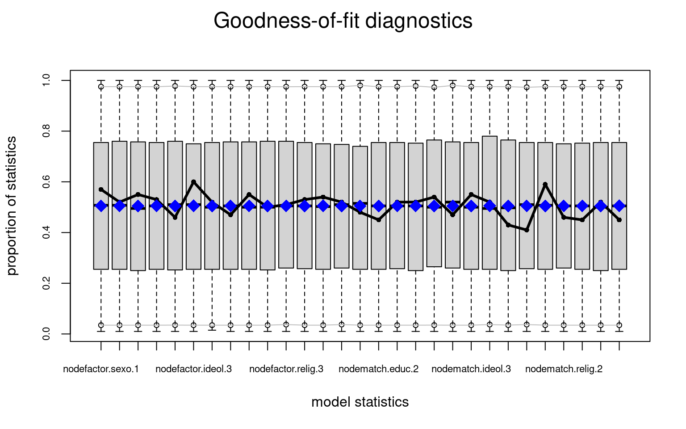



## libraries

``` r
library(ergm)
library(ergm.ego)
library(car)
library(egor)
library(tidyverse)
library(tibble)
library(texreg)
library(purrr)
library(tidyr)
library(prioritizr)
library(questionr)
```

## data

``` r
load("/home/rober/Documents/ricantillan.rbind.io/dat/ELSOC/ELSOC_W02_v3.00_R.RData")
load("/home/rober/Documents/ricantillan.rbind.io/dat/ELSOC/ELSOC_W04_v2.01_R.RData")
load("/home/rober/Documents/ricantillan.rbind.io/dat/ELSOC/ELSOC_W01_v4.01_R.RData")
```

## ELSOC 2017

### Renombrar ID

``` r
a<-elsoc_2017 %>% dplyr::rename(.egoID = idencuesta)
```

### Crear data frame alteris para 2017=a

Creamos subset con data de cada uno de los alteris mencionados, manteniendo el ID de cada ego en el cual están anidados. Las columnas de cada uno de los subset deben tener los mismos nombres.

``` r
columnas <- c("sexo", "edad", "educ", "relig", "ideol", "barrio", "relacion")
num_alters <- 5

alter_list <- list()

for (i in 1:num_alters) {
  alter_cols <- paste0("r13_", columnas, "_", sprintf("%02d", i))
  alter <- a %>%
    dplyr::select(.egoID, all_of(alter_cols)) %>%
    rename_with(~ columnas, alter_cols) %>%
    mutate(n = i)
  
  alter_list[[i]] <- alter
}

alteris <- bind_rows(alter_list)
alteris<-arrange(alteris, .egoID)
```

### Crear vector alter id

En el siguiente chunk creamos un vector identificador para cada uno de los alteris presentes en la data "alteris". Lo identificamos como objeto `tibble` y eliminamos el vector "n".

``` r
alteris   <- rowid_to_column(alteris, var = ".alterID")
alteris   <- as_tibble(alteris)
alteris$n <- NULL
```

### Recod alteris

Recodificamos los valores de los atributos de los alteris.

``` r
# NA
alteris[alteris=="-999"]<-NA
alteris[alteris=="-888"]<-NA

# Educación 
#edulab<-c('ltsecondary', 'secondary', 'technicaled', 'collegeed')
alteris$educ <-factor(Recode(alteris$educ ,"1=1;2:3=2;4=3;5=4"))
table(alteris$educ)
```


       1    2    3    4 
    1362 3543 1042 1719 

``` r
# Religión 
#relilab<-c('catholic','evangelical','other','none')
alteris$relig<-factor(Recode(alteris$relig,"1=1;2=2;3:4=4;5=3"))
table(alteris$relig)
```


       1    2    3    4 
    4907 1407  373 1379 

``` r
# Ideología 
#ideolab<-c('rightwinger','centerright','center','centerleft','leftwinger','none')
alteris$ideol<-factor(Recode(alteris$ideol,"1=1;2=2;3=3;4=4;5=5;6=6"))
table(alteris$ideol)
```


       1    2    3    4    5    6 
     786  191  382  303  759 4644 

``` r
# Edad 
alteris$edad<-as.numeric(alteris$edad)
#alteris$edad <-factor(Recode(alteris$edad ,"0:18=1;19:29=2;30:40=3;41:51=4;52:62=5;63:100=6"))

# Sexo 
#sexolab<-c('male','female')
alteris$sexo <-factor(Recode(alteris$sexo ,"1=1;2=2"))
table(alteris$sexo)
```


       1    2 
    3388 4678 

``` r
# Relación
alteris<-alteris%>%
  dplyr::mutate(rel=case_when(relacion%in%1:3~"fam",
                              relacion%in%4:5~"nofam"))
table(alteris$relacion)
```


       1    2    3    4    5 
     951 1181 2519 2577  838 

``` r
# Barrio 
alteris$barrio<-factor(Recode(alteris$barrio,"1=1;2=2"))
table(alteris$barrio)
```


       1    2 
    4271 3788 

``` r
#alteris<-na.omit(alteris)
```

### Borrar alteris con 5 parámetros con NA

``` r
# Función para borrar casos con un número determinado de NA's. 
#delete.na <- function(DF, n=0) {
#  DF[rowSums(is.na(DF)) <= n,]
#}
#
#alteris<-delete.na(alteris, 4) #borro los casos que tienen más de 4 NA.  
```

### Data Frame Ego's

Creamos un subset con la data de ego equivalente a la data de los alteris. Las nombramos de la misma manera.

``` r
egos <-a %>%
       dplyr::select(.egoID, 
                     sexo=m0_sexo, 
                     edad=m0_edad, 
                     educ=m01, 
                     relig=m38, 
                     ideol=c15,
                     ponderador02,
                     estrato,
                     segmento)

egos <- as_tibble(egos)
```

### Recod data Ego's

Recodificamos las variables de la data de ego siguiendo el patrón de la data de alteris.

``` r
# NA
egos[egos=="-999"]<-NA
egos[egos=="-888"]<-NA

# Educación
egos$educ <-factor(Recode(egos$educ,"1:3=1;4:5=2;6:7=3;8:10=4"))
table(egos$educ)
```


       1    2    3    4 
     597 1045  402  429 

``` r
# Religión
egos$relig<-factor(Recode(egos$relig,"1=1;2=2;3:6=3;7:9=4"))
table(egos$relig)
```


       1    2    3    4 
    1383  499  276  308 

``` r
# Ideología
#ideolab2<-c('leftwinger','centerleft','center','centerright','rightwinger','none')
egos$ideol<-factor(Recode(egos$ideol,"0:2=5;3:4=4;5=3;6:7=2;8:10=1;11:12=6"))
table(egos$ideol)
```


       1    2    3    4    5    6 
     252  149  470  209  282 1080 

``` r
# Edad
egos$edad<-as.numeric(egos$edad)
#egos$edad <-factor(Recode(egos$edad,"18=1;19:29=2;30:40=3;41:51=4;52:62=5;63:100=6"))

# Sexo
egos$sexo <-factor(Recode(egos$sexo,"1=1;2=2"))
table(egos$sexo)
```


       1    2 
     951 1522 

``` r
# Barrio
egos$barrio <- matrix(rbinom(2473*5,1,0.6),2473,1) # Criterio minimalista
egos$barrio<-factor(Recode(egos$barrio,"1=1;0=2"))
table(egos$barrio)
```


       1    2 
    1506  967 

### Crear objeto Egor (requerido para trabajar con función `ergm.ego`)

``` r
# definir diseño complejo
elsoc_ego <- egor(alters = alteris, 
                  egos = egos,
                  alter_design = list(max = 5),
                  ID.vars = list(
                    ego = ".egoID",
                    alter = ".alterID")) %>% as.egor()

ego_design(elsoc_ego) <- list(weight = "ponderador02",
                              strata = "estrato",
                              cluster="segmento") 

# eliminar atributos de diseño
elsoc_ego[["ego"]][["variables"]][["ponderador02"]]<-NULL
elsoc_ego[["ego"]][["variables"]][["estrato"]]<-NULL
elsoc_ego[["ego"]][["variables"]][["segmento"]]<-NULL

# drop NA
variables <- c("sexo", "educ", "relig", "ideol", "barrio")
for (variable in variables) {
  elsoc_ego[["ego"]] <- elsoc_ego[["ego"]] %>% drop_na({{ variable }})
  elsoc_ego[["alter"]] <- elsoc_ego[["alter"]] %>% drop_na({{ variable }})
}

as_tibble(elsoc_ego$alter)
```

    # A tibble: 6,849 × 10
       .altID .egoID  sexo   edad educ  relig ideol barrio relacion rel  
       <chr>  <chr>   <fct> <dbl> <fct> <fct> <fct> <fct>     <dbl> <chr>
     1 1      1101011 1        77 2     1     5     1             1 fam  
     2 6      1101012 1        60 2     1     6     1             1 fam  
     3 11     1101013 2        54 1     1     6     1             3 fam  
     4 12     1101013 2        33 2     1     6     1             3 fam  
     5 16     1101021 1        55 2     1     6     1             4 nofam
     6 21     1101022 2        44 4     4     6     1             2 fam  
     7 26     1101023 1        40 2     1     6     1             3 fam  
     8 31     1101032 2        31 4     1     6     1             2 fam  
     9 32     1101032 1        57 2     1     5     1             1 fam  
    10 36     1101033 1        37 2     1     2     1             1 fam  
    # ℹ 6,839 more rows

### Degree distribution

#### Educación

``` r
degreedist(elsoc_ego, by="educ", prob=T, plot = T, weight=TRUE)
```


#### Sexo

``` r
degreedist(elsoc_ego, by="sexo", prob=T, plot = T, weight=TRUE)
```


# Modelos

`nodefactor` = controla el grado de los diferentes grupos (ajustando las estimaciones de homofilia por el hecho de que algunos grupos, por ejemplo, los hombres, tienen más vínculos que otros grupos, como las mujeres).

El paquete "ergm" proporciona no sólo estadísticas resumidas sino también valores-p. Sin embargo, como indica Kolaczyk y Csárdi (2020), la justificación teórica para las distribuciones asintóticas chi-cuadrado y F utilizadas por `ergm` para calcular estos valores no se ha establecido hasta la fecha. Por lo tanto, puede ser pertinente interpretar estos valores de manera informal, como estadísticas resumidas adicionales.

``` r
## Set # replicates
reps = 1
## Set ppop size and construction
ppop = 15000
ppopwt = 'round' # Round gives consistent netsize/composition
constraint.formula <- (~ bd(maxout = 5)) # constraint por grado máximo para cada ego. 
```

## Modelo 1

``` r
modelo1<-ergm.ego(elsoc_ego~
                    #edges + 
                    #degree(1:5) +
                    nodefactor("sexo", levels = -2) +
                    nodefactor("educ") +
                    nodefactor("ideol") +
                    nodefactor("relig") +
                    nodematch("sexo", diff=TRUE) +
                    nodematch("educ", diff=TRUE) +
                    nodematch("ideol", diff=TRUE)+
                    nodematch("relig", diff=TRUE)+
                    absdiff("edad"),
                 constraints = constraint.formula,
                 control=control.ergm.ego(ppopsize=5000,
                                         ppop.wt=ppopwt,
                                         stats.wt="data",
                                         stats.est="survey"),
                  ergm = control.ergm(init.method = "MPLE",
                                      init.MPLE.samplesize = 5e7,
                                      MPLE.constraints.ignore = TRUE,
                                      MCMLE.effectiveSize = NULL,
                                      MCMC.burnin = 5e4,
                                      MCMC.interval = 5e4,
                                      MCMC.samplesize = 1000000,
                                      parallel = 16,
                                      SAN.nsteps = 5e7))
```

    Warning: Argument(s) 'ergm' were not recognized or used. Did you mistype an
    argument name?

``` r
#?control.ergm.ego
#??ignore.max.alters
```

### Summary

``` r
summary(modelo1)
```

    Call:
    ergm.ego(formula = elsoc_ego ~ nodefactor("sexo", levels = -2) + 
        nodefactor("educ") + nodefactor("ideol") + nodefactor("relig") + 
        nodematch("sexo", diff = TRUE) + nodematch("educ", diff = TRUE) + 
        nodematch("ideol", diff = TRUE) + nodematch("relig", diff = TRUE) + 
        absdiff("edad"), constraints = constraint.formula, control = control.ergm.ego(ppopsize = 5000, 
        ppop.wt = ppopwt, stats.wt = "data", stats.est = "survey"), 
        ergm = control.ergm(init.method = "MPLE", init.MPLE.samplesize = 5e+07, 
            MPLE.constraints.ignore = TRUE, MCMLE.effectiveSize = NULL, 
            MCMC.burnin = 50000, MCMC.interval = 50000, MCMC.samplesize = 1e+06, 
            parallel = 16, SAN.nsteps = 5e+07))

    Monte Carlo Maximum Likelihood Results:

                         Estimate Std. Error MCMC % z value Pr(>|z|)    
    offset(netsize.adj) -8.499436   0.000000      0    -Inf  < 1e-04 ***
    nodefactor.sexo.1    0.026094   0.374902      0   0.070 0.944511    
    nodefactor.educ.2    0.510454   0.111578      0   4.575  < 1e-04 ***
    nodefactor.educ.3    0.453725   0.152892      0   2.968 0.003001 ** 
    nodefactor.educ.4    0.495349   0.184745      0   2.681 0.007335 ** 
    nodefactor.ideol.2  -0.322233   0.208094      0  -1.548 0.121503    
    nodefactor.ideol.3  -0.383891   0.188433      0  -2.037 0.041622 *  
    nodefactor.ideol.4  -0.073608   0.224878      0  -0.327 0.743423    
    nodefactor.ideol.5   0.000392   0.215906      0   0.002 0.998551    
    nodefactor.ideol.6   0.429487   0.205463      0   2.090 0.036587 *  
    nodefactor.relig.2  -0.662670   0.153775      0  -4.309  < 1e-04 ***
    nodefactor.relig.3  -0.224157   0.177162      0  -1.265 0.205776    
    nodefactor.relig.4   0.207720   0.158543      0   1.310 0.190133    
    nodematch.sexo.1     0.265240   0.377637      0   0.702 0.482450    
    nodematch.sexo.2     0.605081   0.386875      0   1.564 0.117812    
    nodematch.educ.1     0.822089   0.135593      0   6.063  < 1e-04 ***
    nodematch.educ.2     0.376890   0.112730      0   3.343 0.000828 ***
    nodematch.educ.3     0.689269   0.142157      0   4.849  < 1e-04 ***
    nodematch.educ.4     1.656137   0.139848      0  11.842  < 1e-04 ***
    nodematch.ideol.1    1.708763   0.199848      0   8.550  < 1e-04 ***
    nodematch.ideol.2    1.075087   0.323500      0   3.323 0.000890 ***
    nodematch.ideol.3   -0.019859   0.238084      0  -0.083 0.933523    
    nodematch.ideol.4    0.291631   0.256309      0   1.138 0.255199    
    nodematch.ideol.5    1.565110   0.191898      0   8.156  < 1e-04 ***
    nodematch.ideol.6    0.548568   0.134902      0   4.066  < 1e-04 ***
    nodematch.relig.1    0.859990   0.130173      0   6.607  < 1e-04 ***
    nodematch.relig.2    2.415272   0.171209      0  14.107  < 1e-04 ***
    nodematch.relig.3    0.787513   0.262693      0   2.998 0.002719 ** 
    nodematch.relig.4    0.740375   0.169100      0   4.378  < 1e-04 ***
    absdiff.edad        -0.031325   0.002267      0 -13.817  < 1e-04 ***
    ---
    Signif. codes:  0 '***' 0.001 '**' 0.01 '*' 0.05 '.' 0.1 ' ' 1


     The following terms are fixed by offset and are not estimated:
      offset(netsize.adj) 

Para interpretar los coeficientes, es útil pensar en términos de la probabilidad de que un par dado de nodos tenga un vínculo, condicionada al estado del nodo entre todos los demás pares. Para el término de homofilia de género (segundo orden) en el modelo anterio: El empate entre dos nodos mujeres, casi cuatriplica las probabilidades (odds) de tener un vínculo en la red observada (por su puesto, manteniendo todo lo demás igual).

Vale indicar también que para todas las variables el coeficiente difiere de cero en al menos un error estándar, lo que sugiere algún efecto no trivial de estas variables en la formación de vínculos en la red.

### Bondad de ajuste

La práctica actual para evaluar la bondad de ajuste en modelos ERGM es simular primero numerosos gráficos aleatorios del modelo ajustado y luego comparar varios resúmenes de estos gráficos con los del gráfico observado originalmente. Si las características de los grafos de red observados no coinciden con los valores típicos que surgen de las realizaciones del modelo de gráfico aleatorio ajustado, esto sugiere diferencias sistemáticas entre la clase especificada de modelos y los datos y, por lo tanto, una falta de bondad.

En general, al evaluar la bondad de ajuste en el modelado de redes, los resúmenes de uso común incluyen la distribución de cualquier número de los diversos resúmenes de la estructura de la red: como el grado, la centralidad y la distancia geodésica. Con los ERGMs, sin embargo, una elección natural de resumen son las propias estadísticas $g$ que definen el ERGM (es decir, las llamadas estadísticas suficientes). Para evaluar la bondad de ajuste de nuestro modelo anterior de homofilia, la función `ergm` ejecuta las simulaciones de Monte Carlo necesarias y calcula las comparaciones con la red original en términos de las distribuciones de cada uno de los estadísticos en el modelo.

``` r
plot(gof(modelo1))
```



Considerando las características particulares capturadas por las estadísticas, el ajuste del modelo es bastante bueno en general, toda vez que las estadísticas observadas están bastante cerca de la mediana de los valores simulados en la mayoría de los casos.

``` r
plot(gof(modelo1, GOF="degree"))
```


### MCMC

``` r
mcmc.diagnostics(modelo1, which = "plots")
```


    Note: To save space, only one in every 2 iterations of the MCMC sample
      used for estimation was stored for diagnostics. Sample size per chain
      was originally around 4418 with thinning interval 16384.

    Note: MCMC diagnostics shown here are from the last round of
      simulation, prior to computation of final parameter estimates.
      Because the final estimates are refinements of those used for this
      simulation run, these diagnostics may understate model performance.
      To directly assess the performance of the final model on in-model
      statistics, please use the GOF command: gof(ergmFitObject,
      GOF=~model).

### simulate

``` r
sim.modelo1 <- simulate(modelo1, popsize=500,
                       control=control.simulate.ergm.ego(
                       simulate=control.simulate.formula(MCMC.burnin=2e6)))
```

    Note: Constructed network has size 244 different from requested 500. Simulated statistics may need to be rescaled.

``` r
plot(sim.modelo1, vertex.col="educ")
legend('bottomleft',fill=1:4,legend=paste('Eduación',1:4),cex=0.75)
```


### Tidy

``` r
broom::tidy(modelo1, exponentiate = TRUE, conf.int = TRUE, conf.level = 0.99)
```

    Warning in tidy.ergm(modelo1, exponentiate = TRUE, conf.int = TRUE, conf.level
    = 0.99): Exponentiating but model didn't use log or logit link.

    # A tibble: 30 × 8
       term      estimate std.error mcmc.error  statistic p.value conf.low conf.high
       <chr>        <dbl>     <dbl>      <dbl>      <dbl>   <dbl>    <dbl>     <dbl>
     1 offset(n… 0.000204     0              0 -Inf       0       0.000204  0.000204
     2 nodefact… 1.03         0.375          0    0.0696  9.45e-1 0.391     2.70    
     3 nodefact… 1.67         0.112          0    4.57    4.77e-6 1.25      2.22    
     4 nodefact… 1.57         0.153          0    2.97    3.00e-3 1.06      2.33    
     5 nodefact… 1.64         0.185          0    2.68    7.33e-3 1.02      2.64    
     6 nodefact… 0.725        0.208          0   -1.55    1.22e-1 0.424     1.24    
     7 nodefact… 0.681        0.188          0   -2.04    4.16e-2 0.419     1.11    
     8 nodefact… 0.929        0.225          0   -0.327   7.43e-1 0.521     1.66    
     9 nodefact… 1.00         0.216          0    0.00182 9.99e-1 0.574     1.74    
    10 nodefact… 1.54         0.205          0    2.09    3.66e-2 0.905     2.61    
    # ℹ 20 more rows

### Predict

``` r
#predict(modelo1, type = "response")
```
