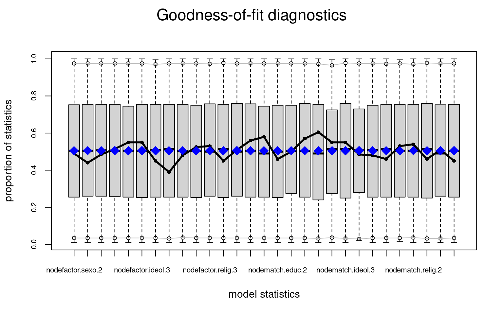
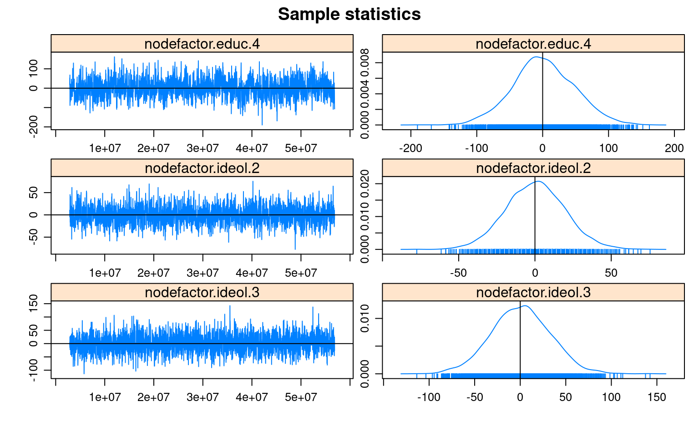
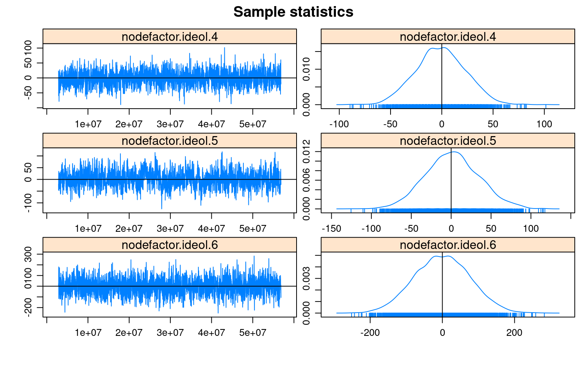
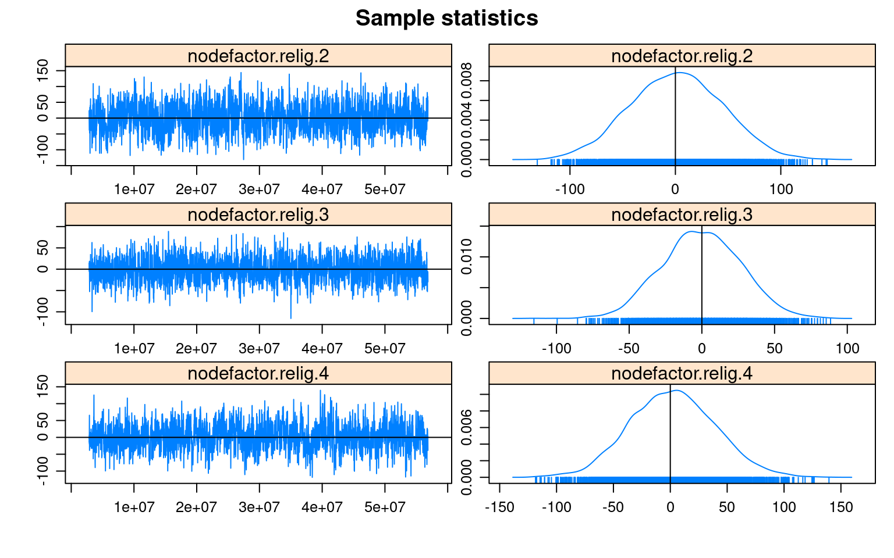
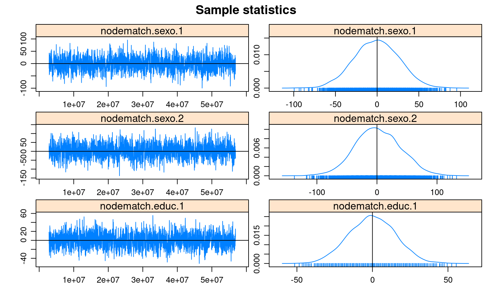
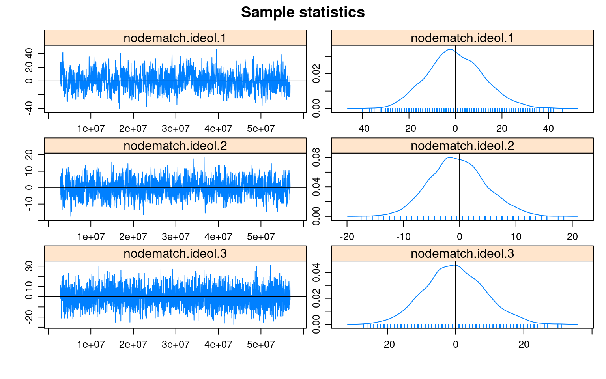
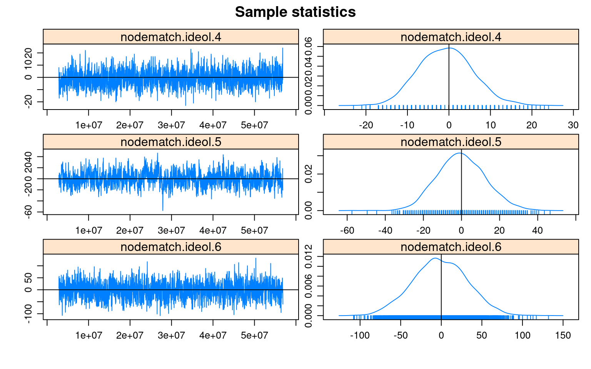
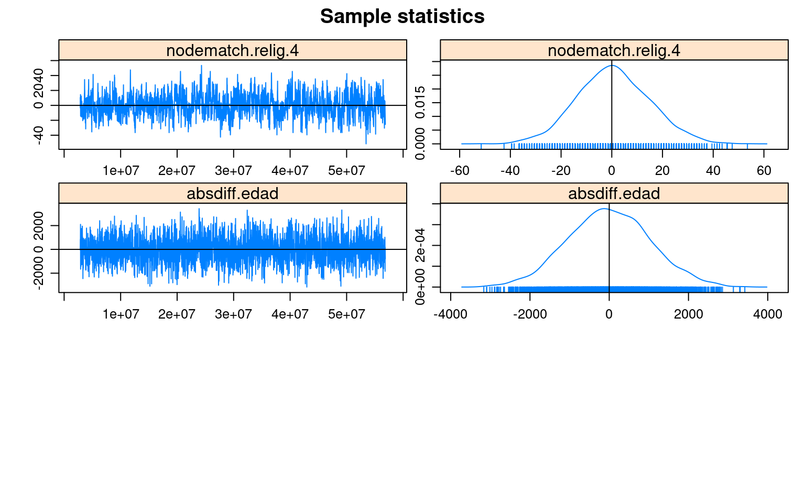



## libraries

``` r
library(ergm)
library(ergm.ego)
library(car)
library(egor)
library(tidyverse)
library(tibble)
library(texreg)
library(purrr)
library(tidyr)
library(prioritizr)
library(questionr)
```

## data

``` r
load("/home/rober/Documents/ricantillan.rbind.io/dat/ELSOC/ELSOC_W02_v3.00_R.RData")
load("/home/rober/Documents/ricantillan.rbind.io/dat/ELSOC/ELSOC_W04_v2.01_R.RData")
load("/home/rober/Documents/ricantillan.rbind.io/dat/ELSOC/ELSOC_W01_v4.01_R.RData")
```

## ELSOC 2017

### Renombrar ID

``` r
a<-elsoc_2017 %>% dplyr::rename(.egoID = idencuesta)
```

### Crear data frame alteris para 2017=a

Creamos subset con data de cada uno de los alteris mencionados, manteniendo el ID de cada ego en el cual están anidados. Las columnas de cada uno de los subset deben tener los mismos nombres.

``` r
columnas <- c("sexo", "edad", "educ", "relig", "ideol", "barrio", "relacion")
num_alters <- 5

alter_list <- list()

for (i in 1:num_alters) {
  alter_cols <- paste0("r13_", columnas, "_", sprintf("%02d", i))
  alter <- a %>%
    dplyr::select(.egoID, all_of(alter_cols)) %>%
    rename_with(~ columnas, alter_cols) %>%
    mutate(n = i)
  
  alter_list[[i]] <- alter
}

alteris <- bind_rows(alter_list)
alteris<-arrange(alteris, .egoID)
```

``` r
#alteris<-rbind(alter_1,alter_2,alter_3,alter_4,alter_5)
```

### Crear vector alter id

En el siguiente chunk creamos un vector identificador para cada uno de los alteris presentes en la data "alteris". Lo identificamos como objeto `tibble` y eliminamos el vector "n".

``` r
alteris   <- rowid_to_column(alteris, var = ".alterID")
alteris   <- as_tibble(alteris)
alteris$n <- NULL
```

### Recod alteris

Recodificamos los valores de los atributos de los alteris.

``` r
# NA
alteris[alteris=="-999"]<-NA
alteris[alteris=="-888"]<-NA

# Educación 
#edulab<-c('ltsecondary', 'secondary', 'technicaled', 'collegeed')
alteris$educ <-factor(Recode(alteris$educ ,"1=1;2:3=2;4=3;5=4"))
table(alteris$educ)
```


       1    2    3    4 
    1362 3543 1042 1719 

``` r
# Religión 
#relilab<-c('catholic','evangelical','other','none')
alteris$relig<-factor(Recode(alteris$relig,"1=1;2=2;3:4=4;5=3"))
table(alteris$relig)
```


       1    2    3    4 
    4907 1407  373 1379 

``` r
# Ideología 
#ideolab<-c('rightwinger','centerright','center','centerleft','leftwinger','none')
alteris$ideol<-factor(Recode(alteris$ideol,"1=1;2=2;3=3;4=4;5=5;6=6"))
table(alteris$ideol)
```


       1    2    3    4    5    6 
     786  191  382  303  759 4644 

``` r
# Edad 
alteris$edad<-as.numeric(alteris$edad)
#alteris$edad <-factor(Recode(alteris$edad ,"0:18=1;19:29=2;30:40=3;41:51=4;52:62=5;63:100=6"))

# Sexo 
#sexolab<-c('male','female')
alteris$sexo <-factor(Recode(alteris$sexo ,"1=1;2=2"))
table(alteris$sexo)
```


       1    2 
    3388 4678 

``` r
# Relación
alteris<-alteris%>%
  dplyr::mutate(rel=case_when(relacion%in%1:3~"fam",
                              relacion%in%4:5~"nofam"))
table(alteris$relacion)
```


       1    2    3    4    5 
     951 1181 2519 2577  838 

``` r
# Barrio 
alteris$barrio<-factor(Recode(alteris$barrio,"1=1;2=2"))
table(alteris$barrio)
```


       1    2 
    4271 3788 

``` r
#alteris<-na.omit(alteris)
```

### Borrar alteris con 5 parámetros con NA

``` r
# Función para borrar casos con un número determinado de NA's. 
#delete.na <- function(DF, n=0) {
#  DF[rowSums(is.na(DF)) <= n,]
#}
#
#alteris<-delete.na(alteris, 4) #borro los casos que tienen más de 4 NA.  
```

### Data Frame Ego's

Creamos un subset con la data de ego equivalente a la data de los alteris. Las nombramos de la misma manera.

``` r
egos <-a %>%
       dplyr::select(.egoID, 
                     sexo=m0_sexo, 
                     edad=m0_edad, 
                     educ=m01, 
                     relig=m38, 
                     ideol=c15)

egos <- as_tibble(egos)
```

### Recod data Ego's

Recodificamos las variables de la data de ego siguiendo el patrón de la data de alteris.

``` r
# NA
egos[egos=="-999"]<-NA
egos[egos=="-888"]<-NA

# Educación
egos$educ <-factor(Recode(egos$educ,"1:3=1;4:5=2;6:7=3;8:10=4"))
table(egos$educ)
```


       1    2    3    4 
     597 1045  402  429 

``` r
# Religión
egos$relig<-factor(Recode(egos$relig,"1=1;2=2;3:6=3;7:9=4"))
table(egos$relig)
```


       1    2    3    4 
    1383  499  276  308 

``` r
# Ideología
#ideolab2<-c('leftwinger','centerleft','center','centerright','rightwinger','none')
egos$ideol<-factor(Recode(egos$ideol,"0:2=5;3:4=4;5=3;6:7=2;8:10=1;11:12=6"))
table(egos$ideol)
```


       1    2    3    4    5    6 
     252  149  470  209  282 1080 

``` r
# Edad
egos$edad<-as.numeric(egos$edad)
#egos$edad <-factor(Recode(egos$edad,"18=1;19:29=2;30:40=3;41:51=4;52:62=5;63:100=6"))

# Sexo
egos$sexo <-factor(Recode(egos$sexo,"1=1;2=2"))
table(egos$sexo)
```


       1    2 
     951 1522 

``` r
# Barrio
egos$barrio <- matrix(rbinom(2473*5,1,0.6),2473,1) # Criterio minimalista
egos$barrio<-factor(Recode(egos$barrio,"1=1;0=2"))
table(egos$barrio)
```


       1    2 
    1492  981 

### Crear objeto Egor (requerido para trabajar con función `ergm.ego`)

``` r
elsoc_ego <- egor(alters = alteris, 
                  egos = egos,
                  ID.vars = list(
                    ego = ".egoID",
                    alter = ".alterID"))

elsoc_ego<-as.egor(elsoc_ego)
#View(elsoc_ego$ego)
#View(elsoc_ego$alter)


elsoc_ego[["ego"]]  <-elsoc_ego[["ego"]]%>%drop_na(sexo)
elsoc_ego[["alter"]]<-elsoc_ego[["alter"]]%>%drop_na(sexo)
elsoc_ego[["ego"]]  <-elsoc_ego[["ego"]]%>%drop_na(educ)
elsoc_ego[["alter"]]<-elsoc_ego[["alter"]]%>%drop_na(educ)
elsoc_ego[["ego"]]  <-elsoc_ego[["ego"]]%>%drop_na(relig)
elsoc_ego[["alter"]]<-elsoc_ego[["alter"]]%>%drop_na(relig)
elsoc_ego[["ego"]]  <-elsoc_ego[["ego"]]%>%drop_na(ideol)
elsoc_ego[["alter"]]<-elsoc_ego[["alter"]]%>%drop_na(ideol)
elsoc_ego[["ego"]]<-elsoc_ego[["ego"]]%>%drop_na(barrio)
elsoc_ego[["alter"]]<-elsoc_ego[["alter"]]%>%drop_na(barrio)
```

### Degree distribution

``` r
degreedist(elsoc_ego, by="educ", prob=T, plot = T, brgmod = T)
```


# Modelos

`nodefactor` = controla el grado de los diferentes grupos (ajustando las estimaciones de homofilia por el hecho de que algunos grupos, por ejemplo, los hombres, tienen más vínculos que otros grupos, como las mujeres).

El paquete "ergm" proporciona no sólo estadísticas resumidas sino también valores-p. Sin embargo, como indica Kolaczyk y Csárdi (2020), la justificación teórica para las distribuciones asintóticas chi-cuadrado y F utilizadas por `ergm` para calcular estos valores no se ha establecido hasta la fecha. Por lo tanto, puede ser pertinente interpretar estos valores de manera informal, como estadísticas resumidas adicionales.

## Modelo 1

``` r
modelo1<-ergm.ego(elsoc_ego~
                    nodefactor("sexo") +
                    nodefactor("educ") +
                    nodefactor("ideol") +
                    nodefactor("relig") +
                    nodematch("sexo", diff=TRUE) +
                    nodematch("educ", diff=TRUE) +
                    nodematch("ideol", diff=TRUE)+
                    nodematch("relig", diff=TRUE)+
                    absdiff("edad"),
                 control=control.ergm.ego(ppopsize="samp",
                                           ppop.wt="sample",
                                           stats.wt="data",
                                           stats.est="survey"),
                  ignore.max.alters=F,
                  boot.R = 10000,
                  ergm = control.ergm(init.method = "MPLE",
                                      init.MPLE.samplesize = 5e7,
                                      MPLE.constraints.ignore = TRUE,
                                      MCMLE.effectiveSize = NULL,
                                      MCMC.burnin = 5e4,
                                      MCMC.interval = 5e4,
                                      MCMC.samplesize = 1000000,
                                      parallel = 16,
                                      SAN.nsteps = 5e7))
```

    Warning: Argument(s) 'ignore.max.alters', 'boot.R', and 'ergm' were not
    recognized or used. Did you mistype an argument name?

### Summary

``` r
summary(modelo1)
```

    Call:
    ergm.ego(formula = elsoc_ego ~ nodefactor("sexo") + nodefactor("educ") + 
        nodefactor("ideol") + nodefactor("relig") + nodematch("sexo", 
        diff = TRUE) + nodematch("educ", diff = TRUE) + nodematch("ideol", 
        diff = TRUE) + nodematch("relig", diff = TRUE) + absdiff("edad"), 
        control = control.ergm.ego(ppopsize = "samp", ppop.wt = "sample", 
            stats.wt = "data", stats.est = "survey"), ignore.max.alters = F, 
        boot.R = 10000, ergm = control.ergm(init.method = "MPLE", 
            init.MPLE.samplesize = 5e+07, MPLE.constraints.ignore = TRUE, 
            MCMLE.effectiveSize = NULL, MCMC.burnin = 50000, MCMC.interval = 50000, 
            MCMC.samplesize = 1e+06, parallel = 16, SAN.nsteps = 5e+07))

    Monte Carlo Maximum Likelihood Results:

                         Estimate Std. Error MCMC % z value Pr(>|z|)    
    offset(netsize.adj) -7.798113   0.000000      0    -Inf  < 1e-04 ***
    nodefactor.sexo.2   -0.795049   0.158602      0  -5.013  < 1e-04 ***
    nodefactor.educ.2    0.332892   0.053171      0   6.261  < 1e-04 ***
    nodefactor.educ.3    0.252757   0.066248      0   3.815 0.000136 ***
    nodefactor.educ.4    0.072947   0.068499      0   1.065 0.286904    
    nodefactor.ideol.2  -0.046263   0.088883      0  -0.520 0.602717    
    nodefactor.ideol.3  -0.109201   0.074093      0  -1.474 0.140526    
    nodefactor.ideol.4  -0.081408   0.085332      0  -0.954 0.340076    
    nodefactor.ideol.5  -0.182390   0.078365      0  -2.327 0.019942 *  
    nodefactor.ideol.6   0.141035   0.073401      0   1.921 0.054678 .  
    nodefactor.relig.2   0.145772   0.075381      0   1.934 0.053138 .  
    nodefactor.relig.3   0.451458   0.085626      0   5.272  < 1e-04 ***
    nodefactor.relig.4   0.762965   0.075611      0  10.091  < 1e-04 ***
    nodematch.sexo.1    -0.222607   0.166982      0  -1.333 0.182493    
    nodematch.sexo.2     1.089294   0.162270      0   6.713  < 1e-04 ***
    nodematch.educ.1     0.717574   0.086384      0   8.307  < 1e-04 ***
    nodematch.educ.2     0.182913   0.066107      0   2.767 0.005659 ** 
    nodematch.educ.3     0.939963   0.097144      0   9.676  < 1e-04 ***
    nodematch.educ.4     1.727625   0.094257      0  18.329  < 1e-04 ***
    nodematch.ideol.1    1.620909   0.137315      0  11.804  < 1e-04 ***
    nodematch.ideol.2    1.080831   0.253297      0   4.267  < 1e-04 ***
    nodematch.ideol.3   -0.071670   0.150800      0  -0.475 0.634597    
    nodematch.ideol.4    0.731124   0.191191      0   3.824 0.000131 ***
    nodematch.ideol.5    1.519932   0.125870      0  12.075  < 1e-04 ***
    nodematch.ideol.6    0.659237   0.085050      0   7.751  < 1e-04 ***
    nodematch.relig.1    1.272272   0.086102      0  14.776  < 1e-04 ***
    nodematch.relig.2    1.980346   0.103581      0  19.119  < 1e-04 ***
    nodematch.relig.3    0.669072   0.178817      0   3.742 0.000183 ***
    nodematch.relig.4    0.777496   0.111076      0   7.000  < 1e-04 ***
    absdiff.edad        -0.023584   0.001451      0 -16.254  < 1e-04 ***
    ---
    Signif. codes:  0 '***' 0.001 '**' 0.01 '*' 0.05 '.' 0.1 ' ' 1


     The following terms are fixed by offset and are not estimated:
      offset(netsize.adj) 

Para interpretar los coeficientes, es útil pensar en términos de la probabilidad de que un par dado de nodos tenga un vínculo, condicionada al estado del nodo entre todos los demás pares. Para el término de homofilia de género (segundo orden) en el modelo anterio: El empate entre dos nodos mujeres, casi cuatriplica las probabilidades (odds) de tener un vínculo en la red observada (por su puesto, manteniendo todo lo demás igual).

Vale indicar también que para todas las variables el coeficiente difiere de cero en al menos un error estándar, lo que sugiere algún efecto no trivial de estas variables en la formación de vínculos en la red.

### Bondad de ajuste

La práctica actual para evaluar la bondad de ajuste en modelos ERGM es simular primero numerosos gráficos aleatorios del modelo ajustado y luego comparar varios resúmenes de estos gráficos con los del gráfico observado originalmente. Si las características de los grafos de red observados no coinciden con los valores típicos que surgen de las realizaciones del modelo de gráfico aleatorio ajustado, esto sugiere diferencias sistemáticas entre la clase especificada de modelos y los datos y, por lo tanto, una falta de bondad.

En general, al evaluar la bondad de ajuste en el modelado de redes, los resúmenes de uso común incluyen la distribución de cualquier número de los diversos resúmenes de la estructura de la red: como el grado, la centralidad y la distancia geodésica. Con los ERGMs, sin embargo, una elección natural de resumen son las propias estadísticas $g$ que definen el ERGM (es decir, las llamadas estadísticas suficientes). Para evaluar la bondad de ajuste de nuestro modelo anterior de homofilia, la función `ergm` ejecuta las simulaciones de Monte Carlo necesarias y calcula las comparaciones con la red original en términos de las distribuciones de cada uno de los estadísticos en el modelo.

``` r
plot(gof(modelo1))
```



Considerando las características particulares capturadas por las estadísticas, el ajuste del modelo es bastante bueno en general, toda vez que las estadísticas observadas están bastante cerca de la mediana de los valores simulados en la mayoría de los casos.

### MCMC

``` r
mcmc.diagnostics(modelo1)
```


















    Sample statistics summary:

    Iterations = 2850816:56852480
    Thinning interval = 16384 
    Number of chains = 1 
    Sample size per chain = 3297 

    1. Empirical mean and standard deviation for each variable,
       plus standard error of the mean:

                           Mean       SD Naive SE Time-series SE
    nodefactor.sexo.2   3.35305   84.184  1.46612         2.2266
    nodefactor.educ.2   0.01259   68.930  1.20047         1.7542
    nodefactor.educ.3  -0.05035   37.194  0.64775         0.9305
    nodefactor.educ.4   1.82560   46.875  0.81636         1.5301
    nodefactor.ideol.2  0.31104   19.404  0.33794         0.5330
    nodefactor.ideol.3  0.68289   32.523  0.56641         0.6882
    nodefactor.ideol.4 -1.09539   24.314  0.42345         0.6348
    nodefactor.ideol.5  1.55429   33.828  0.58914         1.4152
    nodefactor.ideol.6 -0.35138   76.994  1.34091         2.0361
    nodefactor.relig.2  1.23840   43.438  0.75651         1.3523
    nodefactor.relig.3 -0.36715   27.160  0.47301         0.7375
    nodefactor.relig.4  2.11268   37.606  0.65494         1.4673
    nodematch.sexo.1   -0.66257   26.838  0.46741         0.8976
    nodematch.sexo.2    1.85244   37.870  0.65953         1.0612
    nodematch.educ.1   -0.07476   15.407  0.26832         0.4074
    nodematch.educ.2   -1.45299   28.437  0.49525         0.7460
    nodematch.educ.3   -0.02533   13.089  0.22796         0.3976
    nodematch.educ.4    0.46300   19.895  0.34648         0.7686
    nodematch.ideol.1   0.01153   12.045  0.20977         0.5555
    nodematch.ideol.2  -0.28526    5.015  0.08735         0.1861
    nodematch.ideol.3  -0.27753    8.751  0.15241         0.1890
    nodematch.ideol.4  -0.71641    6.530  0.11372         0.1921
    nodematch.ideol.5   0.01592   12.693  0.22107         0.6250
    nodematch.ideol.6  -1.37064   33.532  0.58398         0.9293
    nodematch.relig.1  -1.23218   39.591  0.68950         0.9623
    nodematch.relig.2   0.91068   18.930  0.32968         0.7963
    nodematch.relig.3   0.06900    8.199  0.14279         0.2858
    nodematch.relig.4   0.64255   14.352  0.24995         0.6445
    absdiff.edad       -0.51911 1041.141 18.13218        24.0383

    2. Quantiles for each variable:

                          2.5%    25%   50%   75%  97.5%
    nodefactor.sexo.2   -157.6  -55.0   1.0  59.0  172.2
    nodefactor.educ.2   -129.5  -47.5  -0.5  47.5  134.5
    nodefactor.educ.3    -70.0  -26.0   0.0  25.0   74.0
    nodefactor.educ.4    -90.0  -30.0   0.0  33.0   96.0
    nodefactor.ideol.2   -37.5  -12.5   0.5  13.5   38.5
    nodefactor.ideol.3   -63.5  -21.5   1.5  22.5   64.5
    nodefactor.ideol.4   -47.5  -17.5  -1.5  15.5   45.5
    nodefactor.ideol.5   -63.1  -21.5   1.5  23.5   71.1
    nodefactor.ideol.6  -148.5  -54.5  -0.5  52.5  149.5
    nodefactor.relig.2   -84.0  -29.0   1.0  31.0   84.6
    nodefactor.relig.3   -51.5  -18.5  -0.5  18.5   52.1
    nodefactor.relig.4   -68.5  -23.5   2.5  26.5   77.5
    nodematch.sexo.1     -53.5  -19.5  -0.5  17.5   51.5
    nodematch.sexo.2     -70.5  -24.5   0.5  27.5   77.5
    nodematch.educ.1     -29.5  -10.5  -0.5  10.5   29.5
    nodematch.educ.2     -56.5  -21.5  -1.5  17.5   54.5
    nodematch.educ.3     -25.5   -8.5  -0.5   8.5   25.5
    nodematch.educ.4     -39.1  -12.5  -0.5  13.5   40.5
    nodematch.ideol.1    -23.0   -8.0  -1.0   8.0   25.0
    nodematch.ideol.2     -9.5   -3.5  -0.5   2.5   10.1
    nodematch.ideol.3    -17.0   -6.0   0.0   6.0   18.0
    nodematch.ideol.4    -13.0   -5.0  -1.0   4.0   13.0
    nodematch.ideol.5    -23.5   -8.5  -0.5   8.5   25.5
    nodematch.ideol.6    -67.0  -24.0  -2.0  22.0   65.0
    nodematch.relig.1    -75.5  -27.5  -2.5  24.5   81.5
    nodematch.relig.2    -35.5  -12.5   0.5  13.5   38.5
    nodematch.relig.3    -15.5   -5.5   0.5   5.5   16.5
    nodematch.relig.4    -27.5   -9.5   0.5  10.5   29.5
    absdiff.edad       -2045.1 -699.5 -14.5 698.5 2073.5


    Are sample statistics significantly different from observed?
               nodefactor.sexo.2 nodefactor.educ.2 nodefactor.educ.3
    diff.              3.3530482       0.012587200       -0.05034880
    test stat.         1.5059060       0.007175366       -0.05410863
    P-val.             0.1320913       0.994274935        0.95684862
               nodefactor.educ.4 nodefactor.ideol.2 nodefactor.ideol.3
    diff.              1.8255990          0.3110403          0.6828935
    test stat.         1.1930867          0.5835579          0.9923060
    P-val.             0.2328354          0.5595178          0.3210483
               nodefactor.ideol.4 nodefactor.ideol.5 nodefactor.ideol.6
    diff.             -1.09538975          1.5542918         -0.3513800
    test stat.        -1.72569870          1.0982961         -0.1725722
    P-val.             0.08440163          0.2720752          0.8629877
               nodefactor.relig.2 nodefactor.relig.3 nodefactor.relig.4
    diff.               1.2383985         -0.3671520          2.1126782
    test stat.          0.9157829         -0.4978058          1.4398130
    P-val.              0.3597808          0.6186209          0.1499203
               nodematch.sexo.1 nodematch.sexo.2 nodematch.educ.1 nodematch.educ.2
    diff.            -0.6625720       1.85244161      -0.07476494      -1.45298756
    test stat.       -0.7381656       1.74557183      -0.18349759      -1.94762239
    P-val.            0.4604138       0.08088538       0.85440761       0.05146016
               nodematch.educ.3 nodematch.educ.4 nodematch.ideol.1
    diff.           -0.02532605        0.4629967        0.01152563
    test stat.      -0.06369354        0.6023885        0.02074911
    P-val.           0.94921425        0.5469156        0.98344579
               nodematch.ideol.2 nodematch.ideol.3 nodematch.ideol.4
    diff.             -0.2852593        -0.2775250      -0.716408857
    test stat.        -1.5329006        -1.4686443      -3.729891816
    P-val.             0.1253003         0.1419293       0.000191562
               nodematch.ideol.5 nodematch.ideol.6 nodematch.relig.1
    diff.             0.01592357        -1.3706400        -1.2321808
    test stat.        0.02547877        -1.4748601        -1.2804000
    P-val.            0.97967308         0.1402501         0.2004045
               nodematch.relig.2 nodematch.relig.3 nodematch.relig.4 absdiff.edad
    diff.              0.9106764        0.06900212         0.6425538  -0.51910828
    test stat.         1.1436220        0.24140222         0.9969851  -0.02159506
    P-val.             0.2527804        0.80924339         0.3187718   0.98277097
                     (Omni)
    diff.                NA
    test stat. 9.634655e+01
    P-val.     1.301521e-08

    Sample statistics cross-correlations:
                       nodefactor.sexo.2 nodefactor.educ.2 nodefactor.educ.3
    nodefactor.sexo.2         1.00000000        0.68163975      0.4427735700
    nodefactor.educ.2         0.68163975        1.00000000      0.2236069434
    nodefactor.educ.3         0.44277357        0.22360694      1.0000000000
    nodefactor.educ.4         0.38357248        0.14340891      0.0910929123
    nodefactor.ideol.2        0.23408286        0.16367369      0.1834813837
    nodefactor.ideol.3        0.37590413        0.34814193      0.2525152362
    nodefactor.ideol.4        0.29134222        0.21736083      0.2362881964
    nodefactor.ideol.5        0.36040030        0.30364369      0.1965288100
    nodefactor.ideol.6        0.71108813        0.69794173      0.3716745054
    nodefactor.relig.2        0.44775599        0.39897391      0.1677542558
    nodefactor.relig.3        0.30898614        0.27591724      0.2537940484
    nodefactor.relig.4        0.37725460        0.34146988      0.2389316564
    nodematch.sexo.1          0.04974559        0.36008578      0.2296373005
    nodematch.sexo.2          0.90554145        0.54059234      0.3440327773
    nodematch.educ.1          0.27290864        0.01896117     -0.0064776227
    nodematch.educ.2          0.46618493        0.83750654      0.0472118871
    nodematch.educ.3          0.20639999        0.01627627      0.6929661356
    nodematch.educ.4          0.22788006        0.01017833     -0.0003338171
    nodematch.ideol.1         0.17072058        0.11686394      0.1292924946
    nodematch.ideol.2         0.07959382        0.04410018      0.0556327207
    nodematch.ideol.3         0.08746330        0.09676138      0.0756749986
    nodematch.ideol.4         0.10745926        0.05131033      0.1274485306
    nodematch.ideol.5         0.20309921        0.16776308      0.1057407859
    nodematch.ideol.6         0.54048451        0.54993224      0.2546025272
    nodematch.relig.1         0.59149213        0.54479709      0.3664550715
    nodematch.relig.2         0.31110082        0.26706241      0.0958997698
    nodematch.relig.3         0.11696974        0.10302221      0.1238495827
    nodematch.relig.4         0.19082601        0.16856365      0.1020714899
    absdiff.edad              0.66995375        0.59248486      0.4034628258
                       nodefactor.educ.4 nodefactor.ideol.2 nodefactor.ideol.3
    nodefactor.sexo.2         0.38357248        0.234082860       0.3759041281
    nodefactor.educ.2         0.14340891        0.163673688       0.3481419284
    nodefactor.educ.3         0.09109291        0.183481384       0.2525152362
    nodefactor.educ.4         1.00000000        0.257739479       0.2827891258
    nodefactor.ideol.2        0.25773948        1.000000000       0.0892275286
    nodefactor.ideol.3        0.28278913        0.089227529       1.0000000000
    nodefactor.ideol.4        0.33373703        0.083708662       0.0832399860
    nodefactor.ideol.5        0.32559011        0.079099284       0.0759904753
    nodefactor.ideol.6        0.26224459        0.090884341       0.1741259624
    nodefactor.relig.2        0.11100748        0.115142812       0.2181584165
    nodefactor.relig.3        0.28288580        0.147909462       0.1716295874
    nodefactor.relig.4        0.43886124        0.163636272       0.1836937344
    nodematch.sexo.1          0.36482588        0.143551213       0.2266641453
    nodematch.sexo.2          0.26018011        0.159013252       0.2674838367
    nodematch.educ.1          0.04088057        0.071605597       0.1066804943
    nodematch.educ.2          0.02679900        0.109106574       0.2208451194
    nodematch.educ.3          0.04265394        0.118518375       0.1226637639
    nodematch.educ.4          0.84184718        0.203388754       0.2101162023
    nodematch.ideol.1         0.20945827       -0.021699491      -0.0002323128
    nodematch.ideol.2         0.10296829        0.524273112       0.0107631436
    nodematch.ideol.3         0.07272745        0.014172290       0.5260548592
    nodematch.ideol.4         0.15706360        0.034848145       0.0116901898
    nodematch.ideol.5         0.23153240        0.037888102       0.0094679242
    nodematch.ideol.6         0.13924057       -0.004780427       0.0118291196
    nodematch.relig.1         0.34269720        0.191900195       0.3449488718
    nodematch.relig.2         0.05008449        0.072265812       0.1515570541
    nodematch.relig.3         0.12775674        0.061505566       0.0567967213
    nodematch.relig.4         0.31086834        0.112021931       0.0807510387
    absdiff.edad              0.42302845        0.227082095       0.3581042447
                       nodefactor.ideol.4 nodefactor.ideol.5 nodefactor.ideol.6
    nodefactor.sexo.2          0.29134222        0.360400305       0.7110881285
    nodefactor.educ.2          0.21736083        0.303643687       0.6979417285
    nodefactor.educ.3          0.23628820        0.196528810       0.3716745054
    nodefactor.educ.4          0.33373703        0.325590107       0.2622445911
    nodefactor.ideol.2         0.08370866        0.079099284       0.0908843413
    nodefactor.ideol.3         0.08323999        0.075990475       0.1741259624
    nodefactor.ideol.4         1.00000000        0.086847439       0.1294378738
    nodefactor.ideol.5         0.08684744        1.000000000       0.1206043578
    nodefactor.ideol.6         0.12943787        0.120604358       1.0000000000
    nodefactor.relig.2         0.11696604        0.215653676       0.4017833835
    nodefactor.relig.3         0.19161419        0.173912153       0.3036841051
    nodefactor.relig.4         0.24843021        0.413900476       0.3321864147
    nodematch.sexo.1           0.22011187        0.221608103       0.3599305751
    nodematch.sexo.2           0.21295949        0.271155529       0.5705507535
    nodematch.educ.1           0.03534433        0.094106072       0.2839901782
    nodematch.educ.2           0.11259489        0.194435750       0.4924572032
    nodematch.educ.3           0.14168258        0.104267487       0.1439714624
    nodematch.educ.4           0.26662604        0.230305771       0.1215698976
    nodematch.ideol.1          0.04646339        0.031960774      -0.0002603014
    nodematch.ideol.2          0.01035141        0.020238994      -0.0072317092
    nodematch.ideol.3         -0.02431374       -0.012904442      -0.0220886424
    nodematch.ideol.4          0.57563978       -0.003797352       0.0122705627
    nodematch.ideol.5          0.02227632        0.762887154       0.0315304700
    nodematch.ideol.6          0.02561298        0.028631346       0.8882180041
    nodematch.relig.1          0.23354760        0.191867840       0.5665683386
    nodematch.relig.2          0.05378678        0.162244103       0.2744213941
    nodematch.relig.3          0.08669519        0.073900205       0.1129449301
    nodematch.relig.4          0.12786193        0.317826656       0.1571557946
    absdiff.edad               0.29815613        0.332576325       0.6288356619
                       nodefactor.relig.2 nodefactor.relig.3 nodefactor.relig.4
    nodefactor.sexo.2         0.447755988        0.308986139         0.37725460
    nodefactor.educ.2         0.398973908        0.275917239         0.34146988
    nodefactor.educ.3         0.167754256        0.253794048         0.23893166
    nodefactor.educ.4         0.111007484        0.282885800         0.43886124
    nodefactor.ideol.2        0.115142812        0.147909462         0.16363627
    nodefactor.ideol.3        0.218158417        0.171629587         0.18369373
    nodefactor.ideol.4        0.116966038        0.191614188         0.24843021
    nodefactor.ideol.5        0.215653676        0.173912153         0.41390048
    nodefactor.ideol.6        0.401783383        0.303684105         0.33218641
    nodefactor.relig.2        1.000000000        0.084328546         0.11722973
    nodefactor.relig.3        0.084328546        1.000000000         0.11203784
    nodefactor.relig.4        0.117229725        0.112037836         1.00000000
    nodematch.sexo.1          0.181692871        0.216396387         0.30933153
    nodematch.sexo.2          0.374703952        0.216154053         0.27408341
    nodematch.educ.1          0.271604708        0.054348156         0.05327730
    nodematch.educ.2          0.282496977        0.188854714         0.20739162
    nodematch.educ.3          0.078989784        0.132810681         0.11549878
    nodematch.educ.4          0.049787094        0.194731833         0.32018641
    nodematch.ideol.1         0.081161371        0.046365142         0.05359390
    nodematch.ideol.2         0.046662280        0.035852902         0.05646465
    nodematch.ideol.3         0.064220658        0.041518096         0.04074876
    nodematch.ideol.4         0.042318361        0.085586487         0.11259712
    nodematch.ideol.5         0.121726960        0.111337605         0.30231502
    nodematch.ideol.6         0.302676766        0.219625016         0.24458422
    nodematch.relig.1        -0.009639612        0.042577410         0.04215854
    nodematch.relig.2         0.858099637        0.007051858         0.05362743
    nodematch.relig.3        -0.010359226        0.621202334         0.01773343
    nodematch.relig.4         0.028778625        0.010973392         0.76132968
    absdiff.edad              0.378201378        0.312785306         0.38580215
                       nodematch.sexo.1 nodematch.sexo.2 nodematch.educ.1
    nodefactor.sexo.2        0.04974559       0.90554145      0.272908645
    nodefactor.educ.2        0.36008578       0.54059234      0.018961165
    nodefactor.educ.3        0.22963730       0.34403278     -0.006477623
    nodefactor.educ.4        0.36482588       0.26018011      0.040880568
    nodefactor.ideol.2       0.14355121       0.15901325      0.071605597
    nodefactor.ideol.3       0.22666415       0.26748384      0.106680494
    nodefactor.ideol.4       0.22011187       0.21295949      0.035344326
    nodefactor.ideol.5       0.22160810       0.27115553      0.094106072
    nodefactor.ideol.6       0.35993058       0.57055075      0.283990178
    nodefactor.relig.2       0.18169287       0.37470395      0.271604708
    nodefactor.relig.3       0.21639639       0.21615405      0.054348156
    nodefactor.relig.4       0.30933153       0.27408341      0.053277297
    nodematch.sexo.1         1.00000000       0.04203936      0.080563942
    nodematch.sexo.2         0.04203936       1.00000000      0.221550756
    nodematch.educ.1         0.08056394       0.22155076      1.000000000
    nodematch.educ.2         0.22721531       0.37611660      0.027503975
    nodematch.educ.3         0.10553808       0.15188158      0.014392488
    nodematch.educ.4         0.27013537       0.14976730      0.028188515
    nodematch.ideol.1        0.16043914       0.13745253      0.036383840
    nodematch.ideol.2        0.02742498       0.04032895      0.033017375
    nodematch.ideol.3        0.07456228       0.05361726      0.015270493
    nodematch.ideol.4        0.08315453       0.07521832     -0.005393871
    nodematch.ideol.5        0.15460253       0.14901506      0.043730028
    nodematch.ideol.6        0.25929039       0.44605676      0.226661432
    nodematch.relig.1        0.32429699       0.45621169      0.173912218
    nodematch.relig.2        0.11539608       0.26569509      0.235656817
    nodematch.relig.3        0.08545438       0.07973716     -0.008413067
    nodematch.relig.4        0.19851918       0.13715917      0.005650513
    absdiff.edad             0.37976031       0.50925499      0.200382421
                       nodematch.educ.2 nodematch.educ.3 nodematch.educ.4
    nodefactor.sexo.2       0.466184933       0.20639999     0.2278800561
    nodefactor.educ.2       0.837506540       0.01627627     0.0101783301
    nodefactor.educ.3       0.047211887       0.69296614    -0.0003338171
    nodefactor.educ.4       0.026798995       0.04265394     0.8418471831
    nodefactor.ideol.2      0.109106574       0.11851837     0.2033887536
    nodefactor.ideol.3      0.220845119       0.12266376     0.2101162023
    nodefactor.ideol.4      0.112594892       0.14168258     0.2666260425
    nodefactor.ideol.5      0.194435750       0.10426749     0.2303057711
    nodefactor.ideol.6      0.492457203       0.14397146     0.1215698976
    nodefactor.relig.2      0.282496977       0.07898978     0.0497870942
    nodefactor.relig.3      0.188854714       0.13281068     0.1947318335
    nodefactor.relig.4      0.207391624       0.11549878     0.3201864109
    nodematch.sexo.1        0.227215311       0.10553808     0.2701353668
    nodematch.sexo.2        0.376116602       0.15188158     0.1497673048
    nodematch.educ.1        0.027503975       0.01439249     0.0281885152
    nodematch.educ.2        1.000000000       0.01894819     0.0119530583
    nodematch.educ.3        0.018948189       1.00000000     0.0473874435
    nodematch.educ.4        0.011953058       0.04738744     1.0000000000
    nodematch.ideol.1       0.051997165       0.08622492     0.1451917041
    nodematch.ideol.2       0.037393239       0.04310562     0.0798470053
    nodematch.ideol.3       0.055114811       0.03789266     0.0527483753
    nodematch.ideol.4       0.006813311       0.09140695     0.1324848426
    nodematch.ideol.5       0.103048973       0.06915378     0.1718046622
    nodematch.ideol.6       0.398911751       0.08357599     0.0509532666
    nodematch.relig.1       0.364683385       0.16661444     0.2187829268
    nodematch.relig.2       0.195426221       0.05219183     0.0228126784
    nodematch.relig.3       0.080800984       0.06258193     0.0963860999
    nodematch.relig.4       0.092134015       0.04641254     0.2501959146
    absdiff.edad            0.378035652       0.18437922     0.2814799448
                       nodematch.ideol.1 nodematch.ideol.2 nodematch.ideol.3
    nodefactor.sexo.2       0.1707205757       0.079593818      0.0874633037
    nodefactor.educ.2       0.1168639382       0.044100177      0.0967613776
    nodefactor.educ.3       0.1292924946       0.055632721      0.0756749986
    nodefactor.educ.4       0.2094582741       0.102968294      0.0727274513
    nodefactor.ideol.2     -0.0216994909       0.524273112      0.0141722905
    nodefactor.ideol.3     -0.0002323128       0.010763144      0.5260548592
    nodefactor.ideol.4      0.0464633941       0.010351409     -0.0243137399
    nodefactor.ideol.5      0.0319607738       0.020238994     -0.0129044419
    nodefactor.ideol.6     -0.0002603014      -0.007231709     -0.0220886424
    nodefactor.relig.2      0.0811613710       0.046662280      0.0642206584
    nodefactor.relig.3      0.0463651417       0.035852902      0.0415180959
    nodefactor.relig.4      0.0535938990       0.056464653      0.0407487590
    nodematch.sexo.1        0.1604391425       0.027424978      0.0745622775
    nodematch.sexo.2        0.1374525266       0.040328949      0.0536172578
    nodematch.educ.1        0.0363838396       0.033017375      0.0152704929
    nodematch.educ.2        0.0519971652       0.037393239      0.0551148107
    nodematch.educ.3        0.0862249248       0.043105615      0.0378926552
    nodematch.educ.4        0.1451917041       0.079847005      0.0527483753
    nodematch.ideol.1       1.0000000000       0.003836352      0.0001426120
    nodematch.ideol.2       0.0038363521       1.000000000      0.0024988465
    nodematch.ideol.3       0.0001426120       0.002498847      1.0000000000
    nodematch.ideol.4       0.0434206014      -0.000275907     -0.0178364935
    nodematch.ideol.5       0.0397071743       0.044839827     -0.0004286183
    nodematch.ideol.6      -0.0132136226      -0.024581673     -0.0209639548
    nodematch.relig.1       0.2102667424       0.069193759      0.0944860965
    nodematch.relig.2       0.0399641762       0.045756648      0.0557509089
    nodematch.relig.3      -0.0019804598       0.006737510      0.0024214199
    nodematch.relig.4       0.0086712065       0.071061288      0.0148523759
    absdiff.edad            0.1828115415       0.081918340      0.0863443894
                       nodematch.ideol.4 nodematch.ideol.5 nodematch.ideol.6
    nodefactor.sexo.2       1.074593e-01      0.2030992120      5.404845e-01
    nodefactor.educ.2       5.131033e-02      0.1677630841      5.499322e-01
    nodefactor.educ.3       1.274485e-01      0.1057407859      2.546025e-01
    nodefactor.educ.4       1.570636e-01      0.2315323956      1.392406e-01
    nodefactor.ideol.2      3.484814e-02      0.0378881024     -4.780427e-03
    nodefactor.ideol.3      1.169019e-02      0.0094679242      1.182912e-02
    nodefactor.ideol.4      5.756398e-01      0.0222763228      2.561298e-02
    nodefactor.ideol.5     -3.797352e-03      0.7628871537      2.863135e-02
    nodefactor.ideol.6      1.227056e-02      0.0315304700      8.882180e-01
    nodefactor.relig.2      4.231836e-02      0.1217269603      3.026768e-01
    nodefactor.relig.3      8.558649e-02      0.1113376046      2.196250e-01
    nodefactor.relig.4      1.125971e-01      0.3023150169      2.445842e-01
    nodematch.sexo.1        8.315453e-02      0.1546025330      2.592904e-01
    nodematch.sexo.2        7.521832e-02      0.1490150590      4.460568e-01
    nodematch.educ.1       -5.393871e-03      0.0437300284      2.266614e-01
    nodematch.educ.2        6.813311e-03      0.1030489730      3.989118e-01
    nodematch.educ.3        9.140695e-02      0.0691537795      8.357599e-02
    nodematch.educ.4        1.324848e-01      0.1718046622      5.095327e-02
    nodematch.ideol.1       4.342060e-02      0.0397071743     -1.321362e-02
    nodematch.ideol.2      -2.759070e-04      0.0448398273     -2.458167e-02
    nodematch.ideol.3      -1.783649e-02     -0.0004286183     -2.096395e-02
    nodematch.ideol.4       1.000000e+00     -0.0017766816     -1.725318e-05
    nodematch.ideol.5      -1.776682e-03      1.0000000000      3.478984e-02
    nodematch.ideol.6      -1.725318e-05      0.0347898368      1.000000e+00
    nodematch.relig.1       7.194346e-02      0.1008732331      4.174904e-01
    nodematch.relig.2       2.910964e-02      0.0965921104      2.032680e-01
    nodematch.relig.3       4.157798e-02      0.0577954697      7.267061e-02
    nodematch.relig.4       6.415963e-02      0.2703350798      1.230015e-01
    absdiff.edad            1.057110e-01      0.2011503592      4.618784e-01
                       nodematch.relig.1 nodematch.relig.2 nodematch.relig.3
    nodefactor.sexo.2        0.591492125       0.311100820       0.116969740
    nodefactor.educ.2        0.544797088       0.267062410       0.103022206
    nodefactor.educ.3        0.366455071       0.095899770       0.123849583
    nodefactor.educ.4        0.342697202       0.050084492       0.127756738
    nodefactor.ideol.2       0.191900195       0.072265812       0.061505566
    nodefactor.ideol.3       0.344948872       0.151557054       0.056796721
    nodefactor.ideol.4       0.233547598       0.053786777       0.086695191
    nodefactor.ideol.5       0.191867840       0.162244103       0.073900205
    nodefactor.ideol.6       0.566568339       0.274421394       0.112944930
    nodefactor.relig.2      -0.009639612       0.858099637      -0.010359226
    nodefactor.relig.3       0.042577410       0.007051858       0.621202334
    nodefactor.relig.4       0.042158539       0.053627425       0.017733434
    nodematch.sexo.1         0.324296994       0.115396077       0.085454381
    nodematch.sexo.2         0.456211694       0.265695094       0.079737161
    nodematch.educ.1         0.173912218       0.235656817      -0.008413067
    nodematch.educ.2         0.364683385       0.195426221       0.080800984
    nodematch.educ.3         0.166614443       0.052191834       0.062581934
    nodematch.educ.4         0.218782927       0.022812678       0.096386100
    nodematch.ideol.1        0.210266742       0.039964176      -0.001980460
    nodematch.ideol.2        0.069193759       0.045756648       0.006737510
    nodematch.ideol.3        0.094486097       0.055750909       0.002421420
    nodematch.ideol.4        0.071943462       0.029109640       0.041577984
    nodematch.ideol.5        0.100873233       0.096592110       0.057795470
    nodematch.ideol.6        0.417490430       0.203268023       0.072670612
    nodematch.relig.1        1.000000000      -0.020886864       0.016823847
    nodematch.relig.2       -0.020886864       1.000000000      -0.028770087
    nodematch.relig.3        0.016823847      -0.028770087       1.000000000
    nodematch.relig.4        0.021740528       0.035220651       0.014752284
    absdiff.edad             0.529094334       0.249171844       0.122571588
                       nodematch.relig.4 absdiff.edad
    nodefactor.sexo.2        0.190826005   0.66995375
    nodefactor.educ.2        0.168563648   0.59248486
    nodefactor.educ.3        0.102071490   0.40346283
    nodefactor.educ.4        0.310868342   0.42302845
    nodefactor.ideol.2       0.112021931   0.22708210
    nodefactor.ideol.3       0.080751039   0.35810424
    nodefactor.ideol.4       0.127861931   0.29815613
    nodefactor.ideol.5       0.317826656   0.33257632
    nodefactor.ideol.6       0.157155795   0.62883566
    nodefactor.relig.2       0.028778625   0.37820138
    nodefactor.relig.3       0.010973392   0.31278531
    nodefactor.relig.4       0.761329680   0.38580215
    nodematch.sexo.1         0.198519181   0.37976031
    nodematch.sexo.2         0.137159174   0.50925499
    nodematch.educ.1         0.005650513   0.20038242
    nodematch.educ.2         0.092134015   0.37803565
    nodematch.educ.3         0.046412542   0.18437922
    nodematch.educ.4         0.250195915   0.28147994
    nodematch.ideol.1        0.008671207   0.18281154
    nodematch.ideol.2        0.071061288   0.08191834
    nodematch.ideol.3        0.014852376   0.08634439
    nodematch.ideol.4        0.064159625   0.10571104
    nodematch.ideol.5        0.270335080   0.20115036
    nodematch.ideol.6        0.123001455   0.46187842
    nodematch.relig.1        0.021740528   0.52909433
    nodematch.relig.2        0.035220651   0.24917184
    nodematch.relig.3        0.014752284   0.12257159
    nodematch.relig.4        1.000000000   0.19373600
    absdiff.edad             0.193735995   1.00000000

    Sample statistics auto-correlation:
    Chain 1 
              nodefactor.sexo.2 nodefactor.educ.2 nodefactor.educ.3
    Lag 0            1.00000000        1.00000000        1.00000000
    Lag 16384        0.30139216        0.28067749        0.28551674
    Lag 32768        0.14506993        0.11305066        0.14410581
    Lag 49152        0.07236165        0.06173749        0.04804518
    Lag 65536        0.06172943        0.05452947        0.02741985
    Lag 81920        0.03695270        0.03472799        0.01518900
              nodefactor.educ.4 nodefactor.ideol.2 nodefactor.ideol.3
    Lag 0             1.0000000         1.00000000        1.000000000
    Lag 16384         0.4452443         0.26960175        0.192171468
    Lag 32768         0.2630692         0.15178373        0.040037446
    Lag 49152         0.1977617         0.09003818        0.028778819
    Lag 65536         0.1411386         0.04950074        0.021450250
    Lag 81920         0.1116890         0.07439267        0.005266774
              nodefactor.ideol.4 nodefactor.ideol.5 nodefactor.ideol.6
    Lag 0             1.00000000          1.0000000         1.00000000
    Lag 16384         0.27124362          0.4140371         0.33798087
    Lag 32768         0.14461711          0.3020113         0.17224360
    Lag 49152         0.10238297          0.2095192         0.08520190
    Lag 65536         0.06487659          0.1824986         0.04187978
    Lag 81920         0.02418942          0.1589736         0.04553189
              nodefactor.relig.2 nodefactor.relig.3 nodefactor.relig.4
    Lag 0             1.00000000         1.00000000          1.0000000
    Lag 16384         0.41456776         0.29272865          0.4834178
    Lag 32768         0.22943795         0.16999675          0.3115577
    Lag 49152         0.17462197         0.08343509          0.2338413
    Lag 65536         0.12200683         0.03344760          0.1831005
    Lag 81920         0.09801944         0.05730442          0.1452879
              nodematch.sexo.1 nodematch.sexo.2 nodematch.educ.1 nodematch.educ.2
    Lag 0           1.00000000       1.00000000       1.00000000       1.00000000
    Lag 16384       0.39772527       0.32020390       0.35942882       0.30156435
    Lag 32768       0.21178340       0.16991309       0.16503803       0.14684838
    Lag 49152       0.14071971       0.08770720       0.08500828       0.09308857
    Lag 65536       0.10595547       0.08989945       0.05162263       0.06552803
    Lag 81920       0.05719766       0.05077207       0.03777169       0.05090306
              nodematch.educ.3 nodematch.educ.4 nodematch.ideol.1 nodematch.ideol.2
    Lag 0           1.00000000        1.0000000         1.0000000         1.0000000
    Lag 16384       0.38280764        0.5618229         0.6314779         0.5003835
    Lag 32768       0.21166870        0.3621364         0.4602711         0.3313490
    Lag 49152       0.13558400        0.2564473         0.3347368         0.2370170
    Lag 65536       0.10797027        0.1805808         0.2716293         0.1756646
    Lag 81920       0.07183244        0.1520438         0.2449920         0.1402901
              nodematch.ideol.3 nodematch.ideol.4 nodematch.ideol.5
    Lag 0            1.00000000        1.00000000         1.0000000
    Lag 16384        0.18265938        0.40376130         0.5730602
    Lag 32768        0.06232943        0.24284297         0.4284072
    Lag 49152        0.02546760        0.13526764         0.3341526
    Lag 65536        0.02224779        0.08717096         0.2829043
    Lag 81920        0.02250279        0.05893009         0.2485410
              nodematch.ideol.6 nodematch.relig.1 nodematch.relig.2
    Lag 0            1.00000000        1.00000000         1.0000000
    Lag 16384        0.36667257        0.29246655         0.5242676
    Lag 32768        0.20331042        0.11463762         0.3029135
    Lag 49152        0.11729960        0.04407307         0.2247100
    Lag 65536        0.06238282        0.02526438         0.1658104
    Lag 81920        0.05663832        0.03067870         0.1171838
              nodematch.relig.3 nodematch.relig.4 absdiff.edad
    Lag 0            1.00000000         1.0000000 1.0000000000
    Lag 16384        0.39805247         0.6453808 0.2190316992
    Lag 32768        0.22911390         0.4730169 0.1040958920
    Lag 49152        0.14397411         0.3684835 0.0241282064
    Lag 65536        0.10897319         0.2951930 0.0004124161
    Lag 81920        0.09941422         0.2335631 0.0005524934

    Sample statistics burn-in diagnostic (Geweke):
    Chain 1 

    Fraction in 1st window = 0.1
    Fraction in 2nd window = 0.5 

     nodefactor.sexo.2  nodefactor.educ.2  nodefactor.educ.3  nodefactor.educ.4 
           -0.50254032        -0.28720694         0.94079085        -1.39034376 
    nodefactor.ideol.2 nodefactor.ideol.3 nodefactor.ideol.4 nodefactor.ideol.5 
            1.01728808        -2.74455425        -2.60493453         0.03449505 
    nodefactor.ideol.6 nodefactor.relig.2 nodefactor.relig.3 nodefactor.relig.4 
            0.55571684        -1.56365997        -1.66158317        -1.95271612 
      nodematch.sexo.1   nodematch.sexo.2   nodematch.educ.1   nodematch.educ.2 
           -0.20925427        -0.51830107         0.15143447        -0.56456470 
      nodematch.educ.3   nodematch.educ.4  nodematch.ideol.1  nodematch.ideol.2 
            0.35636998        -1.36505691         0.12315324        -1.45795509 
     nodematch.ideol.3  nodematch.ideol.4  nodematch.ideol.5  nodematch.ideol.6 
           -0.41632583        -2.18219627        -0.76580009         0.71677300 
     nodematch.relig.1  nodematch.relig.2  nodematch.relig.3  nodematch.relig.4 
            1.29626937        -1.67373662        -0.32309301        -1.42574128 
          absdiff.edad 
           -0.89637081 

    Individual P-values (lower = worse):
     nodefactor.sexo.2  nodefactor.educ.2  nodefactor.educ.3  nodefactor.educ.4 
           0.615287499        0.773953875        0.346812050        0.164424517 
    nodefactor.ideol.2 nodefactor.ideol.3 nodefactor.ideol.4 nodefactor.ideol.5 
           0.309016404        0.006059314        0.009189182        0.972482393 
    nodefactor.ideol.6 nodefactor.relig.2 nodefactor.relig.3 nodefactor.relig.4 
           0.578404441        0.117897443        0.096596379        0.050853243 
      nodematch.sexo.1   nodematch.sexo.2   nodematch.educ.1   nodematch.educ.2 
           0.834249749        0.604248226        0.879633004        0.572369882 
      nodematch.educ.3   nodematch.educ.4  nodematch.ideol.1  nodematch.ideol.2 
           0.721563508        0.172235162        0.901985749        0.144852921 
     nodematch.ideol.3  nodematch.ideol.4  nodematch.ideol.5  nodematch.ideol.6 
           0.677171593        0.029095050        0.443795259        0.473514176 
     nodematch.relig.1  nodematch.relig.2  nodematch.relig.3  nodematch.relig.4 
           0.194882699        0.094182374        0.746624802        0.153943036 
          absdiff.edad 
           0.370054751 
    Joint P-value (lower = worse):  0.01322902 

    Note: To save space, only one in every 2 iterations of the MCMC sample
      used for estimation was stored for diagnostics. Sample size per chain
      was originally around 6594 with thinning interval 8192.

    Note: MCMC diagnostics shown here are from the last round of
      simulation, prior to computation of final parameter estimates.
      Because the final estimates are refinements of those used for this
      simulation run, these diagnostics may understate model performance.
      To directly assess the performance of the final model on in-model
      statistics, please use the GOF command: gof(ergmFitObject,
      GOF=~model).

### Tidy

``` r
broom::tidy(modelo1, exponentiate = TRUE, conf.int = TRUE, conf.level = 0.99)
```

    Warning in tidy.ergm(modelo1, exponentiate = TRUE, conf.int = TRUE, conf.level
    = 0.99): Exponentiating but model didn't use log or logit link.

    # A tibble: 30 × 8
       term      estimate std.error mcmc.error statistic  p.value conf.low conf.high
       <chr>        <dbl>     <dbl>      <dbl>     <dbl>    <dbl>    <dbl>     <dbl>
     1 offset(n… 0.000411    0               0  -Inf     0        0.000411  0.000411
     2 nodefact… 0.452       0.159           0    -5.01  5.36e- 7 0.300     0.679   
     3 nodefact… 1.39        0.0532          0     6.26  3.83e-10 1.22      1.60    
     4 nodefact… 1.29        0.0662          0     3.82  1.36e- 4 1.09      1.53    
     5 nodefact… 1.08        0.0685          0     1.06  2.87e- 1 0.902     1.28    
     6 nodefact… 0.955       0.0889          0    -0.520 6.03e- 1 0.759     1.20    
     7 nodefact… 0.897       0.0741          0    -1.47  1.41e- 1 0.741     1.09    
     8 nodefact… 0.922       0.0853          0    -0.954 3.40e- 1 0.740     1.15    
     9 nodefact… 0.833       0.0784          0    -2.33  1.99e- 2 0.681     1.02    
    10 nodefact… 1.15        0.0734          0     1.92  5.47e- 2 0.953     1.39    
    # ℹ 20 more rows

### Predict

``` r
#predict(modelo1, type = "response")
```
