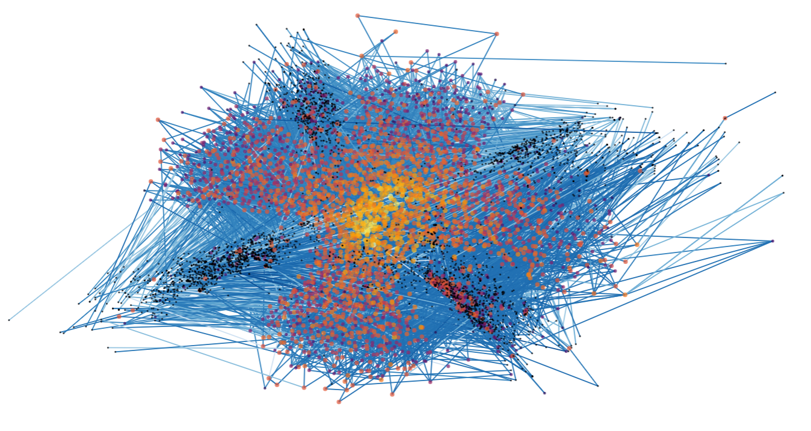

---

### Financiamiento

Los investigadores principales de este proyecto son [Mario Molina](https://mariodmolina.com/), [Luca Pesando](https://www.lucamariapesando.com/), ambos de NYU filial Abu Dabi, y [Mauricio Bucca](https://mebucca.github.io/) de la PUC. Yo participo como asistente de investigación y coautor. 

El presente proyecto tiene como objetivo analizar la dinámica de difusión cultural entre clases sociales en Chile, específicamente la difusión de nombres, desde 1960 hasta 2022. Utilizando datos administrativos y censales, así como técnicas de análisis de redes sociales, se busca identificar los patrones de adopción de nombres a través del tiempo entre distintos grupos socioeconómicos en el país. El enfoque cuantitativo y longitudinal permitirá comprender cómo ciertos nombres se difunden desde clases altas a bajas, o viceversa, actuando como marcadores de estatus, movilidad social e identidad cultural. Este conocimiento aportará evidencia empírica para discutir procesos más amplios sobre estratificación, cohesión e integración social en la sociedad chilena contemporánea.

